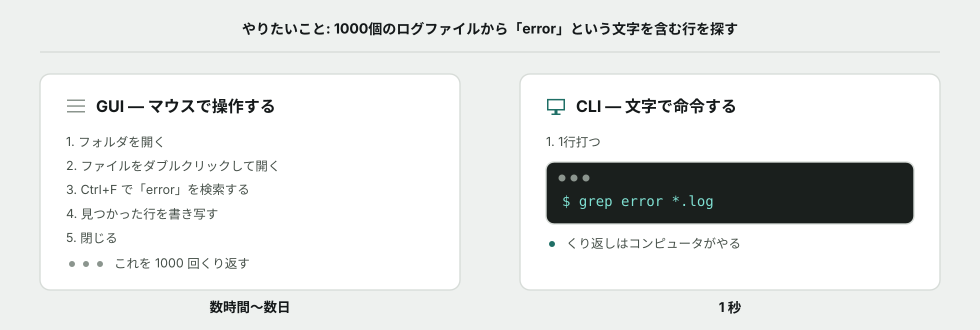
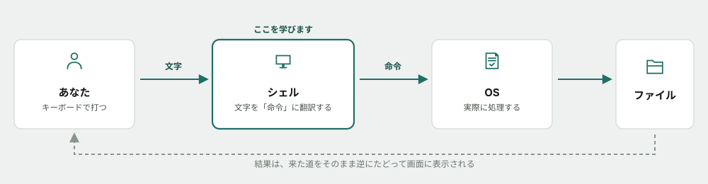
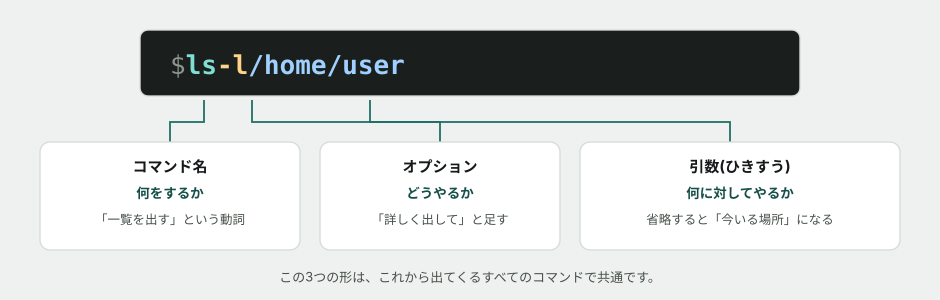
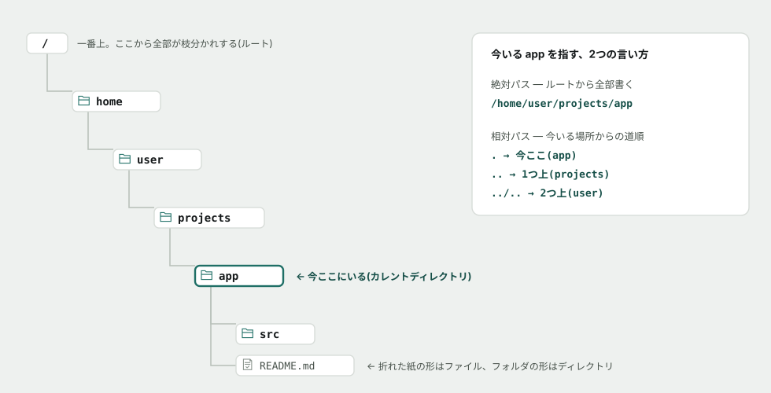
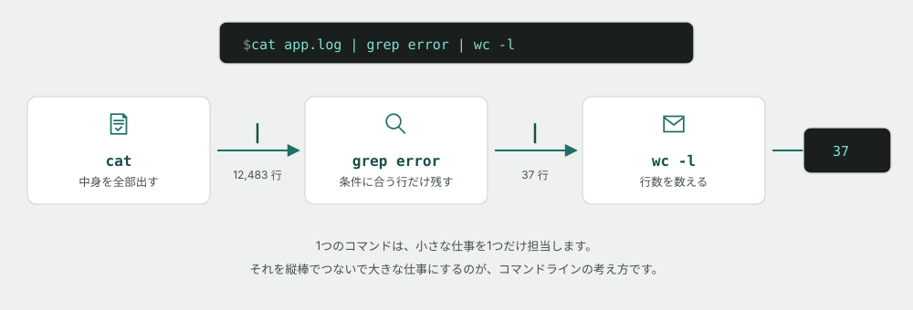
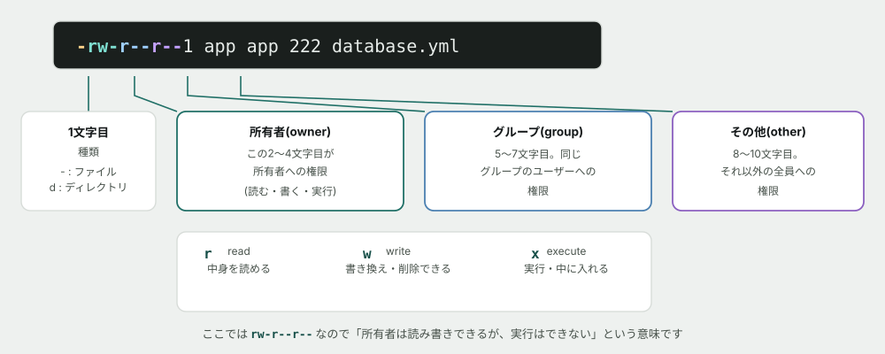
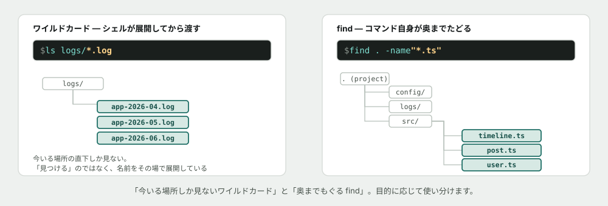
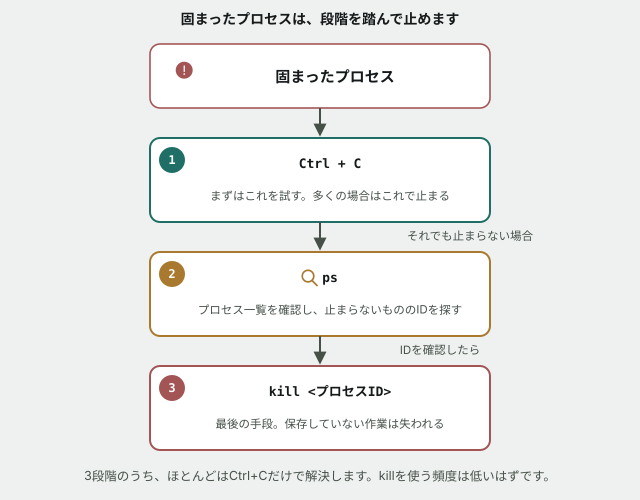

# コマンドライン基礎

## なぜこれを最初に学ぶか

これから3ヶ月で使うほぼすべての道具 — Git、データベース、開発サーバー、AIエージェント — は、**黒い画面に文字を打って動かします。** 画面上のボタンは用意されていません。

そして現場に出ると、この事情はもっと強くなります。**あなたが配属される先のサーバーには、そもそも画面がありません。** マウスも、デスクトップも、アイコンもない。文字で命令する以外に、触る方法がないのです。



*図: マウスなら数時間かかる作業が、1行で終わります。差は「速い」ことではなく、**くり返しをコンピュータに任せられる**ことです。*

ここから先はしばらく**コマンドを1つも打ちません。** 先に「黒い画面が何をしているのか」を頭の中に組み立ててから、実際に手を動かします。焦らず読んでください。

> [!TIP]
> 読んでいて分からない言葉が出てきたら、AIに聞いて構いません。禁止しているのは、後半の演習(Issue)で自分の予測や回答をAIに考えさせることだけです。詳しくは末尾の「この教材の進め方」を参照してください。
>
> コマンドの意味を忘れたときは [コマンド早見表(チートシート)](cheatsheet.md) も使ってください。

## 黒い画面の正体 — シェルという通訳

あの黒い画面そのものには、実は大した機能がありません。文字を表示して、キーボードの入力を受け取るだけの窓です。仕事をしているのは、その窓の向こうにいる<mark>シェル</mark>というプログラムです。

シェルは、**あなたが打った文字を読んで、それをコンピュータへの命令に翻訳する通訳**です。



*図: あなたとコンピュータの間には、必ずシェルが立っています。「コマンドを打つ」とは、この通訳に話しかけることです。*

この構図を覚えておくと、うまくいかないときに**どこで止まっているかを切り分けられます。**

- 打った文字がそもそも認識されない → シェルが「そんな命令は知らない」と言っている
- 命令は通ったが結果がおかしい → OSまで届いていて、そこから先の問題

> [!NOTE]
> **コラム: なぜ「ターミナル」「シェル」「コンソール」と呼び方が揺れるのか** — 厳密には、**ターミナル**は文字を表示する窓、**シェル**はその中で動く通訳です。ただし実務ではほぼ同じ意味で使われ、区別しなくても困りません。「黒い画面のことだな」と理解して先に進んでください。

## コマンドの形 — すべて同じ3つの部品でできている

コマンドは無数にありますが、**形はどれも同じ**です。ここを押さえると、初めて見るコマンドでも構造が読めます。



*図: **コマンド名(何を)+ オプション(どうやって)+ 引数(何に対して)**。この3つです。*

- <mark>コマンド名</mark> — 動詞にあたる部分。`ls` なら「一覧を出す」
- <mark>オプション</mark> — `-` で始まる補足。「もっと詳しく」「隠しファイルも」など、やり方を変える
- <mark>引数</mark>(ひきすう) — 対象。省略すると、多くのコマンドは「今いる場所」を対象にする

**オプションは、コマンドごとに意味が違います。** `-l` は `ls` では「詳しく」ですが、別のコマンドでは全然違う意味かもしれません。覚えようとせず、後述の `--help` で調べる癖をつけてください。

## 今どこにいるか — カレントディレクトリ

ここが最初の関門です。

マウスで操作しているときは、今どのフォルダを開いているかが**目で見えます。** コマンドラインには、それがありません。代わりに、シェルは**「今いる場所」を1つだけ覚えています。** これを<mark>カレントディレクトリ</mark>と呼びます。

ファイルは木のような構造でしまわれています。一番上の<mark>ルート</mark>から枝分かれし、その枝の1本に、あなたは今立っています。



*図: `..`(ドット2つ)は「1つ上」を意味します。この記法は、この先3ヶ月ずっと出てきます。*

場所の言い表し方は2通りあります。

| 呼び方 | 書き方 | 性質 |
|---|---|---|
| <mark>絶対パス</mark> | `/home/user/projects/app` | ルートから全部書く。**今どこにいても同じ場所を指す** |
| <mark>相対パス</mark> | `../projects/app` | 今いる場所からの道順。**今いる場所が変わると、指す先も変わる** |

**「同じコマンドを打ったのに、昨日と結果が違う」の原因は、たいていカレントディレクトリの違いです。** 迷ったら、まず今どこにいるかを確認する — これがコマンドラインでの第一手になります。

## 出力をつなぐ — パイプ

コマンドラインが本当に強いのは、ここからです。

ほとんどのコマンドは、**文字を受け取って、文字を出す**という共通の形をしています。形が揃っているから、**あるコマンドの出力を、次のコマンドの入力にそのまま流し込めます。** この「つなぐ」記号が <mark>パイプ</mark>(`|`)です。



*図: 12,483行のログが、37行に絞られ、最後に「37」という数字1つになります。*

1つ1つのコマンドは、驚くほど単純です。`grep` は「条件に合う行だけ残す」しかしません。`wc -l` は「行数を数える」しかしません。**単純な道具をつないで、複雑な仕事をさせる** — これがコマンドラインの設計思想で、50年間変わっていません。

> [!NOTE]
> **コラム: なぜAIエージェントもこの黒い画面を使うのか** — Claude Code のようなAIエージェントがあなたのパソコンで作業するとき、使っているのはまさにこのコマンドラインです。ボタンを押す代わりに、コマンドを打っています。**つまりコマンドラインが読めないと、AIが今何をしたのかも読めません。** AIに任せる時代だからこそ、ここが読める必要があります。

---

**ここまでが「概念」の話です。** 次から、実際にコマンドを打ってみます。

## 演習を始める前に — 黒い画面を確認する

**[0. はじめに](../00-getting-started.md) で、すでにGit Bash(またはターミナル)とGitを用意しているはずです。** 念のため確認だけしておきます。まだ準備していない方は、先に0番のページを読んでください。

> [!IMPORTANT]
> **Windowsの方は、コマンドプロンプトや PowerShell ではなく Git Bash を使ってください。** この教材と、この先の3ヶ月で扱うコマンドは、Git Bash・macOS・Linux で共通のものです。コマンドプロンプトは別の言葉を話すため、同じコマンドが動きません。

**確かめる。** 黒い画面を開いて、次を打ってください。

```
git --version
```

`git version 2.xx.x` のようにバージョン番号が出れば準備完了です。「コマンドが見つかりません」と出る場合はインストールをやり直すか、講師に相談してください。**ここで確認したGitは、次のGit基礎でそのまま使います。**

## はじめの一歩 — まずは「見る」だけのコマンド

最初に覚えるのは、**何も変更しない、ただ確認するだけのコマンド**です。これはいくら実行しても壊れません。

| コマンド | やること |
|---|---|
| `pwd` | 今いる場所(カレントディレクトリ)を絶対パスで表示する |
| `ls` | 今いる場所にあるファイル・ディレクトリの一覧を表示する |
| `ls -l` | 同じ一覧を、サイズや更新日時つきで詳しく表示する |
| `cd <パス>` | 指定した場所に移動する |

**迷ったら `pwd` と `ls`。** この2つで「自分が今どこにいて、周りに何があるか」が分かります。Git基礎で出てくる `git status` と、まったく同じ役割です。

## 中身を見る・探す

| コマンド | やること |
|---|---|
| `cat <ファイル>` | ファイルの中身を全部表示する |
| `less <ファイル>` | ファイルの中身をスクロールしながら読む(`q` で終了) |
| `grep <文字> <ファイル>` | その文字を含む行だけを抜き出す |
| `wc -l <ファイル>` | 行数を数える |

`grep` は、この先3ヶ月で**最も多く使うコマンド**になります。「この関数はどこで使われているか」を調べる手段が、まさにこれだからです。

## 作る・動かす

| コマンド | やること |
|---|---|
| `mkdir <名前>` | ディレクトリを作る |
| `touch <名前>` | 空のファイルを作る |
| `cp <元> <先>` | コピーする |
| `mv <元> <先>` | 移動する(名前を変えるときもこれ) |

> [!WARNING]
> **`rm` は「ゴミ箱に入れる」ではなく「消す」です。** マウス操作と違い、確認も出ず、元にも戻せません。この教材の演習で `rm` は使いません。現場でも、打つ前に必ず `ls` で対象を確認する癖をつけてください。**特に `rm -rf` は、打ち間違えるとシステムごと消えます。**

## 権限 — 誰が、何をしてよいか

Windowsのファイルにも「読み取り専用」がありますが、Linux(サーバーの多くはこちら)には、もっと細かい仕組みがあります。`ls -l` で見た **9文字** が、その正体です。



*図: 9文字は3文字ずつ3組。**所有者・グループ・その他**の順に、`rwx`(読む・書く・実行する)が並びます。*

権限を変えるコマンドが `chmod` です。

| 書き方 | 意味 |
|---|---|
| `chmod +w <ファイル>` | 書き込み権限を**足す** |
| `chmod -w <ファイル>` | 書き込み権限を**外す** |
| `chmod 644 <ファイル>` | 数字でまとめて指定する(`rw-r--r--` と同じ意味) |

**なぜ書き込み権限をわざわざ外すのか。** `config/database.yml` のような、**間違って書き換えられると困るファイル**を守るためです。読み取り専用にしておけば、`vim` で開いて誤って1行消してそのまま保存してしまう、という事故を防げます。

> [!NOTE]
> **コラム: Windows(Git Bash)では、この一部が効きません** — Git Bashが動いているNTFS(Windowsのファイルシステム)は、Linuxの権限の仕組みをそのまま持っていません。**書き込み権限(`w`)の有無は実際に効きますが、実行権限(`x`)は見た目が変わるだけで、動作は変わりません。** 次の演習でも、これを実際に確認します。実行権限が本当に意味を持つのは、本編で触れる本物のLinuxサーバーの上です。

## ワイルドカード — 名前で一気に選ぶ

`*` は「なんでもいい」という意味の記号です。すでにコマンドライン基礎の冒頭で `grep error *.log` として登場していました。

| 書き方 | 意味 |
|---|---|
| `*.log` | 拡張子が `.log` の全部 |
| `app-*.log` | `app-` で始まり `.log` で終わる全部 |
| `*` | 今いる場所の全部 |

**ここが `find` との違いです。** ワイルドカードは、**シェルがコマンドを実行する前に、その場で名前を展開しているだけ**です。だから今いる場所の直下しか見えません。サブディレクトリの奥までは追いかけてくれません。

## find — 奥まで探す

「あのファイル、どこだっけ」を解決するコマンドです。

```
find . -name "*.ts"
```



*図: `find` は、コマンド自身がディレクトリの中をもぐって探します。**ワイルドカードが届かない場所にも届きます。***

| コマンド | やること |
|---|---|
| `find <場所> -name "<パターン>"` | 名前で探す |
| `find . -type f` | ファイルだけを列挙する |
| `find . -type d` | ディレクトリだけを列挙する |

**`.`(ドット)は「今いる場所」です。** コマンドライン基礎の最初で出てきた、あの `.` と同じものです。

## $PATHの正体 — なぜ名前だけで動くコマンドと、動かないコマンドがあるのか

`git` や `ls` は、どこのディレクトリにいても名前を打つだけで動きます。しかし自分で作った実行ファイルは、同じように名前を打っただけでは「コマンドが見つかりません」と言われます。この違いを生んでいるのが<mark>`$PATH`</mark>という環境変数です。

`$PATH` の中身は、`:` で区切られた**ディレクトリの一覧**です。名前だけでコマンドを打たれると、シェルはこの一覧を**上から順に**探し、最初に見つかった同名の実行ファイルをその場で動かします。


*図: **見つかった時点で探索は止まります。** `git` や `node` がインストール後にどこでも使えるのは、インストーラがそれぞれの実行ファイルの場所を `$PATH` に登録してくれたからです。演習06で、実際に自分のディレクトリを `$PATH` に追加して確かめます。*

## プロセスを止める

コマンドを実行すると、それは<mark>プロセス</mark>という単位でコンピュータの中で動きます。固まって戻ってこないときに使うのがこれです。

| 操作 | やること |
|---|---|
| `Ctrl + C` | 今動いているプロセスを止める |
| `ps` | 今動いているプロセスの一覧を見る |
| `kill <プロセスID>` | 指定したプロセスを強制的に止める |



**まず `Ctrl + C` を試してください。** それでも止まらない、あるいは別のターミナルから止めたいときに `ps` と `kill` を使います。固まった開発サーバーを止められないと、その先に一歩も進めません。

## 困ったときの調べ方

覚える必要はありません。**調べ方を覚えてください。**

| コマンド | やること |
|---|---|
| `<コマンド> --help` | そのコマンドの使い方とオプション一覧を表示する |
| `man <コマンド>` | もっと詳しい説明書を表示する(`q` で終了) |

**この2つを打てることが、実は今日いちばん大事です。** 現場では知らないコマンドが常に出てきます。そのたびに人に聞くのではなく、まず `--help` を打つ。これが柱4(現場で沈まない)の具体的な形です。

## もっと知りたい人へ

**読まなくても演習は完了できます。** 興味が湧いたときにどうぞ。

- [なぜ黒い画面のほうが速いのか](../columns/why-cli-is-fast.md) — 1000ファイルを1秒で処理する仕組みの話
- [クラウドとは何か](../columns/what-is-cloud.md) — 「サーバーには画面がない」の続き。あなたのコードが最終的にどこで動くのか

AIへの質問例:

- 「シェルとカーネルの違いを、レストランに例えて説明して」
- 「`ls` コマンドが1970年代から名前を変えずに残っているのはなぜ?」

## この教材の進め方

演習は GitHub Issue として1つずつ配られます。各 Issue には手順のチェックリストと、いくつかの「予測してから実行する」課題が入っています。**このREADMEを読み終えたら、下の表の順番通りに1→6と進めてください。**

| 順番 | 演習 | 内容 | 目安時間 |
|---|---|---|---|
| 1 | [今どこにいるかを知る](https://github.com/s-okamoto-ez/education-curriculum-poc-oka/issues/1) | `pwd` `ls` `cd` で木の中を歩く | 20〜30分 |
| 2 | [ファイルを作って、中身を見る](https://github.com/s-okamoto-ez/education-curriculum-poc-oka/issues/2) | `mkdir` `touch` `cat` と、パスの書き分け | 25〜35分 |
| 3 | [パイプでつないで絞り込む](https://github.com/s-okamoto-ez/education-curriculum-poc-oka/issues/3) | `grep` `wc` `\|` で1万行から答えを出す | 30〜40分 |
| 4 | [権限を読んで、大事なファイルを守る](https://github.com/s-okamoto-ez/education-curriculum-poc-oka/issues/4) | `ls -l` `chmod` で書き込みを禁止する | 25〜35分 |
| 5 | [ワイルドカードとfindで、散らかったプロジェクトを探る](https://github.com/s-okamoto-ez/education-curriculum-poc-oka/issues/5) | `*` `find` `>` でログから調べる | 30〜45分 |
| 6 | [なぜgitは動くのに、このツールは動かないのか](https://github.com/s-okamoto-ez/education-curriculum-poc-oka/issues/6) | `$PATH` `export` `which` で環境変数を読む | 30〜40分 |

このREADME自体の読了に25〜30分ほど見ているので、**上の6つで合計3時間30分〜4時間30分程度**です。

> [!NOTE]
> **このトピックには合計8時間の枠があり、上の6つでもまだ半分程度です。** 演習を終えた人は、講師が別途出す課題(シェルスクリプトなど)に進みます。

> [!NOTE]
> この時間はまだ実測していない見積もりです。詰まって時間がかかっても、それ自体が確かめたい情報なので気にしないでください。

進め方のルール:

1. **コマンドを実行する前に、出力がどうなるかを Issue のコメントに書く**(当たっていなくてよい)
2. 実際に実行し、結果を貼る
3. 予測と結果が違っていたら、なぜ違ったかを一言書く
4. チェックリストをすべて満たしたら Issue を Close する

Closeするかどうかの判断は自分に任されています。承認を待つ必要はありません。ただし**講師は、Closeされた Issue のコメントに後から目を通します。** 一度で完璧である必要はなく、つまずいた形跡も含めて記録として残ることに意味があります。

**なぜ「予測してから実行」なのか**: 実務で毎回この手順を踏むわけではありません(`ls` を打つ前にいちいち予測はしません)。ここでは意図的に立ち止まり、先に自分の理解を言葉にしてから答え合わせをすることで、**「分かったつもり」と実際の理解のズレ**に自分で気づけるようにしています。AIに聞けば結果は一瞬で分かりますが、それでは自分が何を分かっていないかは分からないままです。

> [!IMPORTANT]
> **演習の予測・回答をAIに考えさせる／書かせるのは禁止です。** 一方で、**分からない用語や概念をAIに聞いて調べるのは自由**です。「予測してから実行する」の予測は、必ず自分の頭で考えてください。

ここでの目的はコマンドを「知っている」ことではなく、「今何が起きているかを自分の言葉で説明できる」ことです。分からないときは、AIに聞く前に `pwd` と `ls` を打ってください。答えは大抵そこに書いてあります。
