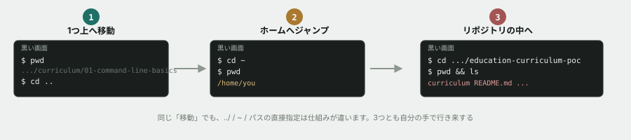

# 01. 今どこにいるかを知る

## 目的

コマンドラインには「今どのフォルダを開いているか」が目で見えない。`pwd` と `ls` で自分の居場所を把握し、`cd` で木の中を移動できるようになる。**迷ったらこの2つを打つ**という反射を作るのがゴール。

## 準備

Windowsの人は **Git Bash**、Mac・Linuxの人は **ターミナル** を開いてください。

> [!IMPORTANT]
> Windowsで「コマンドプロンプト」や「PowerShell」を開くと、この演習のコマンドは動きません。必ず **Git Bash** を使ってください。

## 手順

- [ ] `pwd` を実行する **前に**、どんな文字列が表示されるか予測してこのIssueにコメントする
- [ ] 実際に `pwd` を実行し、結果を貼る
- [ ] `ls` を実行して、今いる場所に何があるかを見る
- [ ] `ls -l` と `ls -la` も実行し、`ls` との違いを一言書く
- [ ] `cd ..` を実行する **前に**、その後 `pwd` が何を表示するか予測してコメントする
- [ ] `cd ..` してから `pwd` を実行し、予測と合っていたか書く
- [ ] `cd ~` を実行して、`pwd` の結果を貼る
- [ ] このリポジトリを `git clone` した場所へ `cd` で移動し、`pwd` と `ls` の結果を貼る
- [ ] **`Tab` キーを使って移動してみる** — `cd cur` まで打って `Tab` を押すと何が起きるか、結果を一言書く

## 予測のヒント

実務で毎回この手順を踏むわけではありません。ここでは意図的に立ち止まり、先に自分の理解を言葉にする訓練をしています。当てることが目的ではありません。分からなければ「見当がつかない」とだけ書いてもかまいません。

`ls -la` で出てくる `.` と `..` は、教材本文で説明した「今ここ」と「1つ上」です。**ディレクトリの中には、必ずこの2つが入っています。**

## 考えてみてほしいこと

以下は Issue のコメントに書いてください。正解を当てる問題ではありません。

1. `ls` の結果に出てこないのに `ls -a` では出てくるファイルがありました。それは何のためにあると思いますか
2. `cd ..` を、今いる場所から何回も繰り返すとどうなると思いますか。**実際にやってみて**、結果を書いてください

## 完了条件

チェックリストがすべて埋まり、予測・結果・気づきのコメントが揃っていること。「考えてみてほしいこと」への回答も1〜2行で書かれていること。
