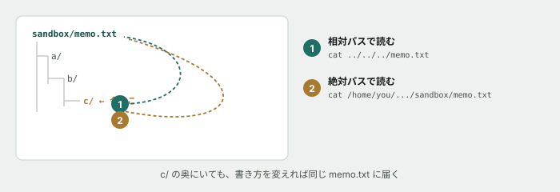

# 02. ファイルを作って、中身を見る

## 目的

ディレクトリとファイルを自分の手で作り、絶対パスと相対パスの違いを**動かして**確かめる。「同じファイルなのに、今いる場所によって書き方が変わる」という感覚を掴むのがゴール。

## 準備

`git clone` したこのリポジトリの中に移動してください(`pwd` の結果が `education-curriculum-poc` で終わっていればOK)。

作業用に、リポジトリの外か中かを気にせず使える場所を作ります。**このIssueで作ったものは、後で消しても構いません。**

## 手順

- [ ] `mkdir sandbox` を実行し、`ls` で作られたことを確認する
- [ ] `cd sandbox` で中に入り、`pwd` で場所を確認する
- [ ] `mkdir -p a/b/c` を実行する **前に**、いくつディレクトリができるか予測してコメントする
- [ ] 実行して `ls -R` (中身をぜんぶ表示)で確認し、予測と合っていたか書く
- [ ] `touch memo.txt` で空のファイルを作り、`ls -l` でサイズを確認する
- [ ] `echo "1行目です" > memo.txt` を実行し、`cat memo.txt` で中身を見る
- [ ] `echo "2行目です" >> memo.txt` を実行する **前に**、`cat` の結果がどうなるか予測してコメントする
- [ ] 実行して `cat memo.txt` の結果を貼り、予測と合っていたか書く
- [ ] **ここが本題です。** `cd a/b/c` で深いところに移動してから、`cat` で `memo.txt` の中身を表示してください。**パスをどう書いたか**をコメントに貼る
- [ ] 同じことを、**絶対パスでも**やってみる(`pwd` で調べた文字列を使う)。両方のコマンドをコメントに貼る

## 予測のヒント

`>` と `>>` は1文字しか違いませんが、動きは大きく違います。実行する前に「どちらが上書きで、どちらが追記か」を、教材本文のチートシートで確認してから予測してください。

10行目は、うまくいかなくて当たり前です。**`..` を何個並べればいいのかを、図を見ながら数えてください。**

## 考えてみてほしいこと

以下は Issue のコメントに書いてください。

1. 相対パスと絶対パス、どちらのほうが打つ文字数が少なくて済みましたか。では**なぜ絶対パスという書き方が必要なのだ**と思いますか
2. `echo "3行目" > memo.txt` を実行したら、1行目と2行目はどうなりますか。**予測を書いてから実行して**、結果を貼ってください

## 片付け

演習が終わったら、作った `sandbox` は残しておいて構いません。消したい場合は `rm` ではなく、**ファイルマネージャ(エクスプローラーやFinder)から消してください。** `rm` は元に戻せないため、この教材ではまだ使いません。

## 完了条件

チェックリストがすべて埋まり、予測・結果・気づきのコメントが揃っていること。「考えてみてほしいこと」への回答も1〜2行で書かれていること。
