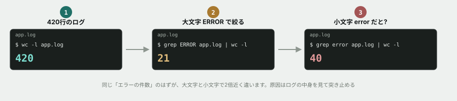

# 03. パイプでつないで絞り込む



## 目的

420行の本物らしいログから、必要な情報だけを取り出す。**手で数えるのが現実的でない量を、コマンドで一瞬にする**経験をする。この演習で使う `grep` は、この先3ヶ月で最も多く打つコマンドになる。

## 題材

`curriculum/01-command-line-basics/samples/app.log` を使います。架空のSNSサービスのAPIサーバーが吐いた、1日分のログという設定です。

まずこのファイルのある場所に移動してください。

```
cd curriculum/01-command-line-basics/samples
```

## 手順

- [ ] `cat app.log` を実行して、どんな形式のログかを眺める(全部読む必要はありません)
- [ ] `less app.log` でも開いてみて、`cat` との違いを一言書く(`q` で終了できます)
- [ ] `head -5 app.log` と `tail -5 app.log` を実行し、結果を貼る
- [ ] `wc -l app.log` を実行する **前に**、何行くらいあるか予測してコメントする(桁が合っていれば上出来です)
- [ ] 実行して結果を貼る

### ここからが本題です

- [ ] **`grep ERROR app.log | wc -l` を実行する前に、何件くらい出るか予測してコメントする**
- [ ] 実行して結果を貼る
- [ ] **次に `grep error app.log | wc -l`(小文字)を実行する前に、さっきと同じ数になるか、違う数になるかを予測してコメントする**
- [ ] 実行して結果を貼る
- [ ] **数が違った場合、なぜ違ったのかを自分で突き止めてください。** `grep error app.log` の出力を実際に見て、原因を1〜2行で書く

### 絞り込みを重ねる

- [ ] `grep ERROR app.log | grep NullPointerException | wc -l` を実行し、結果を貼る
- [ ] `grep "user=u1043" app.log | wc -l` で、特定ユーザーのアクセス数を数える
- [ ] **`user=u1043` が起こしたERRORだけを数えるコマンドを、自分で組み立ててください。** コマンドと結果を貼る

## 予測のヒント

`grep` は**文字列を探すのであって、意味を理解しているわけではありません。** 「エラーを探す」つもりで打ったコマンドが、まったく別のものを拾ってくることがあります。

小文字と大文字で件数が変わったときは、**実際に出力を目で見てください。** 何が余計に混ざっているかが見えます。答えはログの中に書いてあります。

## 考えてみてほしいこと

以下は Issue のコメントに書いてください。

1. 大文字と小文字で件数が変わった原因は何でしたか。**この失敗は、現場ではどんな事故につながると思いますか**
2. `grep -i error app.log | wc -l` はさらに違う数になります。実行して、なぜその数になるか説明してください
3. このログを見て、**「このシステムには何か問題がありそうだ」と思った点**を1つ挙げてください。根拠になるコマンドも一緒に貼ってください(正解はありません。目のつけどころを見ています)

## 完了条件

チェックリストがすべて埋まり、予測・結果・気づきのコメントが揃っていること。特に「大文字と小文字で件数が変わった原因」が、自分の言葉で説明されていること。
