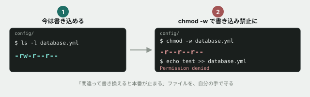

# 04. 権限を読んで、大事なファイルを守る



## 目的

`ls -l` に並ぶ9文字の権限表記を読めるようになる。そして `chmod` で、**間違って書き換えられると困るファイルを守る**ところまでを自分の手でやる。

## 準備

```
cd curriculum/01-command-line-basics/samples/project
```

架空のSNS「つながるノート」のバックエンドという設定の、小さなプロジェクトです。

## 手順

### 権限を読む

- [ ] `ls -l config/` を実行し、結果を貼る
- [ ] `database.yml` の権限表記(先頭10文字)をコメントに書き出し、**1文字目・2〜4文字目・5〜7文字目・8〜10文字目がそれぞれ何を表すか**を1行ずつ説明する
- [ ] **所有者は、このファイルに書き込めますか。** `rwx` の意味に沿って答える

### 書き込みを禁止する

`config/database.yml` の中身を読んでください。**「誤って書き換えると本番サービスが止まる」と書いてあります。** これを守ります。

- [ ] `chmod -w config/database.yml` を実行する **前に**、この後 `ls -l` の表記がどう変わるか予測してコメントする
- [ ] 実行して `ls -l config/database.yml` の結果を貼り、予測と合っていたか書く
- [ ] `echo "test" >> config/database.yml` を実行する **前に**、成功すると思うか予測する
- [ ] 実行して、**結果を貼る**(エラーが出れば、それも含めて貼ってください)
- [ ] `cat config/database.yml` を実行し、中身が変わっていないことを確認する

### 元に戻す

- [ ] `chmod +w config/database.yml` を実行し、`ls -l` で権限が戻ったことを確認する

### 実行権限を試す(結果が予想と違うかもしれません)

- [ ] `ls -l src/timeline.ts` を実行し、実行権限(`x`)の欄がどうなっているか貼る
- [ ] `chmod -x src/timeline.ts` を実行してから、もう一度 `ls -l src/timeline.ts` を確認する
- [ ] **権限表記は変わりましたか。** 事実だけをコメントに書く(Windowsの方は、変わらなくても正常です)

## 予測のヒント

「書き込みを禁止する」は、**Windows(Git Bash)でも実際に効きます。** `echo >> ` がエラーで止まるはずです。これはNTFSの「読み取り専用」属性とつながっているためです。

一方で**実行権限(`x`)は、WindowsのGit Bash環境では見た目が変わらないことがあります。** これは失敗ではありません。NTFSがLinuxの実行権限の仕組みをそのまま持っていないためで、環境による違いそのものが今日の学びです。

## 考えてみてほしいこと

以下は Issue のコメントに書いてください。

1. `chmod -w` で書き込みを禁止したファイルを、**うっかり `vim` や VS Code で開いて保存しようとしたら何が起きると思いますか**
2. 実行権限がWindows(Git Bash)で変わらなかった人へ: **本物のLinuxサーバーでは、これがどう困る場面につながると思いますか**(コマンドライン基礎の冒頭「なぜこれを最初に学ぶか」を思い出してください)
3. `config/secret.env` の中身を見てください。**このファイルにも書き込み禁止をかけるべきだと思いますか。** それとも他の対策のほうが適切だと思いますか(正解はありません)

## 完了条件

チェックリストがすべて埋まり、権限表記の9文字を自分の言葉で説明できていること。`chmod -w` による書き込み禁止が実際に効いたことを、エラーメッセージつきで確認していること。
