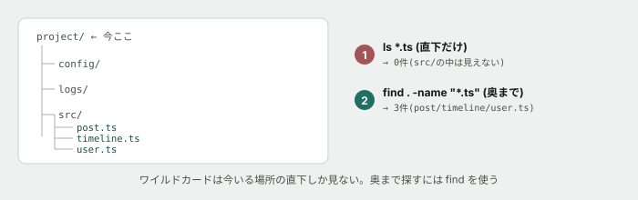

# 05. ワイルドカードとfindで、散らかったプロジェクトを探る



## 目的

`*` で名前を一気に選び、`find` でディレクトリの奥まで探し、`>` で結果をファイルに残す。3つとも単体では地味ですが、**組み合わせると「散らかった場所から必要なものだけ取り出す」ができるようになります。**

## 状況

`samples/project/` は、架空のSNS「つながるノート」のバックエンドという設定です。設定ファイル・ログ・ソースコードが混ざって置かれています。**現場で実際に渡されるプロジェクトも、最初はこう見えます。**

```
cd curriculum/01-command-line-basics/samples/project
```

## 手順

### まず全体を見る

- [ ] `find . -type f` を実行し、結果を貼る。**何件ありましたか**
- [ ] `find . -type d` を実行し、ディレクトリの一覧を貼る

### ワイルドカードで、今いる場所から選ぶ

- [ ] `ls logs/*.log` を実行する **前に**、何件出るか予測してコメントする
- [ ] 実行して結果を貼る
- [ ] **`error-` で始まるログだけ**を、ワイルドカードを使って一覧するコマンドを自分で書く

### find で、奥まで探す

- [ ] `find . -name "*.ts"` を実行し、結果を貼る。**`ls *.ts` ではなく `find` を使わないといけない理由**を1行で書く
- [ ] `find . -name "*.log"` を実行する **前に**、`ls logs/*.log` と同じ件数になるか予測してコメントする
- [ ] 実行して結果を貼り、予測と合っていたか書く

### リダイレクトで、結果を残す

- [ ] `find . -name "*.log" > found-logs.txt` を実行する
- [ ] `cat found-logs.txt` で中身を確認する
- [ ] `wc -l found-logs.txt` で行数を数える。**`find` の結果の件数と一致していますか**

### 総合問題

**次の依頼に、コマンド1行(パイプでつないでよい)で答えてください。**

> 「このプロジェクトの中で、`ERROR` という文字を含む行が何行あるか知りたいです」

- [ ] コマンドを組み立てる **前に**、どう組み立てるか方針をコメントに書く(`find` で対象ファイルを絞り、`grep` で中身を探し、`wc` で数える、という3段構えのはずです)
- [ ] `find . -name "*.log" | xargs grep -l ERROR` を実行してみる(`xargs` は「受け取った一覧を、次のコマンドの引数として渡す」道具です)。結果を貼る
- [ ] **`ERROR` を含む行の総数**まで出すには、どうすればよいか考えて実行する(`grep -c` や `grep -h` を調べてみてください)

## 予測のヒント

`ls *.ts` が空振りする理由は、**ワイルドカードが今いる場所の直下しか見ないから**です。`.ts` ファイルは `src/` の中にあり、直下にはありません。教材本文の図をもう一度見てください。

`xargs` は初見だと戸惑います。「`find` の結果を、`grep` の**引数として**渡す」という発想は、これまでのパイプ(`grep` の**入力として**渡す)とは少し違います。分からなければAIに聞いて構いません。

## 考えてみてほしいこと

以下は Issue のコメントに書いてください。

1. `find . -type f` の結果に、`config/secret.env` も含まれていました。**このファイルが `.gitignore` に入っていなかったら、何が起きると思いますか**
2. `ls *.log` と `find . -name "*.log"` で結果が違いました。**現場で「あるはずのファイルが見つからない」と困ったとき、どちらを先に試すべき**だと思いますか
3. 総合問題で組み立てたコマンドを、**もし毎日実行するとしたら、どうしますか**(コマンドライン基礎のチートシート「この教材では扱わないが、この先すぐ使うもの」を思い出してください)

## 完了条件

チェックリストがすべて埋まり、`found-logs.txt` が実際に作られていること。総合問題のコマンドが動き、`ERROR` を含む行数が出ていること。
