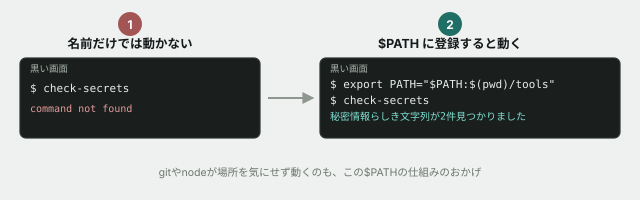
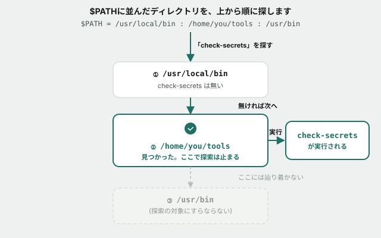

# 06. なぜ `git` は動くのに、このツールは動かないのか



## 目的

`git --version` はどこのディレクトリにいても動きます。しかし自分で置いた実行ファイルは、同じように名前を打つだけでは動きません。**この違いを生んでいる仕組み(環境変数 `$PATH`)を読み、自分で制御できるようになる**のが今回のゴールです。



## 状況

先輩から「デプロイ前に秘密情報の漏れをチェックするツールを `tools/` に置いておいたので、使ってください」と言われました。

```
cd curriculum/01-command-line-basics/samples/project
```

## 手順

### まず、そのまま動かそうとしてみる

- [ ] `check-secrets` とだけ打って実行する **前に**、何が起きるか予測してコメントする(このツールがどこにあるか、まだ確認していません)
- [ ] 実際に実行し、結果を貼る

### 見つけて、直接指定して動かす

- [ ] `find . -name "check-secrets"` で、ツールの実際の場所を確認する
- [ ] `./tools/check-secrets` を実行する **前に**、今度は動くと思うか予測してコメントする
- [ ] 実際に実行し、結果を貼る。**何が見つかりましたか**

### なぜ最初は動かなかったのか

- [ ] `echo $PATH` を実行し、結果を貼る。`:` で区切られた**ディレクトリの一覧**になっているはずです
- [ ] `which git` を実行する。**表示された場所は、`$PATH` に含まれるディレクトリの1つと一致していますか**
- [ ] 今の `$PATH` の中に、`tools/check-secrets` があるディレクトリ(`samples/project/tools`)は含まれていますか。目で確認してコメントに書く

### 一時的に、名前だけで呼べるようにする

- [ ] `export PATH="$PATH:$(pwd)/tools"` を実行する(**`$(pwd)/tools` の部分は、今いる場所からの絶対パスに展開されます**)
- [ ] もう一度 `echo $PATH` を実行する。**さっきと比べて何が変わりましたか**
- [ ] 今度は `check-secrets` とだけ打って実行する **前に**、動くようになったと思うか予測してコメントする
- [ ] 実際に実行し、結果を貼る

### この変更はどこまで続くか

- [ ] **もし今すぐ新しいタブでもう1つ黒い画面を開いたら、そちらでも `check-secrets` は動くと思いますか。** 理由も添えて予測をコメントする(実際に新しいタブを開いて試してもかまいません)

## 予測のヒント

シェルは、名前だけでコマンドを打たれると、`$PATH` に並んだディレクトリを**順番に**探し、最初に見つかった同名の実行ファイルを動かします。`git` や `node` がインストール後にどこでも使えるのは、**インストーラがそれぞれの実行ファイルの場所を `$PATH` に登録してくれた**からです。コマンドライン基礎の冒頭で確認した `git --version` も、しくみとしては今回とまったく同じです。

`export` で行った変更は、**その黒い画面(シェル)が開いている間だけ**有効です。新しいタブや、次にパソコンを立ち上げたときには引き継がれません。ずっと有効にする方法(設定ファイルに書く)もありますが、これはこの教材では扱いません。

## 考えてみてほしいこと

以下は Issue のコメントに書いてください。

1. **なぜシェルは、今いる場所(カレントディレクトリ)を自動では探してくれないのでしょうか。** `$PATH` に今いる場所が常に含まれていたら、何が困りそうですか(ヒント: ダウンロードした覚えのないファイルが置かれているフォルダで、うっかり `ls` と同じ名前のコマンドを実行してしまったら)
2. `check-secrets` は `config/secret.env` と `incident-report/deploy-log.txt` の2箇所を見つけました。**`config/secret.env` はワイルドカード基礎の演習05でも登場していました。** もしこのプロジェクトを今すぐGitHubに公開するとしたら、公開する前に何をすべきだと思いますか
3. `incident-report/deploy-log.txt` の中身は、**デプロイ時にパスワードをそのままログへ出力してしまった記録**です。コードを書く本人はデバッグのつもりだったはずです。**こうした「意図せず秘密情報が漏れる」事故は、どうすれば早期に見つけられると思いますか**(今回使った `check-secrets` のようなツールを、いつ・誰が実行するのが良さそうか)

## 完了条件

チェックリストがすべて埋まり、`$PATH` に自分でディレクトリを追加する前後の違いを、実際に実行して確認していること。
