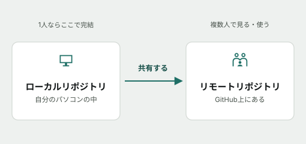
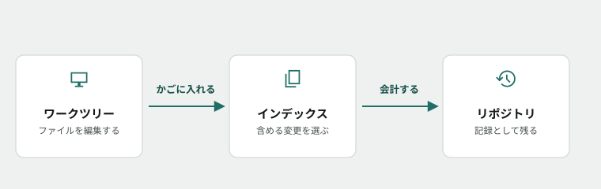
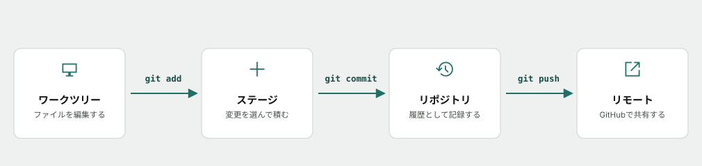
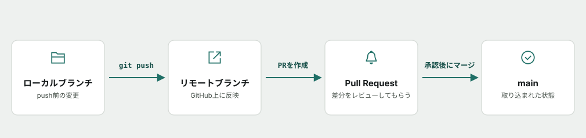
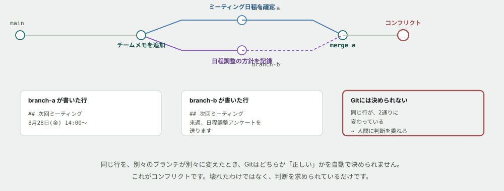
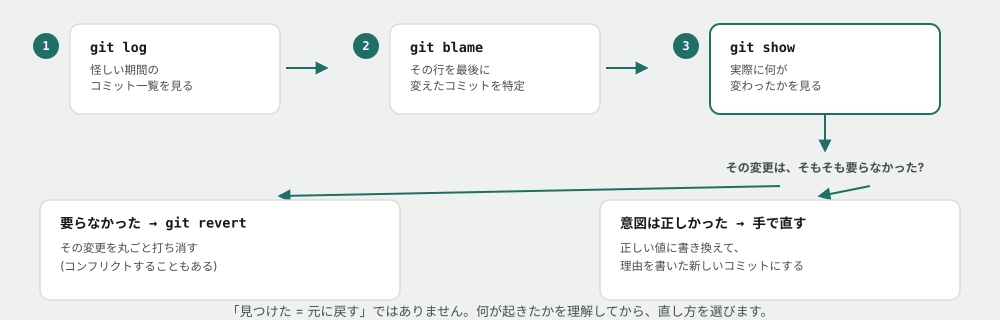

# Git基礎

## なぜこれを最初に学ぶか

これから3ヶ月、あなたが書いたコードはすべて Git というツールで管理し、Pull Request（PR）という形で講師や他の受講者にレビューしてもらいます。Git を使えないと、その先のすべての工程で足止めを食います。逆に言えば、ここさえ乗り越えれば、あとの工程は「操作」ではなく「中身」に集中できます。

ここから先はしばらく**コマンドを1つも使いません。** 先に「Gitが何をするものか」を頭の中に組み立ててから、実際に手を動かします。焦らず読んでください。

> [!TIP]
> 読んでいて分からない言葉が出てきたら、AIに聞いて構いません。禁止しているのは、後半の演習（Issue）で自分の予測や回答をAIに考えさせることだけです。詳しくは末尾の「この教材の進め方」を参照してください。
>
> コマンドの意味を忘れたときは [コマンド早見表（チートシート）](cheatsheet.md) も使ってください。

## そもそも、なぜ「バージョン管理」が要るのか

Git の説明に入る前に、Git が無かったらどうなるかを想像してください。

1人でファイルを編集しているだけでも、`report.docx` → `report_v2.docx` → `report_v2_最終.docx` → `report_v2_最終_本当の最終.docx` のようなファイル名がどんどん増えていった経験はありませんか。これが複数人での共同作業になると、さらに深刻です。2人が同時に同じファイルを直して、片方の変更がもう片方に上書きされて消える、といった事故が起きます。

**Git は、この「今どれが最新か分からない」「誰が何を変えたか分からない」という問題を解決するために作られたツールです。**

## リポジトリとは — 履歴を記録する場所

Git がファイルの状態を記録していく置き場所を、<mark>リポジトリ</mark>と呼びます。

リポジトリには2種類あります。

- <mark>ローカルリポジトリ</mark> — 自分の手元のパソコンの中にあるリポジトリ。1人で作業している間はここで完結する
- <mark>リモートリポジトリ</mark> — GitHubのようなサーバ上にあり、複数人で共有するリポジトリ

普段の作業はローカルリポジトリで行い、キリの良いところでリモートリポジトリに送って、他の人と共有します。**「まず自分の手元で記録し、それから必要なタイミングで共有する」という2段構えになっている**ことを、まず覚えてください。



## コミットとは — 変更を記録する操作

リポジトリに、変更を記録する操作を<mark>コミット</mark>と呼びます。

一番シンプルなイメージは、**ゲームのセーブポイント**です。ゲームでは、キリの良いところでセーブしておけば、あとで失敗しても直前のセーブポイントに戻れます。コミットも同じで、キリの良いところで「ここまでの変更を記録として残す」操作です。


*図: **記録は積み重なっていくだけで、上書きされません。** だから、あとから好きな時点まで遡れます。*

コミットを積み重ねていくと、それが**そのままファイルの変更履歴になります。** 「先週は動いていたのに、いつからおかしくなったんだろう」というとき、コミットの履歴を遡れば、どの変更が原因かを特定できます。これが保守・改修の現場で最初に頼る手段になります。

コミットには、あとで自分や他人が読むための**メッセージ**を必ず添えます。「何を」「なぜ」変えたのかが分かるメッセージを書く習慣は、入門フェーズのうちに身につけてください。

## ワークツリーとインデックス — 記録する前に「置いておく場所」

ここが一番つまずきやすいところです。ファイルを編集しただけでは、まだコミットされません。実は、Git には次の3層があります。

1. <mark>ワークツリー</mark>（作業ディレクトリ） — 今あなたが実際にファイルを編集している場所
2. <mark>インデックス</mark>（ステージとも呼ばれる） — コミットする準備として、変更を一時的に置いておく場所
3. <mark>リポジトリ</mark> — インデックスの内容が、コミットとして記録される場所

なぜワークツリーから直接リポジトリに記録せず、インデックスという中間地点を挟むのか。スーパーで買い物をするところを想像してください。商品を手に取ったら、いきなりレジを通すのではなく、一度**買い物かご**に入れますよね。かごに入れたものだけが会計（コミット）の対象になり、まだ入れていない商品は対象になりません。

インデックスも同じ役割です。**10個のファイルを変更していても、「今回のコミットに含めたい3個」だけをインデックスに置いて、残りは次回に回す**、ということができます。これができないと、意味の異なる変更が1つのコミットに混ざってしまい、後から履歴を追うときに読みにくくなります。



*図: 編集した変更を「かごに入れる」ようにインデックスへ選んで置き、「会計する」ようにコミットするとリポジトリに記録として残ります。*

---

**ここまでが「概念」の話です。** 次から、実際にコマンドを使ってこの3層を動かしてみます。

## 演習を始める前に — 自分の名前を設定し、リモートを手元にコピーする

### 1. 自分が誰かをGitに伝える(初回だけ)

コミットには「誰が変更したか」が記録されます。演習を始める前に、名前とメールアドレスを一度だけ設定してください(コマンドライン基礎で確認した黒い画面に打ちます)。

```
git config --global user.name "あなたの名前"
git config --global user.email "GitHubに登録したメールアドレス"
```

**確かめる**

```
git config --global user.name
git config --global user.email
```

設定した値がそのまま表示されれば完了です。

### 2. GitHubにログインできる状態にする

`git clone` や `git push` はGitHubとの通信が必要で、初回に**認証**を求められます。**Git for Windows / macOSのGitにはGit Credential Managerが同梱されており**、初回の `git clone` または `git push` を実行するとブラウザが自動で開き、GitHubのログイン画面が出ます。ログインすれば、以降は自動で認証されます。

ブラウザが開かない・うまくいかない場合は、[GitHub公式のPersonal Access Tokenの作り方](https://docs.github.com/ja/authentication/keeping-your-account-and-data-secure/managing-your-personal-access-tokens)を参照してトークンを発行し、パスワードを聞かれた欄にそのトークンを貼り付けてください。詰まったら講師に相談してください。

### 3. リモートを手元にコピーする

演習では、実際にリポジトリを手元に置いて操作します。GitHub上の<mark>リモートリポジトリ</mark>を、自分のパソコンに<mark>ローカルリポジトリ</mark>として複製する操作を <mark>git clone</mark> と呼びます。「リポジトリとは」で説明した2段構えの、最初の一歩です。演習の手順で最初に出てくる `git clone` は、この操作を指しています。

## はじめの一歩 — まずは「見る」だけのコマンド

Git を学び始めるときに一番怖いのは、「操作を間違えて何かを壊してしまうかもしれない」という不安です。そこで最初に覚えるのは、**何も変更しない、ただ状態を確認するだけのコマンド**です。これはいくら実行しても壊れません。

| コマンド | やること |
|---|---|
| `git status` | 今どのファイルが変更されていて、ワークツリー・インデックス・リポジトリのどこにあるかを表示する |
| `git diff` | 変更の中身（何行目がどう変わったか）を表示する |

**この2つを読む習慣が、保守改修フェーズで一番効いてきます。** 何かおかしいと感じたら、まず `git status` を打つ。これだけで「自分が今どこにいるか」の大半が分かります。

## 変更を記録してみる

先ほどの3層を、実際にコマンドで動かします。

| コマンド | やること |
|---|---|
| `git add <ファイル>` | ワークツリーの変更を、インデックス（ステージ）に置く |
| `git commit -m "メッセージ"` | インデックスに置いたものを、1つの区切り（コミット）としてリポジトリに記録する |

## 記録を振り返る

コミットを積み重ねたら、次はそれを振り返るコマンドです。

| コマンド | やること |
|---|---|
| `git log` | これまでのコミットの履歴を表示する |

`git log` を実行すると、いつ・誰が・どんなメッセージで記録したかが、新しい順に並びます。ゲームのセーブデータ一覧を見るのと同じ感覚です。

## 全体像 — 今まで学んだことのつながり

ここまでの5つのコマンドと3層の関係を、1枚の図にまとめます。自分の変更は、常にこの4つの場所のどれかにいます。



*図: `git add` でインデックス(ステージ)に進め、`git commit` でリポジトリ(履歴)に進めます。迷ったら `git status` で、自分の変更が今どこにいるかを確認してください。一番右の「リモート」（`git push`）は、次のトピックであなたの手元の記録をGitHub上でチームと共有するときに使います。*

## PRの位置づけ — リモートのその先

「リモートに送ったら終わり」ではありません。**本編では、リモートに送った変更は必ず Pull Request(PR)としてレビューを受けてから `main` に取り込まれます。**



*図: `git push` の先に、もう2段階あります。**PRは「取り込んでください」という提案**で、レビューを経て初めて `main` に反映されます。この一連の流れは、演習3の発展で実際に体験できます。*

## コンフリクト — Gitが「決められない」とき

ここまでは、みんなが別々の場所を編集していました。**同じ行を、別々のブランチが別々に変えると**、話が変わります。



*図: Gitは賢いですが、**「どちらが正しいか」までは判断できません。** 決めるのは人間です。*

コンフリクトが起きると、ファイルの中にこういう印が入ります。

```
<<<<<<< HEAD
8月28日(金) 14:00〜
=======
来週、日程調整アンケートを送ります
>>>>>>> practice/branch-b
```

- `<<<<<<< HEAD` から `=======` まで — **今いる側(自分)の内容**
- `=======` から `>>>>>>>` まで — **取り込もうとしている側の内容**

**やることは3つだけです。**

1. どちらを残すか(あるいは両方を活かして書き直すか)を決める
2. `<<<<<<<` `=======` `>>>>>>>` の印を、**自分で消す**
3. 決めた内容で保存し、`add` → `commit` する

> [!WARNING]
> **コンフリクトは「壊れた」ではありません。** 赤い印がたくさん出ると身構えてしまいますが、Gitは「ここだけは人間が決めてください」と言っているだけです。落ち着いて、印を消しながら正しい内容に整えれば直ります。

## 過去を調べる — 誰が、いつ、なぜ変えたか

**保守改修の現場で一番頻繁に使うのが、ここからの3つです。** 「このデータ、いつからおかしいんだろう」を突き止める道具です。



*図: **見つけたら即・元に戻す、ではありません。** 何が起きたかを理解してから、直し方を選びます。*

| コマンド | やること |
|---|---|
| `git log <ファイル>` | そのファイルの変更履歴を見る |
| `git log -p <ファイル>` | 履歴に、変更の中身(diff)も添えて見る |
| `git blame <ファイル>` | **各行を最後に変えたのが誰・いつのコミットか**を1行ずつ表示する |
| `git show <コミット>` | 指定したコミットで、実際に何が変わったかを見る |

**`git blame` が本命です。** 「この行、なぜこうなってるんだろう」というとき、その行にカーソルを合わせて由来を聞ける道具だと思ってください。

見つけたあとの判断は2通りあります。

- **その変更が丸ごと不要だった** → `git revert <コミット>` で打ち消す(ただし、後のコミットと重なっていると、これ自体がコンフリクトになることがあります)
- **意図は正しかったが、値や書き方を間違えた** → **手で正しく直し、理由を書いた新しいコミットにする**

「見つけた = revert」ではありません。**revertは「そのコミットが無かったことにする」操作**なので、そのコミットの中に正しい変更(直したい間違い以外の部分)も混ざっていたら、それも一緒に消えてしまいます。

## .gitignore — 追跡から除外する

`node_modules/` や `.env.local` のような、**Gitに記録したくないファイル**があります。それを指定するのが `.gitignore` です。

ただし、ここには誤解しやすい落とし穴があります。**`.gitignore` は「これから先、追跡し始めないでください」という指示でしかありません。** すでに `git add` されて追跡が始まっているファイルには効きません。


*図: `.gitignore` を書くだけでは、Gitの記憶からは消えません。**明示的に「追跡をやめてください」(`git rm --cached`)と伝えて、初めて除外されます。** このとき `--cached` を付けるのが重要で、ファイル自体は手元に残ります。演習06で、この一連の流れを実際に手を動かして確かめます。*

## もっと知りたい人へ

**読まなくても演習は完了できます。** 興味が湧いたときにどうぞ。

- [なぜ黒い画面のほうが速いのか](../columns/why-cli-is-fast.md) — 「やったことが文字で残る」ことの価値
- [クラウドとは何か](../columns/what-is-cloud.md) — GitHubに送ったコードは、最終的にどこへ行くのか

AIへの質問例:

- 「Gitが分散型と呼ばれるのはなぜか、昔のバージョン管理と比べて教えて」
- 「良いコミットメッセージの書き方を、悪い例と一緒に教えて」

## この教材の進め方

演習は GitHub Issue として1つずつ配られます。各 Issue には手順のチェックリストと、いくつかの「予測してから実行する」課題が入っています。**このREADMEを読み終えたら、下の表の順番通りに1→6と進めてください。**

| 順番 | 演習 | 内容 | 目安時間 |
|---|---|---|---|
| 1 | [git status / git diff を読む](https://github.com/s-okamoto-ez/education-curriculum-poc-oka/issues/7) | 状態を確認するだけの2コマンド | 15〜20分 |
| 2 | [はじめてのコミットを作る](https://github.com/s-okamoto-ez/education-curriculum-poc-oka/issues/8) | `add` → `commit` → `log` | 15〜20分 |
| 3 | [ブランチを切ってみる](https://github.com/s-okamoto-ez/education-curriculum-poc-oka/issues/9) | ブランチを切って戻る（発展でPR作成） | 20〜30分 |
| 4 | [コンフリクトを起こして、自分で解決する](https://github.com/s-okamoto-ez/education-curriculum-poc-oka/issues/10) | 2つのブランチを衝突させ、自分の手で直す | 40〜60分 |
| 5 | [過去の履歴から、原因を突き止める](https://github.com/s-okamoto-ez/education-curriculum-poc-oka/issues/11) | `git blame` `git show` `git revert` で調べて、判断する | 60〜90分 |
| 6 | [.gitignoreを設計する](https://github.com/s-okamoto-ez/education-curriculum-poc-oka/issues/12) | 誤って追跡したファイルを、`.gitignore` と `git rm --cached` で外す | 30〜45分 |

このREADME自体の読了に20〜25分ほど見ているので、**上の6つで合計3時間30分〜4時間30分程度**です。

> [!NOTE]
> **このトピックには合計10時間の枠があり、上の6つでもまだ半分弱です。** 演習を終えた人は、講師が別途出す課題(リベース、タグなど)に進みます。

> [!NOTE]
> この時間はまだ実測していない見積もりです。詰まって時間がかかっても、それ自体がこのPoCで確かめたい情報なので気にしないでください。

進め方のルール:

1. **コマンドを実行する前に、出力がどうなるかを Issue のコメントに書く**（当たっていなくてよい）
2. 実際に実行し、結果を貼る
3. 予測と結果が違っていたら、なぜ違ったかを一言書く
4. チェックリストをすべて満たしたら Issue を Close する

Closeするかどうかの判断は自分に任されています。承認を待つ必要はありません。ただし**講師は、Closeされた Issue のコメントに後から目を通します。** 一度で完璧である必要はなく、つまずいた形跡も含めて記録として残ることに意味があります。

**なぜ「予測してから実行」なのか**: 実務で毎回この手順を踏むわけではありません（`git status` を打つ前にいちいち予測はしません）。ここでは意図的に立ち止まり、先に自分の理解を言葉にしてから答え合わせをすることで、**「分かったつもり」と実際の理解のズレ**に自分で気づけるようにしています。AIに聞けば結果は一瞬で分かりますが、それでは自分が何を分かっていないかは分からないままです。

> [!IMPORTANT]
> **演習の予測・回答をAIに考えさせる／書かせるのは禁止です。** 一方で、**分からない用語や概念をAIに聞いて調べるのは自由**です。「予測してから実行する」の予測は、必ず自分の頭で考えてください。

ここでの目的はコマンドを「知っている」ことではなく、「今何が起きているかを自分の言葉で説明できる」ことです。分からないときは、AIに聞く前に `git status` の出力をもう一度読んでください。答えは大抵そこに書いてあります。
