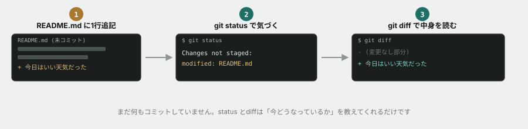

# 01. git status / git diff を読む

## 目的

`git status` と `git diff` が「今、何が起きているか」を教えてくれることを体で覚える。この2つを読む習慣が、保守改修フェーズで一番効いてくる。

## 手順

- [ ] このリポジトリをローカルに `git clone` する
- [ ] `curriculum/02-git-basics/README.md` の一番下に、好きな一言を1行追記する（保存するだけでよい、コミットはまだしない）
- [ ] `git status` を実行する **前に**、どんな出力が出るか予測してこのIssueにコメントする
- [ ] 実際に `git status` を実行し、結果をコメントに貼る
- [ ] `git diff` を実行する **前に**、どんな出力が出るか予測してコメントする
- [ ] 実際に `git diff` を実行し、結果をコメントに貼る
- [ ] 予測と結果が違っていた点があれば、何が違ったかを一言書く

## 予測のヒント

実務で毎回この手順を踏むわけではありません。ここでは意図的に立ち止まり、先に自分の理解を言葉にする訓練をしています。当てることが目的ではありません。「たぶんこう出るはず」という仮説を先に言葉にすることで、実際の出力を読むときの解像度が上がります。分からなければ「見当がつかない」とだけ書いてもかまいません。

## 完了条件

チェックリストがすべて埋まり、予測・結果・気づきのコメントが揃っていること。
