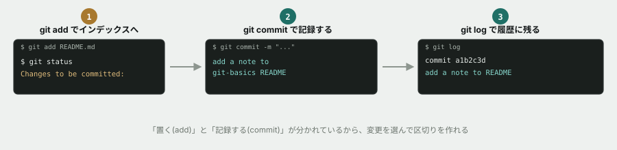
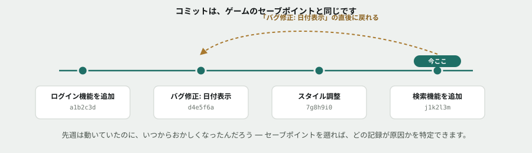

# 02. はじめてのコミットを作る

## 目的

`add` → `commit` の一連の流れを実際にやってみて、「コミット＝区切りを作る操作」だという感覚をつかむ。

## 手順

- [ ] Issue #1 で追記した1行を、`git add` する
- [ ] `add` した直後にもう一度 `git status` を実行し、表示が Issue #1 のときと何が変わったかをコメントに書く
- [ ] `git commit -m "add a note to git-basics README"` でコミットする
- [ ] `git log` を実行する **前に**、何が表示されるか予測してコメントする
- [ ] 実際に `git log` を実行し、結果を貼る
- [ ] コミットメッセージを見て、「このメッセージだけで、あとから見た人に何が伝わるか／伝わらないか」を一言書く

## 問い

`git add` をしてから `git commit` をする、という2段階になっているのはなぜだと思いますか。1段階（変更したら即コミット）ではダメな理由を、自分の言葉で予想して書いてください。正解を知っていることより、考えた形跡があることを見ます。

## 完了条件

チェックリストがすべて埋まり、最後の問いに対する自分なりの答えが書かれていること。
