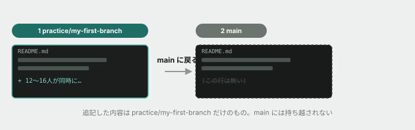

# 03. ブランチを切ってみる

## 目的

ブランチを切って作業し、あとで Pull Request を出す、という保守改修フェーズの基本フローを小さく体験する。

## 手順

- [ ] `git branch` を実行し、今どのブランチにいるか確認する
- [ ] `git switch -c practice/my-first-branch` で新しいブランチを作って移動する
- [ ] `curriculum/02-git-basics/README.md` に、Issue #2 の問いに対する自分の答えをもう一度、今度は本文として1〜2行で追記する
- [ ] 変更を `add` → `commit` する
- [ ] `git switch main` で元のブランチに戻る **前に**、今追記した内容が `main` 側にも見えるかどうかを予測してコメントする
- [ ] 実際に `git switch main` してから README を開き、予測が当たっていたか確認してコメントする

## 問い

ブランチを分けずに `main` で直接作業していたら、何が困ると思いますか。今回のような1人作業ではなく、「12〜16人が同時に同じリポジトリで作業している」場面を想像して答えてください。

## 完了条件

チェックリストがすべて埋まり、予測との答え合わせと最後の問いへの回答が書かれていること。

## 発展（任意）

ここまでできた人は、`git switch practice/my-first-branch` で作業ブランチに戻り、GitHub 上でこのブランチから `main` への Pull Request を作ってみてください。Merge はしなくてかまいません。

**なぜ任意なのか。** 入門フェーズで扱うのは「PRを作る操作」までです。「レビュー指摘を受けて直す」という続きの練習は、実際にレビューしてくれる相手がいる本編(保守改修フェーズ)で行います。ただし**本編では、これがブランチを切るのと同じくらい毎日発生する操作になります。** 今のうちに一度手を動かしておくと、本編の初日で操作に戸惑う分の負荷が減ります。時間に余裕があれば、ぜひ試してください。
