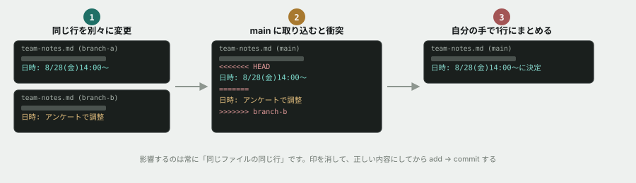

# 04. コンフリクトを起こして、自分で解決する



## 目的

コンフリクトは、いつか必ず出会います。**出会ったときに慌てないために、安全な場所で一度自分の手で起こし、自分で直します。**

複数人がいなくても、コンフリクトは1人で再現できます。**2つのブランチが、同じ行を別々に変えれば、それだけで起きます。**

## 準備

`samples/team-notes.md` を使います。まだ触れていなければ、リポジトリの中にあるはずです。

```
cat curriculum/02-git-basics/samples/team-notes.md
```

## 手順

### 種をまく

- [ ] `git switch -c practice/branch-a` で新しいブランチを作る
- [ ] `curriculum/02-git-basics/samples/team-notes.md` の「未定」を、好きな日時に書き換える(例: `8月28日(金) 14:00〜`)
- [ ] `add` → `commit`(メッセージ例: `ミーティング日程を確定`)
- [ ] `git switch main` で戻る
- [ ] `git switch -c practice/branch-b` で、**main から**別のブランチを作る
- [ ] 同じファイルの同じ「未定」の行を、**さっきとは違う内容**に書き換える(例: `来週、日程調整アンケートを送ります`)
- [ ] `add` → `commit`(メッセージ例: `日程調整の方針を記録`)

### 1本目を取り込む(ここまでは問題なし)

- [ ] `git switch main` で main に戻る
- [ ] `git merge practice/branch-a` を実行する。**問題なく終わるはずです**
- [ ] `cat` でファイルの中身を確認する

### 2本目を取り込む(ここでコンフリクトが起きます)

- [ ] `git merge practice/branch-b` を実行する **前に**、何が起きると思うか予測してコメントする
- [ ] 実行する。**エラーのような出力が出ますが、慌てなくて大丈夫です**
- [ ] `git status` を実行し、結果を貼る
- [ ] `cat curriculum/02-git-basics/samples/team-notes.md` でファイルの中身を見る。**`<<<<<<<` `=======` `>>>>>>>` が見えるはずです**

### 解決する

- [ ] エディタでファイルを開き、印を全部消して、**あなたが正しいと思う内容**にする(両方の情報を活かして書き直しても構いません)
- [ ] `cat` で、印が残っていないことを確認する
- [ ] `add` → `commit` する(コミットメッセージは自動で入力されていることがあります。そのままで構いません)
- [ ] `git log --oneline --graph --all` を実行し、結果を貼る。**branch-a と branch-b が、どちらも main に合流していることを確認する**

## 予測のヒント

「エラーのような出力」に動揺しないでください。`git merge` が止まったのは、**「ここだけは判断できないので、お願いします」という意思表示**です。ファイルは壊れていません。

## 考えてみてほしいこと

以下は Issue のコメントに書いてください。

1. `git status` の出力に、**次に何をすればいいかのヒント**が書かれていました。何と書かれていましたか
2. もし12人が同時に同じファイルを編集するプロジェクトだったら、**コンフリクトはどれくらいの頻度で起きると思いますか**。それを減らすには、どうすればいいと思いますか
3. コンフリクトを解決するとき、**「相手が書いた内容」を確認せずに、自分の書いた内容で全部上書きしてしまったらどうなると思いますか**

## 完了条件

`git log --oneline --graph --all` で、branch-a と branch-b の両方が main に取り込まれていることが確認できること。`team-notes.md` に `<<<<<<<` などの印が残っていないこと。
