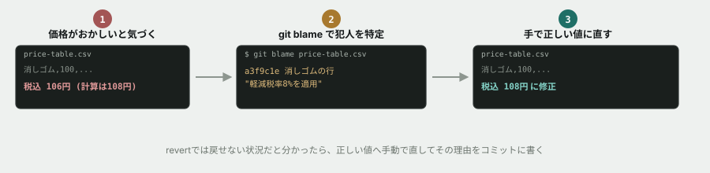

# 05. 過去の履歴から、原因を突き止める



## 目的

「このデータ、いつからおかしいんだろう」を、`git log` `git blame` `git show` で突き止める。見つけたあと、**元に戻すべきか、手で直すべきかを自分で判断する**ところまでやります。

## 状況(ここから、あなたは経理担当からの問い合わせを受けています)

> お疲れさまです。価格表の件で確認です。
> 「消しゴム」の税込価格が `106円` になっていますが、これは何かの間違いではないでしょうか。
> 確認をお願いします。

## 準備

この演習専用の、履歴つきの練習リポジトリが `samples/history-practice.bundle` に入っています。**バンドルファイルは、Gitの履歴をまるごと1つのファイルに詰めたものです。**

```
cd curriculum/02-git-basics/samples
git clone history-practice.bundle history-practice
cd history-practice
```

`history-practice` という新しいフォルダができ、その中に**過去の会話が全部入った、独立した小さなリポジトリ**が展開されます。

## 手順

### まず、指摘を自分の目で確認する

- [ ] `cat price-table.csv` を実行し、中身を全部貼る
- [ ] `消しゴム` の行を計算してみる。**税抜100円に8%の軽減税率をかけると、いくらになりますか。** 計算過程をコメントに書く
- [ ] ファイルに書かれている `106` と、あなたが計算した数字は**一致しますか**

### 履歴を調べる

- [ ] `git log --oneline` を実行し、コミットの一覧を貼る
- [ ] `git log -p price-table.csv` を実行する **前に**、何が表示されるか予測してコメントする(diffの読み方はコマンドライン基礎の `git diff` を思い出してください)
- [ ] 実行して、結果を(長ければ該当部分だけ)貼る

### 犯人を特定する

- [ ] `git blame price-table.csv` を実行し、結果を貼る
- [ ] **消しゴムの行(4行目)を、最後に変更したのはどのコミットですか。** コミットのハッシュ(先頭7文字でよい)とメッセージを書く
- [ ] `git show <そのコミット>` を実行し、**実際に何が変わったのか**(diff)を貼る
- [ ] **このコミットは「何をするつもりだった」のかを、コミットメッセージから読み取って1行で書く**

### 判断する — 戻すべきか、直すべきか

- [ ] **この変更(軽減税率8%を適用すること自体)は、正しい業務判断だったと思いますか、それとも間違いだったと思いますか。** 理由も書く
- [ ] `git revert <そのコミット>` を実行する **前に**、成功すると思うか予測してコメントする
- [ ] 実行して、結果を貼る(**コンフリクトになるかもしれません。その場合は焦らず `git status` で状況を確認してください**)
- [ ] コンフリクトになった場合、`git revert --abort` で元に戻す。**なぜコンフリクトが起きたと思いますか**(直前の演習04を思い出してください。このコミットの後に、別の行を変えたコミットがもう1つあります)

### 手で直す

`revert` がこの状況に適さないと分かったところで、方針を変えます。

- [ ] `price-table.csv` の消しゴムの行を、あなたが計算した正しい数字に**手で書き換える**
- [ ] `add` → `commit` する。**コミットメッセージに、何を・なぜ直したのかを書いてください**(例: 「消しゴムの軽減税率(8%)適用時の入力ミスを修正」)
- [ ] `git log --oneline` で、履歴に新しいコミットが積まれたことを確認する
- [ ] `cat price-table.csv` で、最終的な中身を貼る

## 予測のヒント

`git revert` は「そのコミットの変更を打ち消す」操作です。**打ち消した結果、そのコミットより後に別の行が変わっていると、Gitは「元の状態」を素直に復元できずコンフリクトになることがあります。** これは失敗ではなく、Gitが正直に「分からないので聞いています」と言っている状態です。

## 考えてみてほしいこと

以下は Issue のコメントに書いてください。

1. もし `git revert` がすんなり成功していたら、消しゴムの税込価格は何円に戻っていたと思いますか。**それは経理が求めている答えと同じですか**
2. 「見つけたコミットを打ち消す」と「手で正しい値に直す」、**この2つの結果は何が違いますか**(ヒント: 軽減税率を適用するという判断そのものは、残すべきものでしたか)
3. `git blame` が便利なのは分かりましたが、**この道具だけでは分からないことは何だと思いますか**(ヒント: 「なぜ106という数字を書いたのか」という、書いた人の頭の中)

## 完了条件

犯人のコミットが特定できていること。`revert` を実際に試し、結果(成功かコンフリクトか)が記録されていること。最終的に、正しい値への手動修正コミットが積まれていること。**「なぜrevertではなく手で直したのか」が自分の言葉で説明されていること。**
