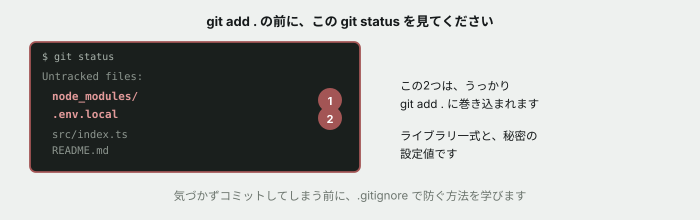
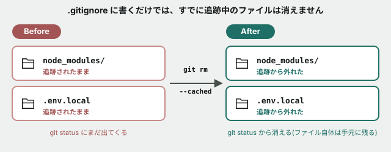

# 06. .gitignoreを設計する — 消したはずのファイルが消えない



## 目的

「うっかりコミットしてはいけないファイルをコミットしてしまった」は、現場で非常によく起きる事故です。`.gitignore` の書き方と、**書くだけでは直らない場合がある**という落とし穴を体験します。



## 状況(ここから、あなたは新しいツールを試している最中です)

> ためしにローカルでツールを動かしてみたら、`node_modules/`(ライブラリ一式)と `.env.local`(自分だけの設定値)ができていました。よく確認せずに `git add .` して、そのままコミットしてしまいました。

## 手順

### 事故を再現する

- [ ] `curriculum/02-git-basics/samples/` に移動する
- [ ] `mkdir -p scratch-app/node_modules/some-library` で、ライブラリっぽいディレクトリを作る
- [ ] `echo "本物ならここに大量のファイルが入ります" > scratch-app/node_modules/some-library/index.js` で、中身のダミーファイルを作る
- [ ] `echo "API_KEY=sk-practice-1234567890" > scratch-app/.env.local` で、秘密の設定値っぽいファイルを作る
- [ ] `git status` を実行し、この2つが「Untracked files」として出ていることを確認する
- [ ] **深く考えず**、`git add scratch-app` → `git commit -m "scratch-appを追加"` を実行する(これが「うっかり」の再現です)
- [ ] `git log --stat -1` を実行し、**この1コミットに何ファイル含まれているか**を確認してコメントに書く

### 気づいて、.gitignore を書く

- [ ] `curriculum/02-git-basics/samples/scratch-app/.gitignore` というファイルを作り、次の2行を書く

```
node_modules/
.env.local
```

- [ ] `git status` を実行する **前に**、この2つのファイルはこれで「消える」と思うか、それともそのまま出てくると思うか予測してコメントする
- [ ] 実行して、結果を貼る

### 予測と結果を突き合わせる

- [ ] `git log --stat -1` をもう一度実行する。**さっきコミットしたファイルは、まだ履歴に残っていますか**
- [ ] `.env.local` の中身を書き換えて(値を適当なものに変える)、`git diff` を実行する。**変更が検出されますか**

### 追跡から外す

- [ ] `git rm -r --cached scratch-app/node_modules scratch-app/.env.local` を実行する(`--cached` は「ファイル自体は手元に残し、Gitの追跡だけ外す」という意味です)
- [ ] `git status` を実行し、結果を貼る。**さっきと表示がどう変わりましたか**
- [ ] `add` → `commit`(メッセージ例: `node_modulesと.env.localを追跡から除外`)
- [ ] `ls scratch-app/node_modules` を実行し、**ファイル自体はまだ手元に残っていること**を確認する
- [ ] もう一度 `.env.local` の中身を書き換えて `git diff` を実行する。**今度は変更が検出されますか**

## 予測のヒント

`.gitignore` は「これから先、追跡し始めないでください」という指示です。**すでに追跡が始まっているファイルには効きません。** 一度 `git add` されたファイルは、`.gitignore` に書いても、Gitの記憶からは自動的には消えません。**明示的に「追跡をやめてください」(`git rm --cached`)と伝える必要があります。**

## 考えてみてほしいこと

以下は Issue のコメントに書いてください。

1. もし `.env.local` に本物のパスワードが入っていて、それが一度でも `git push` されていたら、後から `.gitignore` に書いて `git rm --cached` しても、**その問題は完全に解決すると思いますか**(ヒント: `git log` はコミットを丸ごと消しません。過去のコミットにまだ残っています)
2. `node_modules/` を最初から `.gitignore` に書いておけば、今回の事故は起きませんでした。**プロジェクトを始める最初の1コミット目に `.gitignore` を置いておくべきだと思いますか。理由も書いてください**
3. `git status` が「Untracked files」としてちゃんと教えてくれていたのに、なぜ人は気づかずコミットしてしまうと思いますか

## 完了条件

`scratch-app/.gitignore` が作られていること。`node_modules/` と `.env.local` がGitの追跡から外れ(`git rm --cached` 済み)、それでもファイル自体は手元に残っていること。「なぜ `.gitignore` を書くだけでは直らなかったのか」が自分の言葉で説明されていること。
