# HTML/CSS基礎

## なぜこれを学ぶか

保守改修の現場で最初に渡される仕事は、たいてい**画面まわり**です。「このボタンの位置がずれている」「この文字が表示されない」「スマートフォンで見ると崩れる」。

このとき、**画面がどうやって組み立てられているかを知らないと、直しようがありません。** どのファイルを触ればいいのかすら分からないからです。

そしてもう1つ。このトピックで学ぶ<mark>開発者ツール</mark>は、**あなたがブラウザの中で何が起きているかを見るための、唯一の窓**です。

> [!IMPORTANT]
> **「AIエージェントが直してくれるのでは」と思ったなら、その感覚は半分正しく、半分危険です。**
>
> AIは「`useEffect` の依存配列が原因です」「`z-index` が効いていません」と自信満々に答えます。**それが正しいかを判断するには、開発者ツールで実際の状態を見るしかありません。** エージェントが直せる時代だからこそ、直したものが正しいかを判定できる人にしか価値がありません。ここはその土台です。

このトピックは入門フェーズで**最も時間が長く(26時間)、最も手を動かします。** 概念の説明は最小限にして、早めに実際のページを触りにいきます。

> [!TIP]
> 読んでいて分からない言葉が出てきたら、AIに聞いて構いません。禁止しているのは、後半の演習(Issue)で自分の予測や回答をAIに考えさせることだけです。詳しくは末尾の「この教材の進め方」を参照してください。
>
> タグやプロパティを忘れたときは [早見表(チートシート)](cheatsheet.md) も使ってください。

## 今日触る画面

これから、架空のSNS「つながるノート」の画面を、実際に手を動かして直していきます。**まずは、これから何を触ることになるのかを見ておきましょう。**

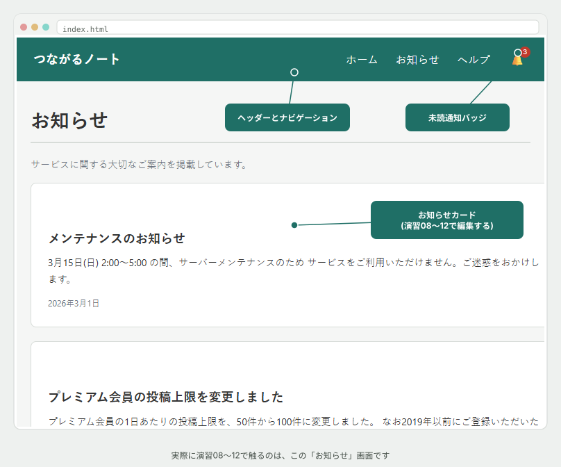

これは `samples/index.html` と `samples/style.css` が組み立てている、**お知らせ一覧の画面**です。演習01〜07ではこのページの一部を、演習08〜12では前任者から引き継いだ保守担当としてこのページ全体を触ります。

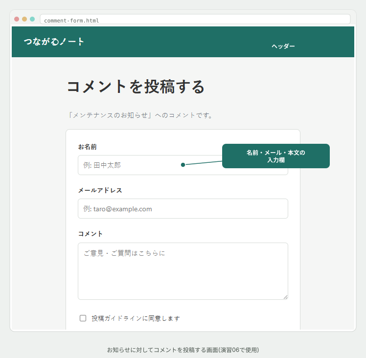

こちらは `samples/comment-form.html` が組み立てている、**コメント投稿画面**です。演習06で使います。

**今はまだ、この2枚がどうやって組み立てられているか分からなくて大丈夫です。** これから順番に、部品の作り方を学んでいきます。

## HTMLとCSSの役割分担

Webページは、性質の違う2つの言語でできています。

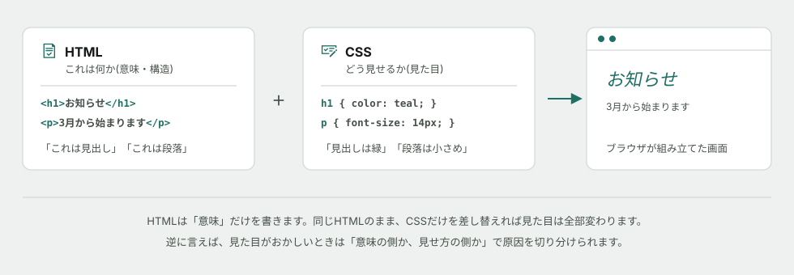

*図: HTMLは「意味」だけを書き、見た目はCSSが全部持ちます。*

- <mark>HTML</mark> — 「これは見出し」「これは段落」「これはリンク」という**意味と構造**を書く
- <mark>CSS</mark> — 「見出しは緑で大きく」「段落は小さめに」という**見せ方**を書く

**なぜ分けるのか。** 同じHTMLのまま、CSSだけ差し替えれば見た目を丸ごと変えられるからです。逆に見た目を変えるたびにHTMLを書き直していたら、ページが100枚あったとき100枚とも直すことになります。

そしてこの分離は、**不具合の切り分けにそのまま使えます。** 「文字が出ない」なら意味の側(HTML)、「文字は出ているが見えない」なら見せ方の側(CSS)です。

## HTMLの部品 — 要素の形

HTMLはタグだらけに見えますが、部品は4種類しかありません。

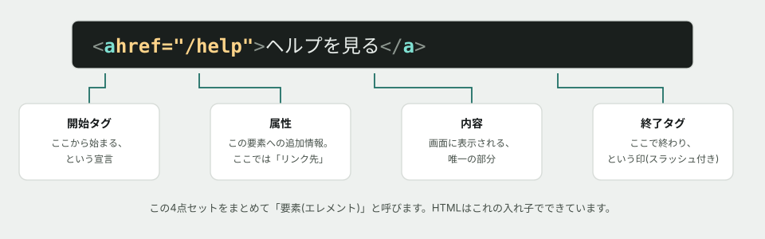

*図: この4点セットをまとめて<mark>要素</mark>と呼びます。*

**画面に表示されるのは「内容」だけです。** タグそのものは表示されません。タグは「この文字は見出しですよ」とブラウザに教えるための印です。

<mark>属性</mark>は、その要素への追加情報です。よく使うものは限られています。

| 属性 | 意味 | 例 |
|---|---|---|
| `href` | リンク先 | `<a href="/help">` |
| `src` | 画像などの読み込み元 | `` |
| `class` | この要素につける名札。**CSSから狙い撃つために使う** | `<p class="notice">` |
| `id` | ページ内で1つだけの名札 | `<h1 id="main-title">` |

**`class` が最重要です。** CSSを当てる手段の大半がこれになります。

## 入れ子が「木」を作る — DOM

要素は入れ子にできます。そして**ブラウザは、その入れ子を木の形として頭の中に持ちます。** これを <mark>DOM</mark>(Document Object Model)と呼びます。

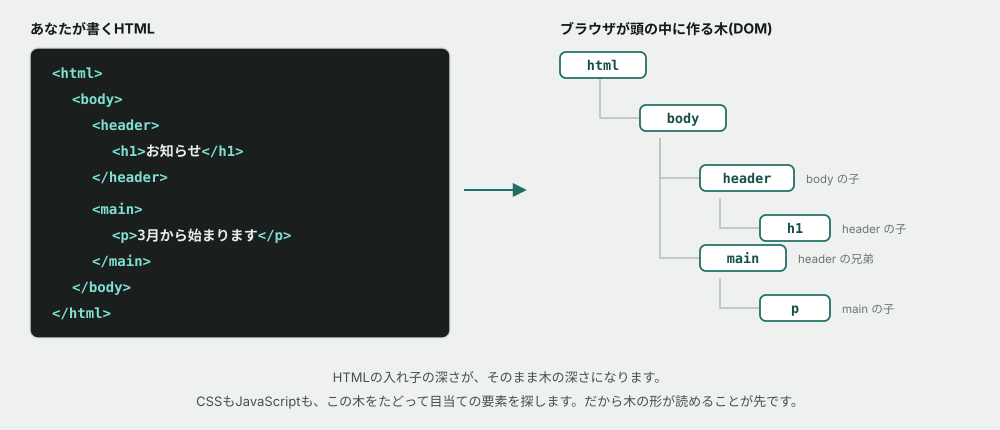

*図: 入れ子の深さが、そのまま木の深さになります。*

木なので、要素同士には**親子・兄弟**という関係があります。この言葉はこの先ずっと使います。

- **親** — 自分を囲んでいる要素
- **子** — 自分が囲んでいる要素
- **兄弟** — 同じ親を持つ、隣の要素

**なぜ木の形を意識するのか。** CSSもJavaScriptも、この木をたどって目当ての要素を探すからです。木の形が読めないと、「なぜこの指定がこの要素に効いているのか」が永久に分かりません。

> [!NOTE]
> **コラム: HTMLファイルとDOMは別物です** — HTMLファイルは「最初の設計図」で、DOMは「今の状態」です。JavaScriptが後から要素を足したり消したりすると、**HTMLファイルには何も書かれていないのに、DOMには存在する**という状態になります。開発者ツールが見せるのは常に後者(今の状態)です。この違いは、本編で必ず引っかかるポイントです。

## CSSの当て方 — セレクタ

CSSは「**どの要素に**」「**何を**」の2つで書きます。この「どの要素に」の部分を<mark>セレクタ</mark>と呼びます。

```css
.notice {          /* ← セレクタ: class="notice" の要素すべて */
  color: teal;     /* ← 何を: 文字色を teal に */
  font-size: 16px;
}
```

| セレクタ | 意味 |
|---|---|
| `p` | すべての `<p>` 要素 |
| `.notice` | `class="notice"` がついた要素(**ドットで始める**) |
| `#main-title` | `id="main-title"` の要素(**シャープで始める**) |
| `.card p` | `.card` の**中にある**すべての `<p>`(半角スペースは「子孫」の意味) |

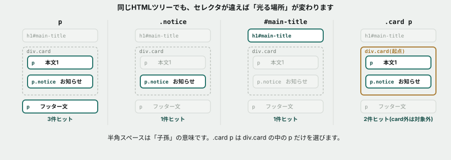

*図: **同じツリーでも、セレクタが違えば「光る場所」が変わります。** `.card p` だけが、`.card` の外にある `<p>` を対象から外します。*

**実務ではほぼ `class` を使います。** `id` はページ内で1つしか使えず、後から上書きしづらいためです。

## ボックスモデル — すべての要素は箱である

CSSでいちばん躓くのがここです。**画面上のあらゆる要素は、4層の箱でできています。**

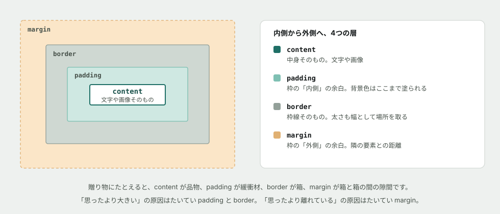

*図: 内側から content → padding → border → margin。*

覚え方は**贈り物**です。品物(content)を緩衝材(padding)で包み、箱(border)に入れ、箱と箱の間に隙間(margin)を空ける。

| 症状 | だいたいの犯人 |
|---|---|
| 思ったより**大きい** | `padding` か `border`(幅に加算されるため) |
| 隣と**離れすぎ／近すぎ** | `margin` |
| 背景色が**思ったより広く塗られる** | `padding`(背景は padding まで塗られる) |

**この表を暗記する必要はありません。** 開発者ツールがこの図をそのまま実測値つきで表示してくれるので、見て判断できます。

## なぜCSSが効かないのか — 詳細度

初学者が最も時間を溶かすのがここです。**CSSを書いたのに効かない。** 原因のほとんどは1つです。

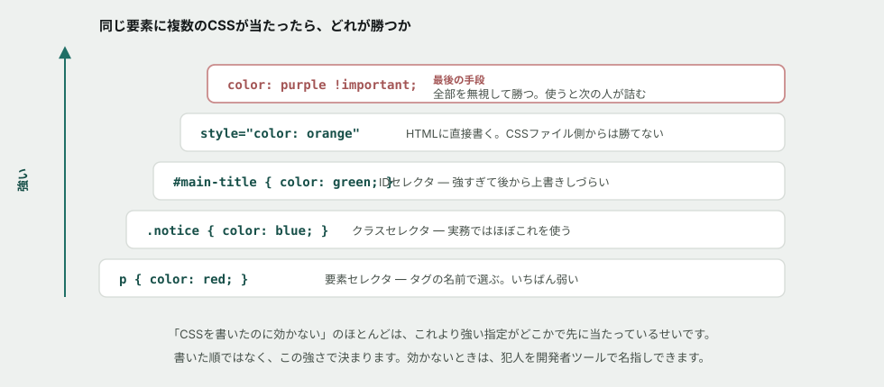

*図: 勝ち負けは、書いた順ではなく**指定の強さ(詳細度)**で決まります。*

つまり、こういうことが起きます。

```css
h1 { color: red; }        /* 弱い */
.notice { color: blue; }  /* 強い → こちらが勝つ */
```

`h1` のほうを後に書いても、`.notice` が勝ちます。**「後に書いたほうが勝つ」は、強さが同じときだけのルールです。**

> [!WARNING]
> **`!important` は使わないでください。** 目の前の問題は解決しますが、次にそのCSSを直す人(たいてい半年後の自分)が、何をしても上書きできなくなります。**現場で `!important` が並んでいるCSSファイルは、過去の誰かが原因を調べずに力ずくで解決した跡です。** 保守改修フェーズで、あなたはこれに出会います。

## 開発者ツール — ブラウザの中を見る唯一の窓

**このトピックで一番大事なのはここです。** タグを覚えることではありません。

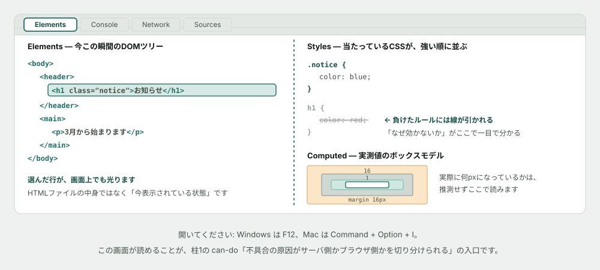

*図: 負けたCSSには打ち消し線が引かれます。**「なぜ効かないか」を推測せず、名指しで確認できます。***

開き方:

| OS | キー |
|---|---|
| Windows | `F12`(または `Ctrl + Shift + I`) |
| macOS | `Command + Option + I` |

最初に覚えるパネルは2つだけです。

| パネル | 何が見えるか |
|---|---|
| **Elements** | 今この瞬間のDOM。要素をクリックすると、画面上の該当箇所が光る |
| **Styles** | 選んだ要素に当たっているCSSが、**強い順**に並ぶ。負けたものには打ち消し線 |

**推測をやめて、見る。** これがこのトピックで身につけてほしい態度です。「たぶん margin が効いていない」ではなく、「Computed に margin: 0 と出ているから効いていない」と言えるようになってください。

> [!NOTE]
> **コラム: 開発者ツールで書き換えても、ファイルは変わりません** — Elements パネルの値は、その場で編集して結果を確認できます。ただし変更されるのは「今の表示」だけで、**リロードすれば元に戻ります。** これは欠点ではなく利点です。**壊す心配なしに、いくらでも試せる**ということだからです。

---

**ここまでが「概念」の話です。** ここから先は、実際にページを触ります。

## Flexbox — 横に並べる

CSSの既定は「上から下に積む」です。**横に並べたい**とき、あるいは「均等に間隔を空けたい」ときに使うのが <mark>Flexbox</mark> です。

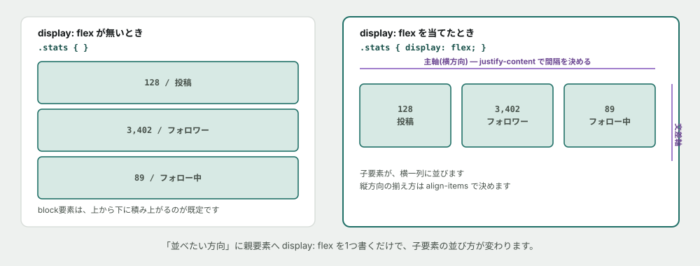

*図: 親要素に `display: flex` を1つ書くだけで、子要素の並び方が変わります。**並べる方向を主軸**と呼びます。*

```css
.stats {
  display: flex;              /* 子要素を横に並べる */
  justify-content: space-between; /* 主軸方向の間隔 */
  align-items: center;        /* 交差軸(縦)の位置 */
  gap: 16px;                  /* 要素同士の隙間 */
}
```

| プロパティ | やること |
|---|---|
| `display: flex` | 子要素を横並びにする、Flexboxの起点 |
| `justify-content` | 主軸(横)方向の並べ方。`space-between` `center` など |
| `align-items` | 交差軸(縦)方向の並べ方 |
| `gap` | 要素同士の隙間。`margin` を1個ずつ書かなくてよい |
| `flex-wrap: wrap` | 入りきらないとき、折り返す |

**すでにこのページの `.site-header` が Flexbox で組まれています。** ロゴとナビゲーションを横に並べているのがそれです。開発者ツールで確認してみてください。

## レスポンシブ対応 — 画面幅で出し分ける

コラム「[なぜWebページは崩れるのか](../columns/why-layouts-break.md)」で見た通り、**同じCSSが、画面の幅によっては破綻します。** これを直す仕組みが <mark>メディアクエリ</mark> です。

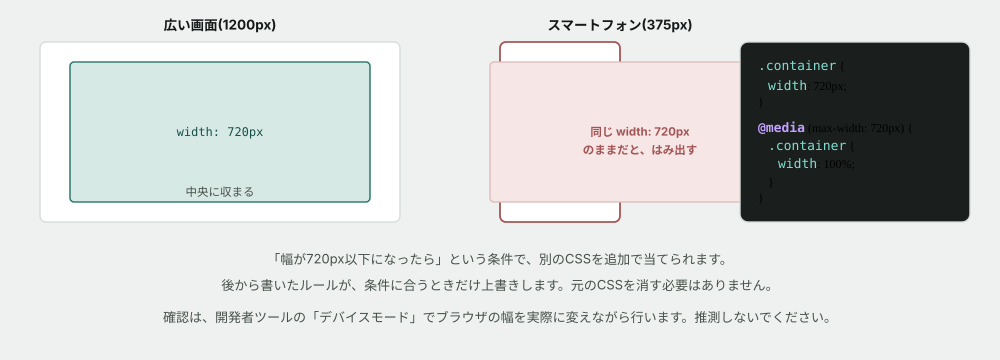

*図: 「幅が◯◯px以下になったら」という条件で、**元のCSSの上に追加のCSSを重ねます。** 元のCSSを消す必要はありません。*

```css
.container {
  width: 720px;
}

@media (max-width: 720px) {
  .container {
    width: 100%;
  }
}
```

**`@media (max-width: 720px)` は「画面の幅が720px以下のときだけ、この中身を適用する」という意味です。** 中に書いたCSSは、条件に合う画面でだけ、通常のCSSの上から追加で当たります。

> [!TIP]
> 確認は、開発者ツールの**デバイスモード**(スマートフォン表示に切り替える機能)を使います。**推測せず、実際に幅を変えて見てください。** ボタンの位置はブラウザによって違いますが、たいていツールバーの左上にあります。

## フォーム — 入力を受け取る部品

ユーザーからの入力を受け取るときに使うのが<mark>フォーム</mark>です。

| タグ | 意味 |
|---|---|
| `<form>` | 入力欄をまとめる入れ物 |
| `<label for="id名">` | その入力欄の名札。**`for` 属性で、対応する入力欄の `id` を指す** |
| `<input type="text">` | 1行のテキスト入力 |
| `<input type="email">` | メールアドレス用。形式が違うとブラウザが警告してくれる |
| `<input type="checkbox">` | チェックボックス |
| `<textarea>` | 複数行のテキスト入力 |
| `<button type="submit">` | 送信ボタン |

**`<label>` の `for` 属性が、地味ですが非常に重要です。** 正しく `id` と結びついていると、**ラベルの文字をクリックしただけで、入力欄にカーソルが移動します。** マウス操作が難しい人にとっては、これが無いとクリックできる範囲が極端に狭くなります。

> [!IMPORTANT]
> **送信ボタンは、必ず `<button>` タグ(または `<input type="submit">`)を使ってください。** `<div>` に見た目だけボタンらしいCSSを当てても、**キーボードの `Tab` で選べず、`Enter` でも送信されません。** HTML/CSS基礎の最初に出てきた「意味のあるタグを選ぶ理由」が、ここで実際の不具合として現れます。


*図: **どちらも「見た目は同じなのに、キーボード操作だけできない」という同じ形の不具合です。** マウスだけで確認すると見逃します。*

## positionの基準点 — z-indexを疑う前に

`position: absolute` を指定した要素は、**画面のどこかに勝手に浮くわけではありません。** 「どこを基準に位置を決めるか」を、**祖先(親・親の親…)をさかのぼって探します。**

探し方には決まりがあります。**直近にある「`position` が `static`(初期値)以外の祖先」が基準になります。** `relative` `absolute` `fixed` `sticky` のどれかが指定されていれば、そこで探索は止まります。**見つかるまでは、どこまでも上にさかのぼり続けます。**

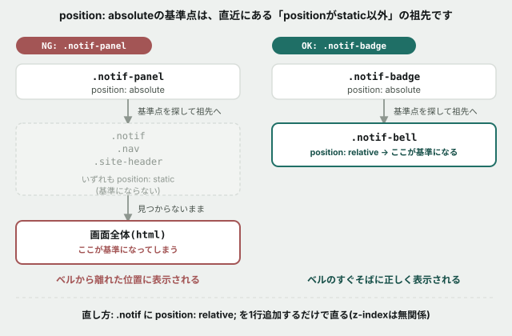

*図: **祖先を1つずつさかのぼり、最初に条件を満たした場所で止まります。** どの祖先にも指定が無いと、探索は画面全体(初期包含ブロック)まで進んでしまいます。*

> [!IMPORTANT]
> **`z-index` は、この基準点が正しく揃っている前提で「どちらを手前に出すか」を決めるだけです。** 基準点そのものがズレていたら、`z-index` をいくら足しても位置は直りません。「重なる順番がおかしい」と「そもそも置かれる場所が違う」は、似ているようで別の問題です。演習07で、この違いを実際に確認します。

## 演習を始める前に — 題材のページ

演習では `samples/` にある小さなページを使います。

```
cd curriculum/03-html-css-basics/samples
```

`index.html` をブラウザで開いてください(ファイルをダブルクリックするだけで開きます)。**サーバーは要りません。** このページには、実務でよく見る崩れ方を意図的に仕込んであります。

## もっと知りたい人へ

**読まなくても演習は完了できます。** 興味が湧いたときにどうぞ。

- [なぜWebページは「崩れる」のか](../columns/why-layouts-break.md) — 紙とWebの決定的な違いの話
- [クラウドとは何か](../columns/what-is-cloud.md) — このHTMLが最終的にどこに置かれるのか

AIへの質問例:

- 「`display: block` と `display: inline` の違いを、文章の中の単語と段落に例えて説明して」
- 「HTMLに `<div>` ばかり使うのがなぜ良くないとされるのか、アクセシビリティの観点から教えて」

## この教材の進め方

演習は GitHub Issue として1つずつ配られます。各 Issue には手順のチェックリストと、いくつかの「予測してから実行する」課題が入っています。**このREADMEを読み終えたら、下の表の順番通りに1→12と進めてください。**

演習01〜07は、それぞれ独立したCSSの概念を扱う演習です。**演習08からは違います。** 同じ「つながるノート」のお知らせページを、前任者から引き継いだ保守担当という設定で、**08〜12の5つを通して同じページを触り続けます。**

| 順番 | 演習 | 内容 | 目安時間 |
|---|---|---|---|
| 1 | [開発者ツールでページを解剖する](exercises/01-inspect-with-devtools.md) | Elements と Styles を読む。まだ1文字も書かない | 40〜60分 |
| 2 | [ボックスモデルを崩して、直す](exercises/02-box-model.md) | padding・margin・border を自分で動かす | 60〜90分 |
| 3 | [CSSが効かない原因を突き止める](exercises/03-why-css-not-applied.md) | 詳細度の犯人を名指しする | 60〜90分 |
| 4 | [Flexboxで組む](exercises/04-flexbox.md) | 統計とタグ一覧を、横並び・折り返しで組む | 60〜90分 |
| 5 | [レスポンシブ対応 — スマートフォンで壊す、直す](exercises/05-responsive.md) | メディアクエリで、幅ごとにCSSを出し分ける | 45〜60分 |
| 6 | [フォームの、見えない不具合を見つける](exercises/06-forms.md) | ラベルの紐付けと、キーボード操作を確認する | 45〜60分 |
| 7 | [positionを読み解く — 通知パネルが迷子になる](exercises/07-position-and-z-index.md) | z-indexを疑う前に、position の基準点を確かめる | 45〜60分 |
| 8 | [NEWバッジをつけたら、ヘッダーに飛んでいった](exercises/08-badge-position.md) | position:absoluteを自分で組み立てる側に回る | 60〜90分 |
| 9 | [直したら、他のカードまで変わった](exercises/09-shared-class-ripple.md) | 共有クラスを直接変える怖さと、専用クラスでの対処 | 60〜90分 |
| 10 | [1つのカードだけ、CSSが効かない](exercises/10-inline-style-blocks-fix.md) | インラインスタイルの強さと、詳細度の階段の続き | 45〜60分 |
| 11 | [カードを2列にしたのに、スマホでも2列のまま](exercises/11-grid-and-source-order.md) | CSS Gridの導入と、詳細度が同じときのソース順序 | 75〜100分 |
| 12 | [このページの説明書を、初めて書く](exercises/12-write-the-readme.md) | クラスの役割とCSSの決まりごとを、次の人のために書く | 60〜90分 |

このREADME自体の読了に45〜55分ほど見ています。**上の12個で合計12〜17時間程度**です。

> [!NOTE]
> **このトピックには合計26時間の枠があります。** 演習を終えてなお時間があれば、講師と相談のうえで追加の題材(自分でページを組む課題など)に進みます。

> [!NOTE]
> この時間はまだ実測していない見積もりです。詰まって時間がかかっても、それ自体が確かめたい情報なので気にしないでください。

進め方のルール:

1. **変更を加える前に、画面がどう変わるかを Issue のコメントに書く**(当たっていなくてよい)
2. 実際に変更し、結果を貼る(スクリーンショットでも構いません)
3. 予測と結果が違っていたら、なぜ違ったかを一言書く
4. チェックリストをすべて満たしたら Issue を Close する

Closeするかどうかの判断は自分に任されています。承認を待つ必要はありません。ただし**講師は、Closeされた Issue のコメントに後から目を通します。** 一度で完璧である必要はなく、つまずいた形跡も含めて記録として残ることに意味があります。

**なぜ「予測してから実行」なのか**: このトピックでは特に効きます。CSSは**当てずっぽうでも、いつか偶然直ってしまう**からです。偶然直ると、何が原因だったのか分からないまま次に進むことになり、同じ問題に何度もぶつかります。先に予測を書いておけば、**偶然と理解を自分で区別できます。**

> [!IMPORTANT]
> **演習の予測・回答をAIに考えさせる／書かせるのは禁止です。** 一方で、**分からない用語や概念をAIに聞いて調べるのは自由**です。「予測してから実行する」の予測は、必ず自分の頭で考えてください。

ここでの目的はプロパティ名を「知っている」ことではなく、「なぜ今こう表示されているかを自分の言葉で説明できる」ことです。分からないときは、AIに聞く前に開発者ツールを開いてください。答えは大抵そこに表示されています。
