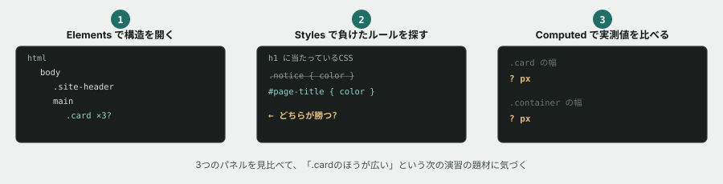

# 01. 開発者ツールでページを解剖する

## 目的

**この演習では、コードを1文字も書きません。** 開発者ツールで「今、画面がどう組み立てられているか」を読むことだけをやります。

保守改修の第一歩は、直すことではなく**現状を正確に把握すること**です。書く前に読む。この順序を最初に体に入れます。

## 準備

`curriculum/03-html-css-basics/samples/index.html` を、ブラウザでそのまま開いてください(ファイルをダブルクリック)。

開発者ツールを開きます。

| OS | キー |
|---|---|
| Windows | `F12`(または `Ctrl + Shift + I`) |
| macOS | `Command + Option + I` |

## 手順

### Elements パネルを読む

- [ ] Elements パネルで、DOMツリーの一番外側から順に開いていく。`html` → `body` → その下に何があるかをコメントに書く
- [ ] ツリーの中の要素にマウスを乗せると、画面上の該当箇所が光ります。**「メンテナンスのお知らせ」の見出しがどの要素か**を突き止め、そのタグ名と `class` をコメントに貼る
- [ ] **`.card` は全部でいくつありますか。** 数える前に予測してコメントし、それから数える
- [ ] `.card-important` がついているのはどのカードか。**なぜそのカードだけ左に線が入っているのか**を、Styles パネルを見て説明する

### Styles パネルを読む

- [ ] 「お知らせ」という大見出し(`h1`)をクリックして選ぶ
- [ ] **Styles パネルに、この要素に当たっているCSSがいくつ並んでいるか**を数えてコメントに書く
- [ ] そのうち **打ち消し線が引かれているものがあるか**を確認する。あれば、どのプロパティが負けているかを貼る
- [ ] 一番下の「パスワードの再設定」カードの日付(`2026年1月9日`)をクリックして選ぶ
- [ ] **この日付の文字色は、どこで決まっていますか。** Styles パネルの表示をそのまま貼って、1行で説明する

### Computed(実測値)を読む

- [ ] `.card` のどれか1つを選び、Computed タブ(または Styles パネル下部)のボックスモデル図を見る
- [ ] **その `.card` の実際の幅は何pxですか。** 数字をコメントに貼る
- [ ] `.container` を選び、**その幅は何pxですか。** 数字を貼る
- [ ] **この2つの数字を見比べて、気づいたことを書いてください**(これが次の演習の題材になります)

### 壊してみる

開発者ツールで値を書き換えても、**ファイルは変わりません。リロードすれば元に戻ります。** 安心して壊してください。

- [ ] Styles パネルで `.site-header` の `background` を、好きな色に書き換えてみる。画面が変わることを確認する
- [ ] ページをリロードして、**元に戻ることを確認する**
- [ ] Elements パネルで、カードのどれか1つを選んで `Delete` キーで消してみる。画面から消えることを確認し、リロードで戻す

## 予測のヒント

「`.card` はいくつあるか」は、画面を見れば数えられます。**先に画面を見て数え、それから Elements で確認してください。** ズレていたら、それ自体が発見です。

Styles パネルに並ぶルールは**強い順**です。上にあるほど強い。教材本文の「詳細度」の図をもう一度見てから読むと、並び順の意味が分かります。

## 考えてみてほしいこと

以下は Issue のコメントに書いてください。

1. 日付の色を、CSSファイルの `.card-meta` を書き換えて変えようとしたら、**うまくいくカードといかないカードが出ます。** なぜだと思いますか(まだ試さなくて構いません。予想だけ書いてください)
2. Elements パネルに表示されているものは、`index.html` の中身と**完全に同じですか。** 違うとしたら、どういうときに違いが生まれると思いますか
3. この演習で、**推測ではなく「見て確かめた」ことは何でしたか。** 1つ挙げてください

## 完了条件

チェックリストがすべて埋まり、数字や貼り付けが具体的であること。「考えてみてほしいこと」への回答も1〜2行で書かれていること。**この演習でCSSファイルを保存・編集する必要はありません。**
