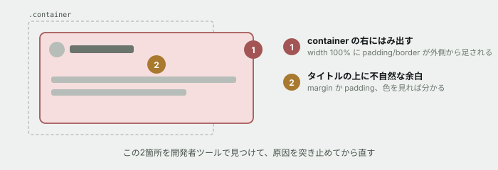

# 02. ボックスモデルを崩して、直す

## 目的

前の演習で見つけた「`.card` の幅が `.container` より広い」という現象の原因を突き止め、直す。あわせて `padding` `margin` `border` が実際にどう効くかを、自分の手で動かして確かめる。

**このページには、実務でよく見る崩れ方が3つ仕込まれています。** 全部見つけて直してください。

## 準備

`curriculum/03-html-css-basics/samples/` の `index.html` をブラウザで開き、`style.css` をエディタで開いてください。

CSSファイルを保存したら、**ブラウザをリロードすると反映されます。**

> [!TIP]
> 直接ファイルを編集する前に、**まず開発者ツールで値を書き換えて試してください。** 正しい値が分かってからファイルに書くほうが、圧倒的に速く、そして安全です。これは実務でも同じ手順です。

## 手順

### 崩れ1 — カードが container からはみ出す

- [ ] `.card` を選び、Computed のボックスモデル図で **content の幅 / padding / border** の数字をそれぞれ貼る
- [ ] `.container` の幅も貼る
- [ ] **なぜ `.card` のほうが広くなるのか**を、貼った数字を使って計算式で説明する(例: `◯◯ + ◯◯ × 2 + ◯◯ × 2 = ◯◯`)
- [ ] `.card` に `box-sizing: border-box;` を**開発者ツールで**追加してみる。幅がどうなるか確認して、結果を書く
- [ ] 直ったら、`style.css` にも同じ1行を書いて保存し、リロードして確認する

### 崩れ2 — カードの上に妙な余白がある

- [ ] カードのタイトルと、カードの上辺の間に、不自然な隙間があります。**開発者ツールでどの要素の余白が原因かを突き止めてください**(margin は開発者ツールでオレンジ色に表示されます)
- [ ] 犯人のセレクタとプロパティをコメントに貼る
- [ ] **その値を 0 にすると何が起きるか予測してから**、開発者ツールで 0 にして確認する
- [ ] `style.css` を直して保存し、リロードして確認する

### 崩れ3 — 自分で仕込んで、自分で直す

ここからは、あなたが壊す側になります。**`style.css` を直接編集してください。**

- [ ] `.card` の `padding: 24px` を `padding: 4px` に変えて保存し、リロードする。**見た目がどう変わったか**を書く
- [ ] 元に戻す
- [ ] `.card` の `margin-bottom: 20px` を `margin-bottom: 0` に変えて保存し、リロードする。**カード同士がどうなったか**を書く
- [ ] 元に戻す
- [ ] `.card` の `border: 1px solid #d7dcd8` を `border: 20px solid #d7dcd8` に変えて保存する。**カードの幅は変わりましたか。** `box-sizing` を入れる前と後で、答えが変わることを確認する
- [ ] 元に戻す

## 予測のヒント

崩れ1は、**足し算です。** `width: 100%` は「content の幅を100%にする」という意味であって、「箱全体を100%にする」ではありません。そこに `padding` と `border` が外側から足されます。

崩れ2は、**margin と padding のどちらか**です。開発者ツールのボックスモデル図は、margin をオレンジ、padding を緑で塗り分けています。**色を見れば、どちらかは考えなくても分かります。**

## 考えてみてほしいこと

以下は Issue のコメントに書いてください。

1. `box-sizing: border-box` は、なぜ**最初からそうなっていない**のだと思いますか(調べてもAIに聞いても構いません。ただし自分の言葉でまとめてください)
2. 崩れ2の原因になっていた値は、**なぜ最初から入っていたのだと思いますか。** 「前任者が何を意図して書いたか」を想像して書いてください(正解はありません)
3. 崩れ3で `padding: 4px` にしたとき、**読みやすさはどう変わりましたか。** 余白は「無駄なスペース」ではなく何のためにあるか、一言で書いてください

## 完了条件

崩れ1と崩れ2が `style.css` 上で直っていて、リロードしても崩れないこと。原因の説明が、推測ではなく**開発者ツールで見た数字**に基づいていること。
