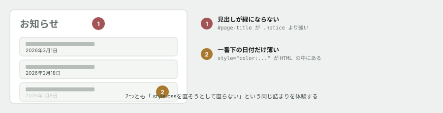

# 03. CSSが効かない原因を突き止める

## 目的

**入門フェーズで最も再現性の高い「詰まり」を、意図的に体験してもらいます。**

CSSを書いたのに効かない。この状況で当てずっぽうに値をいじり続けると、いつか偶然直ります。**偶然直ると、何が原因だったか分からないまま次に進むことになり、同じ問題に何度もぶつかります。**

この演習のゴールは直すことではなく、**犯人を名指しできること**です。

## 依頼(ここから、あなたは保守担当です)

> お疲れさまです。お知らせページの件で2点お願いします。
>
> 1. 大見出しの「お知らせ」を、ヘッダーと同じ緑(`#1f6f66`)にしてください
> 2. 一番下のカードの日付だけ、他のカードより色が薄くて読みにくいという指摘がありました。他と揃えてください
>
> よろしくお願いします。

## 手順

### 依頼1 — 大見出しを緑にする

- [ ] `style.css` の一番下に `.notice { color: #1f6f66; }` があります。**`index.html` を見ると、大見出しには `class="notice"` がついています。** ということは、この見出しはすでに緑になっているはずです。**なぜ緑になっていないのか、予測をコメントに書く**
- [ ] `.notice` の色を、`red` など分かりやすい色に変えて保存し、リロードする。**画面はどうなりましたか**
- [ ] 開発者ツールで大見出しを選び、Styles パネルを見る。**`.notice` の `color` に打ち消し線が引かれていますか。** スクリーンショットか、読み取った内容をコメントに貼る
- [ ] **勝っているルールのセレクタは何ですか。** 名前をコメントに書く
- [ ] **なぜそちらが勝つのか**を、教材本文の詳細度の図を使って1〜2行で説明する
- [ ] `.notice` を元に戻し、**正しい場所を直して**依頼1を完了させる

### 依頼2 — 日付の色を揃える

- [ ] `style.css` の `.card-meta` の `color` を、分かりやすい色(`blue` など)に変えて保存し、リロードする
- [ ] **3枚のカードのうち、何枚の日付の色が変わりましたか**
- [ ] 変わらなかったカードの日付を開発者ツールで選び、Styles パネルの**一番上に何が表示されているか**を貼る
- [ ] **この指定はどこに書かれていますか。** `style.css` の中を探しても見つかりません。**どこを探せば見つかるか**を突き止めて、コメントに書く
- [ ] `.card-meta` を元に戻し、**正しい場所を直して**依頼2を完了させる

### 最後に

- [ ] 2つの依頼が両方とも完了していることを、リロードして確認する
- [ ] **今回、2回とも「CSSファイルを直そうとして直らなかった」わけですが、共通する教訓は何ですか。** 1〜2行で書く

## 予測のヒント

**両方とも、原因は「別のもっと強い指定が先に勝っている」です。** ただし勝っている相手の種類が違います。

1つ目は CSSファイルの中にいます。2つ目は **CSSファイルの中にいません。** 「CSSはCSSファイルにしか書けない」という思い込みがあると、永久に見つかりません。**開発者ツールが、どのファイルの何行目かまで教えてくれます。**

## 考えてみてほしいこと

以下は Issue のコメントに書いてください。

1. 依頼1の犯人は、`style.css` の中でコメント付きで書かれていました。**そのコメントを読んで、書いた人が何を意図していたか**を想像して書いてください。その意図は間違っていましたか
2. 依頼2のような書き方(HTMLに直接スタイルを書く)は、**なぜ実務で嫌われるのだ**と思いますか
3. `!important` を使えば、今回の2つとも一瞬で解決します。**それでも使ってはいけない理由**を、あなたの言葉で書いてください
4. `style.css` の末尾に、コメントアウトされた `.headline` というルールが残っています。**これは消すべきだと思いますか、残すべきだと思いますか。** 理由も書いてください(正解はありません。判断とその根拠を見ています)

## 完了条件

2つの依頼が `style.css`(または `index.html`)上で正しく直っていて、リロードしても正しく表示されること。**そして、なぜ最初のやり方では直らなかったのかが、自分の言葉で説明されていること。** 後者のほうが重要です。
