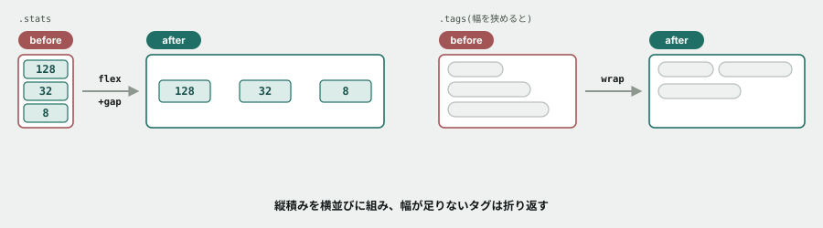

# 04. Flexboxで組む

## 目的

「上から下に積む」しか知らない状態から抜け出し、**横に並べる・均等に間隔を空ける**を自分の手でやる。

## 準備

`curriculum/03-html-css-basics/samples/` の `index.html` をブラウザで開き、`style.css` をエディタで開いてください。**ページの一番下までスクロールしてください。** 「統計」と「タグ一覧」が、今は縦に積み上がっているはずです。

## 手順

### 統計を横に並べる

- [ ] 開発者ツールで `.stats` を選び、Elements パネルで**子要素が何個あるか**を確認する
- [ ] `style.css` の `.stats` に `display: flex;` を1行だけ足して保存し、リロードする。**何が変わったか**を書く
- [ ] 3つの数字ボックスの間に、隙間がありません。`gap: 16px;` を足して保存し、リロードする
- [ ] **右側にだけ、大きな空きがありませんか。** これは既定(`justify-content: flex-start`)が「左に寄せる」だからです
- [ ] `justify-content: space-between;` を足して保存し、リロードする。**空きの位置がどう変わったか**を書く

### タグを折り返して並べる

- [ ] `.tags` に `display: flex;` だけを足して保存し、リロードする。**タグはどうなりましたか**
- [ ] ブラウザの幅を狭めてみる(ウィンドウを縮める、または開発者ツールのデバイスモード)。**何が起きますか**
- [ ] `flex-wrap: wrap;` を足して、同じように幅を狭めて確認する。**さっきと何が違いますか**
- [ ] `gap: 8px;` を足して、タグ同士の間隔を整える

### 元からある例を読む

- [ ] `.site-header` の CSS を読む。`display: flex;` に加えて、どんなプロパティが使われていますか
- [ ] `justify-content: space-between;` を一時的に `justify-content: center;` に変えてみて、ロゴとナビゲーションの位置がどう変わるか確認する
- [ ] 元(`space-between`)に戻す

## 予測のヒント

`display: flex;` だけでは、**間隔は自動で空きません。** 「横に並べる」と「間隔を空ける」は別の指定です。この2つを混同すると、「flexにしたのに詰まって見える」で詰まります。

`flex-wrap` を書かないと、Flexboxは**無理やり1行に収めようとします。** 幅が足りないとき何が起きるか、自分の目で確認してください。

## 考えてみてほしいこと

以下は Issue のコメントに書いてください。

1. `justify-content: space-between` と `justify-content: center` で、見た目はどう変わりましたか。**それぞれ、どんな場面で使うのが向いていると思いますか**
2. `flex-wrap: wrap` が無いとき、タグはどうなりましたか。**もし本番のタグ一覧で `flex-wrap` を忘れていたら、どんな不具合として報告されると思いますか**
3. `.stats` と `.tags` で、同じ `display: flex` でも `flex-wrap` の要不要が違いました。**何が違いを生んでいると思いますか**(ヒント: 子要素の数と、1つあたりの幅)

## 完了条件

`.stats` が横並びで均等な間隔になっていること。`.tags` が折り返して表示され、幅を狭めても壊れないこと。両方とも `style.css` に保存されていること。
