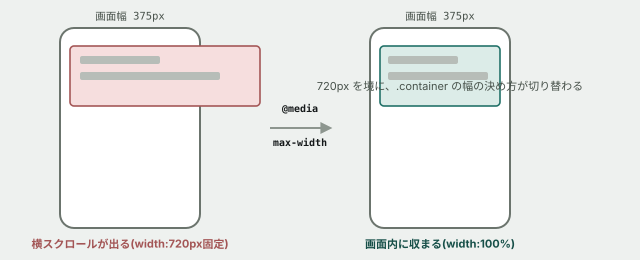

# 05. レスポンシブ対応 — スマートフォンで壊す、直す



## 目的

コラム「[なぜWebページは崩れるのか](../../columns/why-layouts-break.md)」で読んだ「型4 — 画面幅の想定が違った」を、自分の手で再現し、メディアクエリで直す。

## 準備

`index.html` をブラウザで開き、開発者ツールを開いてください。**デバイスモード**(スマートフォン表示に切り替える機能)に切り替えます。多くのブラウザでは、開発者ツールのツールバー左上に、スマートフォンとタブレットのアイコンがあります。

## 手順

### 壊れているのを見る

- [ ] デバイスモードで、幅を **375px**(iPhoneの標準的な幅)に設定する
- [ ] ページ全体を見て、**何がおかしいか**を1つ以上見つけてコメントに書く(横スクロールが出る、文字が窮屈、など)
- [ ] 開発者ツールで `.container` を選び、Computed タブで**実際の幅が何pxになっているか**を確認する
- [ ] 画面の幅(375px)と、`.container` の幅を見比べる。**何pxはみ出していますか**

### 原因を`style.css`で確認する

- [ ] `.container` の CSS を探して貼る
- [ ] **`width: 720px;` が、画面幅を無視して固定されていること**を確認する

### メディアクエリで直す

- [ ] `style.css` の `.container` のルールのすぐ後に、次を追加する(**先に、これがどう効くと思うか予測してコメントする**)

```css
@media (max-width: 720px) {
  .container {
    width: 100%;
  }
}
```

- [ ] 保存してリロードし、幅375pxでの見た目を確認する。**横スクロールは消えましたか**
- [ ] デバイスモードの幅を、375px → 600px → 800px → 1200px と変えながら確認する。**720pxを境に何が切り替わるか**を書く

### 演習04で作ったFlexboxも、狭い画面で確認する

- [ ] `.stats`(統計)を、幅375pxで確認する。**3つの数字は、まだ横に並んでいますか。読みやすいですか**
- [ ] 読みにくいと感じた場合、`@media (max-width: 720px)` の中に `.stats { flex-direction: column; }` を追加してみる(`flex-direction` は主軸の向きを変えるプロパティです)
- [ ] 保存してリロードし、狭い画面で `.stats` が縦に積み直されることを確認する

## 予測のヒント

`@media (max-width: 720px)` は、**画面の幅が720px「以下」のときだけ**中身が効きます。境界の720pxちょうどでどちらが勝つか気になった人は、実際に720pxぴったりに合わせて試してみてください。

`.container` を直しても、`.stats` は自動では直りません。**メディアクエリは、指定したセレクタにしか効きません。** 狭い画面で崩れる場所ごとに、追加で書く必要があります。

## 考えてみてほしいこと

以下は Issue のコメントに書いてください。

1. `width: 720px` を最初から `width: 100%; max-width: 720px;` と書いておけば、メディアクエリなしでも375pxで壊れなかったはずです。**それでも、この演習で「メディアクエリで直す」方法を学ぶ意味は何だと思いますか**(ヒント: 本編で触るのは、あなたが最初から書くコードではなく、他人がすでに書いたコードです)
2. `flex-direction: column` を追加する前と後で、**情報の伝わりやすさはどう変わりましたか**
3. 「スマートフォンで見ると崩れる」という報告を受けたとき、**あなたなら最初に何を確認しますか**(この演習の手順を振り返って書いてください)

## 完了条件

`.container` が幅375pxで横スクロールを起こさないこと。`.stats` が狭い画面で縦積みに切り替わること。両方の変更が `style.css` に保存されていること。
