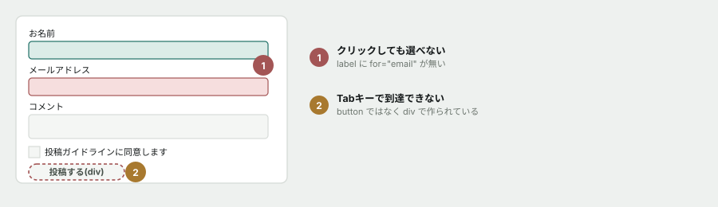
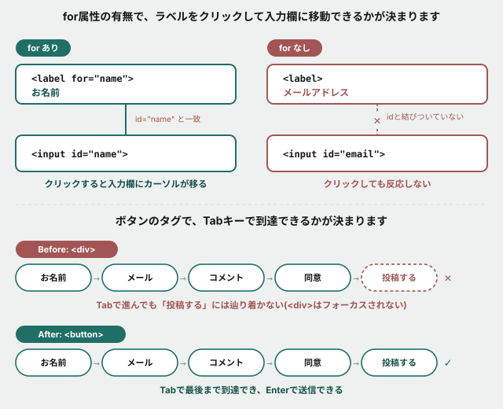

# 06. フォームの、見えない不具合を見つける

## 目的

「見た目は正しいのに、使いにくい」フォームを直す。**マウスとキーボードの両方で操作して、初めて気づける不具合**を体験します。

## 状況(ここから、あなたは保守担当です)

> お疲れさまです。コメント投稿フォームの件です。
>
> 「メールアドレスの入力欄をクリックしようとしたのに、うまく選べないことがある」
> 「キーボードだけで投稿しようとしたら、送信ボタンにたどり着けない」
>
> という問い合わせが来ています。確認をお願いします。

## 準備

`curriculum/03-html-css-basics/samples/comment-form.html` をブラウザで開いてください。

## 手順

### 不具合1を再現する — ラベルが効かない

- [ ] 「お名前」という**文字そのもの**をクリックしてみる。カーソルが入力欄に移動しますか
- [ ] 「メールアドレス」という**文字そのもの**をクリックしてみる。カーソルは入力欄に移動しますか。**さっきと違いがありましたか**
- [ ] 開発者ツールで、「お名前」の `<label>` を選び、`for` 属性が何を指しているか確認する
- [ ] 「メールアドレス」の `<label>` も同じように確認する。**`for` 属性はありますか**
- [ ] `comment-form.html` を開き、`<label>メールアドレス</label>` の行を見つける。**何が足りないか**をコメントに書く

### 不具合1を直す

- [ ] `<label>` に `for="email"` を追加する(お名前のラベルの書き方を参考にしてください)
- [ ] 保存してリロードし、「メールアドレス」の文字をクリックして、カーソルが移動することを確認する

### 不具合2を再現する — キーボードで届かない

- [ ] ページの何もない場所をクリックしてから、**マウスに触れず** `Tab` キーだけを繰り返し押す
- [ ] フォーカス(今どこが選ばれているか、青い枠などで分かります)が、**お名前 → メールアドレス → コメント → 同意チェックボックス**の順に進むことを確認する
- [ ] さらに `Tab` を押す。**「投稿する」ボタンにフォーカスは移りますか**
- [ ] 開発者ツールで「投稿する」の要素を選ぶ。**タグ名は何ですか**(`<button>` だと思っていたら、違うかもしれません)

### 不具合2を直す

- [ ] `comment-form.html` の `
投稿する
` を、`<button type="submit" class="submit-button">投稿する</button>` に書き換える
- [ ] 保存してリロードし、`Tab` で「投稿する」にフォーカスが移ることを確認する
- [ ] フォーカスした状態で `Enter` キーを押す。**何が起きますか**(何も起きなくて構いません。フォームの送信先が無いためです)
- [ ] 見た目が変わっていないことも確認する(`class="submit-button"` を残したので、CSSはそのまま効くはずです)

## 予測のヒント

不具合1は、`for` と `id` が**文字列として一致しているかどうか**だけの問題です。目で見ても分かりません。開発者ツールで `for` の値と `id` の値を、実際に見比べてください。

不具合2は、**`
` に見た目だけボタンらしいCSSを当てても、ブラウザは「これはボタンだ」とは思わない**ということです。HTML/CSS基礎の最初に出てきた「HTMLは意味、CSSは見た目」を、逆側から体験する演習です。

## 考えてみてほしいこと

以下は Issue のコメントに書いてください。

1. マウスだけでこのフォームを試したら、不具合2に気づけたと思いますか。**この不具合が「見つかりにくい」理由は何だと思いますか**
2. `
` に `onclick` のようなJavaScriptを書き足せば、クリックでは動くボタンが作れます。**それでも `<button>` を使うべき理由は何だと思いますか**
3. このフォームには、まだ他にも改善できる点があるかもしれません。**気づいたことがあれば1つ書いてください**(正解はありません)

## 完了条件

「メールアドレス」のラベルをクリックすると入力欄にカーソルが移ること。`Tab` キーだけで「投稿する」ボタンまで到達できること。両方が `comment-form.html` に保存されていること。
