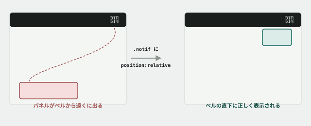

# 07. position を読み解く — 通知パネルが迷子になる

## 目的

「重なる順番がおかしい」と「そもそも置かれる場所が違う」は、似ているようで別の問題です。この演習では、**`position` の基準点(どこを起点に位置が決まるか)** を読み、`z-index` を疑う前に確かめるべきことを体験します。

## 状況(ここから、あなたは保守担当です)

> お疲れさまです。ヘッダーに通知ベルを追加したのですが、通知一覧を開くと、ベルの近くではなく画面の思ってもみない場所に表示されてしまいます。直してもらえますか。

## 準備

`curriculum/03-html-css-basics/samples/index.html` をブラウザで開いてください。ヘッダー右側に🔔(ベル)アイコンが追加されています。

## 手順

### 不具合を再現する

- [ ] ベルアイコンにカーソルを合わせる(または `Tab` キーでフォーカスする)。通知パネルが開きます。**パネルはどこに表示されましたか。** ベルのすぐ下ではないはずです
- [ ] 開発者ツールで `.notif-badge`(ベルの右上にある赤い未読件数)を選ぶ。**これは正しい位置(ベルの右上)に表示されていますか**
- [ ] 開発者ツールで `.notif-panel` を選び、Styles パネルで `position` の値を確認する

### 予測する

- [ ] **この見た目のズレは `z-index` の問題だと思いますか、それとも別の理由だと思いますか。** 理由も添えてコメントに書く(まだ直さないでください)

### 試してみる

- [ ] 試しに `.notif-panel` へ `z-index: 999;` を1行追加して保存・リロードする。**パネルの位置は直りましたか**
- [ ] 直っていなければ、その `z-index: 999;` はいったん削除する(不要な変更を残さないため)

### 原因を突き止める

- [ ] 開発者ツールで `.notif-panel` を選んだまま、DOMツリーを祖先方向(親・親の親…)にたどる。それぞれの祖先要素の `position` を Styles / Computed で確認する
- [ ] **`position: absolute` の要素は、直近にある「`position` が `static` 以外の祖先」を基準に位置が決まります。** `.notif-panel` の祖先(`.notif` → `.nav` → `.site-header` …)の中に、その条件を満たす要素はありますか
- [ ] `style.css` を開き、`.notif` のルールを見つける。**`position` の指定はありますか**

### 直す

- [ ] `.notif` のルールに `position: relative;` を1行追加する
- [ ] 保存してリロードし、通知パネルがベルの直下(右寄せ)に正しく表示されることを確認する

## 予測のヒント

`z-index` は「同じ基準点の上で、どちらを手前に表示するか」を決めるだけです。**基準点そのものがズレていたら、`z-index` をいくら足しても位置は直りません。** 今回、`.notif-panel` は `.notif` の中に置かれているつもりでも、CSSの上では `.notif` がその基準になっていませんでした。

## 考えてみてほしいこと

以下は Issue のコメントに書いてください。

1. 手順「試してみる」で `z-index: 999` を足しても位置は直らなかったはずです。**なぜ `z-index` は今回の直接の原因ではなかったのか**を自分の言葉で説明してください
2. 教材冒頭に「AIは『`z-index` が効いていません』と自信満々に答える」という一文がありました。**今回のケースでAIにそう言われたら、あなたはどう検証しますか**
3. `.notif-badge`(未読件数のバッジ)は最初から正しい位置に表示されていました。**`.notif-panel` と何が違ったから**だと思いますか(ヒント: バッジの親である `.notif-bell` の `position` を確認してください)

## 完了条件

通知パネルがベルの直下(右寄せ)に正しく表示され、`.notif` に追加した `position: relative;` だけで直っていること(`z-index` の追加は残っていないこと)。
