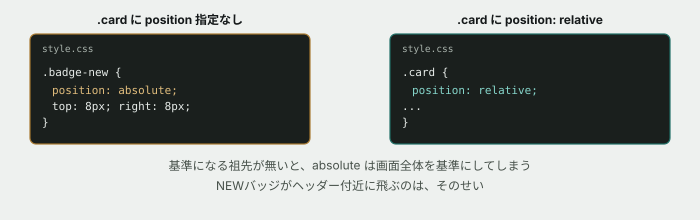

# 08. NEWバッジをつけたら、ヘッダーに飛んでいった

## 目的

演習07で学んだ「`position: absolute` は、直近の `position` 指定祖先を基準にする」を、**今度は自分で組み立てる側**として使います。読み解くのと、最初から正しく作るのは別の力です。

## 状況(ここから、あなたは保守担当です)

> 一番新しいお知らせに、目立つように「NEW」のバッジをつけてほしいです。カードの右上あたりでお願いします。

## 準備

`curriculum/03-html-css-basics/samples/index.html` と `style.css` を開いてください。1枚目のカード(「メンテナンスのお知らせ」)が対象です。

## 手順

### まず素朴に作ってみる

- [ ] `index.html` の1枚目の `<section class="card">` の中、`<h2 class="card-title">` の直前に `NEW` を追加する
- [ ] `style.css` に `.badge-new` のルールを追加する。**`position: absolute; top: 8px; right: 8px;` を使ってください**(色や形は自由)
- [ ] 保存してブラウザで開く。**バッジはどこに表示されましたか**

### 予測する

- [ ] おそらく狙った場所(カードの右上)には出ていないはずです。**なぜだと思いますか。** 演習07の内容を思い出しながら、コメントに書いてください(まだ直さないでください)

### 原因を確かめる

- [ ] 開発者ツールで `.badge-new` を選び、DOMツリーを祖先方向にたどる。`.card` → `.container` → `<main>` … それぞれの `position` を確認する
- [ ] `style.css` の `.card` のルールを見つける。**`position` の指定はありますか**
- [ ] `position: absolute` の要素は、直近にある「`position` が `static` 以外の祖先」を基準にします。**今回、その条件を満たす祖先はどこにもありませんでした。** その場合、基準点はどこになりますか(演習07の `.notif-panel` が最初にそうなったのと同じ状況です)

### 直す

- [ ] **直す前に予測する。** `.card` に何を1行足せば直ると思いますか
- [ ] `.card` のルールに `position: relative;` を追加する
- [ ] 保存してリロードし、バッジがカードの右上に正しく表示されることを確認する

## 予測のヒント

演習07では「パネルが迷子になる」不具合を**直す側**でした。今回は逆に、**あなたが `position: absolute` を使った時点で、この問題を作り込む側に回っています。** `absolute` を書くたびに、「この要素の基準点は今どこか」を自分で確認する癖をつけてください。

基準点が見つからないとき、探索は祖先を上へ上へとたどり続け、最終的に**画面全体**(初期包含ブロック)を基準にします。**ヘッダーの近くにバッジが表示されたのは、偶然ではありません。** 画面右上を基準に `top: 8px; right: 8px;` を計算した結果です。

## 考えてみてほしいこと

以下は Issue のコメントに書いてください。

1. `position: absolute` を使う要素を書くとき、**もう1つ確認すべきことは何ですか。** 今回の経験から、自分なりのチェック手順を書いてください
2. `.card` に `position: relative;` を足したことで、**見た目が変わった場所は他にありますか。** 変わっていないとしたら、それはなぜだと思いますか(ヒント: `relative` は「基準点になる」以外の見た目への影響がほとんどありません)
3. もし2枚目・3枚目のカードにも同じバッジをつけるとしたら、**`.card` に足した `position: relative;` は、そのときも役に立ちますか**

## 完了条件

- 1枚目のカードの右上に「NEW」バッジが正しく表示されていること
- `.card` に追加した `position: relative;` 以外、不要な変更が残っていないこと
- なぜ最初は画面の思わぬ場所に飛んだのかを、自分の言葉で説明できていること
