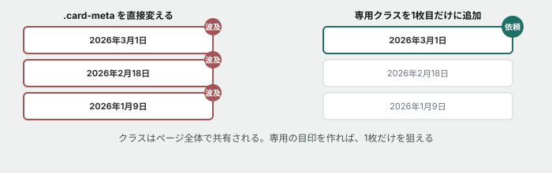

# 09. 直したら、他のカードまで変わった



## 目的

**CSSのクラスは、ページ全体で共有されています。** 1箇所を直したつもりが、同じクラスを使っている他の場所すべてに変化が及ぶ — これはCSSの保守で最もよく起きる事故です。今日はそれを実際に踏み、正しい直し方を身につけます。

## 状況(ここから、あなたは保守担当です)

> 一番上の「メンテナンスのお知らせ」、大事な内容なので**日付をもう少し目立たせたい**です。太字で、濃い色にしてもらえますか。

対象は1枚目のカードの日付(`2026年3月1日`)**だけ**です。

## 準備

`curriculum/03-html-css-basics/samples/index.html` と `style.css` を開いてください。3枚のカードそれぞれに日付が表示されています。

## 手順

### まず素直に直す

- [ ] `style.css` で、日付を表示しているクラスを見つける(`index.html` で日付の `<p>` タグに何というクラスがついているか確認してください)
- [ ] そのクラスのルールに `font-weight: bold;` と、濃い色(例: `color: #333333;`)を**直接追加する**
- [ ] 保存してブラウザで確認する。**1枚目の日付は狙いどおり目立つようになったはずです**

### 依頼していない場所を確認する

**ここで止まらないでください。**

- [ ] 2枚目・3枚目のカードの日付も見てください。**何か変わっていますか**
- [ ] `index.html` を開き、日付を表示している `<p class="card-meta">` が**いくつありますか**。`grep` を使うと早く数えられます

```
grep -n "card-meta" index.html
```

- [ ] 依頼されていないのに変わってしまった箇所があれば、それを貼る

### 直し方をやり直す

- [ ] さっき `.card-meta` に直接足した `font-weight: bold;` と `color` の変更を取り消す(元の見た目に戻す)
- [ ] 代わりに、**新しいクラス**(例: `.card-meta-highlight`)を作り、`font-weight: bold;` と `color` はそちらに書く
- [ ] `index.html` の1枚目のカードの日付だけに、そのクラスを**追加で**つける(`class="card-meta card-meta-highlight"` のように、スペース区切りで2つ書けます)
- [ ] 保存して確認し、1枚目だけ目立っていて、2枚目・3枚目は元のままであることを確認する

## 予測のヒント

`.card-meta` は、**3枚のカードすべてから同じクラスを共有されています。** `.card-meta` のルールを直接書き換えるということは、「この見た目を使っている全員」に影響することと同じです。1枚目だけを直したいなら、**1枚目だけが持つ目印(クラス)を新しく用意する**必要があります。

これは演習03で見た「詳細度」の話ではありません。**詳細度は「どちらが勝つか」の話で、今回の問題は「そもそも同じ的を狙ってしまっている」ことです。** 同じクラスを直接変えれば、そのクラスを使う全員に同じ変化が起きるのは当然の挙動であって、CSSの不具合ではありません。

## 考えてみてほしいこと

以下は Issue のコメントに書いてください。

1. **最初の直し方で、なぜ2枚目・3枚目まで変わってしまったのですか。** 自分の言葉で説明してください
2. `grep` で `.card-meta` の使用箇所を数える**前**に、いくつあるか予測できていましたか
3. **もし将来、4枚目のカードが追加されて、そこにも `card-meta` がついていたら**、あなたが今日作った `.card-meta-highlight` は、そのカードにどう影響しますか(ヒント: 何もクラスをつけなければ影響しません)
4. 「共有されているものを直接変えていいとき」と「新しく専用のクラスを用意すべきとき」、**その判断はどう考えればよいと思いますか**

## 完了条件

- 1枚目のカードの日付だけが太字・濃い色になっていること
- 2枚目・3枚目のカードの日付が、最初の見た目のままであること
- なぜ最初の直し方だと他のカードまで変わってしまったのかを、自分の言葉で説明できていること
