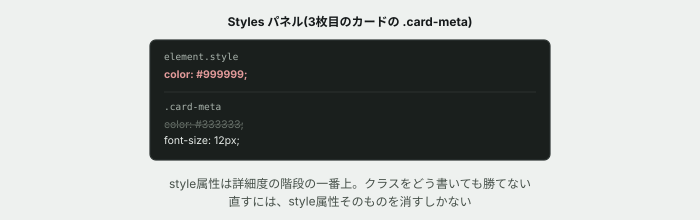

# 10. 1つのカードだけ、CSSが効かない

## 目的

演習03で「CSSが効かない原因は、たいてい詳細度」と学びました。今日はその中でも**最強の相手** — `style="..."` として要素に直接書かれたスタイルを扱います。クラスをどれだけ工夫しても、これには勝てません。

## 状況(ここから、あなたは保守担当です)

> お知らせの日付、ちょっと薄くて読みにくいという声がありました。**全部のカードで**、もう少し濃くしてもらえますか。

今回は**3枚すべて**が対象です。演習09と違って、共有クラスを直接直すのが正しい選択になります。

## 準備

`curriculum/03-html-css-basics/samples/index.html` と `style.css` を開いてください。

## 手順

### 直す

- [ ] `style.css` で `.card-meta` の `color` を、もっと濃い色(例: `#333333`)に変更する
- [ ] 保存してブラウザで確認する。**3枚とも濃くなりましたか**

### 直っていないカードを見つける

- [ ] 3枚のカードを見比べてください。**1枚だけ、まだ薄いままのカードがあるはずです。** どれですか
- [ ] 開発者ツールでそのカードの日付(`.card-meta`)を選び、Styles パネルを見る。**`.card-meta` のルールで指定した色は、勝っていますか、負けていますか**(打ち消し線が付いているかを確認)
- [ ] Styles パネルの一番上に、**`style` という見出しの行**があるはずです。何が書かれていますか

### 原因を確かめる

- [ ] `index.html` を開き、そのカードの `
` タグを見てください。**`class` 以外に、何か書かれていますか**
- [ ] 演習03で見た詳細度の階段を思い出してください。**`class` のルールと、要素に直接書かれた `style`、どちらが強いですか**

### 直す(続き)

- [ ] **直す前に予測する。** どうすれば直ると思いますか
- [ ] `index.html` から、そのカードの `style="..."` の部分を削除する
- [ ] 保存してリロードし、3枚とも同じ濃さになっていることを確認する

> [!WARNING]
> **`!important` を使って上書きしようとしないでください。** 目の前の問題は消えますが、README冒頭で触れた通り、次にこのCSSを直す人が二度と上書きできなくなります。正しい対処は「強さで殴り返す」ことではなく、**そもそも `style="..."` を書かないことです。**

## 予測のヒント

`class` を使ったCSSのルールは、**詳細度で比べられます。** ところが要素に直接書く `style="..."` は、**詳細度の比較にすら入りません。** ほぼどんなクラスのルールよりも強く勝ちます。演習03の詳細度の階段でいうと、一番上の段より、さらに上にあるものだと考えてください。

だからこそ、**`style="..."` を安易に使ってはいけません。** 後から来た人がCSSファイルをどれだけ丁寧に直しても、そこだけは絶対に上書きできないからです。

## 考えてみてほしいこと

以下は Issue のコメントに書いてください。

1. Styles パネルで、`.card-meta` のルールに打ち消し線が付いていました。**これは「間違っている」という意味ですか、それとも別の意味ですか**
2. 演習09では「共有クラスを直接変えると、他の場所まで変わってしまう」と学びました。今回は逆に**「共有クラスを直接変えたのに、1箇所だけ変わらなかった」**という現象でした。この2つは矛盾していますか、それとも同じ理屈で説明できますか
3. `style="..."` が使われる場面を、あなたは今後どう扱いますか。**見つけたら必ず消すべきですか、それとも許容される場面もありますか**

## 完了条件

- 3枚のカードすべての日付が、同じ濃さで表示されていること
- `!important` を使わずに直せていること
- なぜその1枚だけ最初は直らなかったのかを、詳細度の言葉で説明できていること
