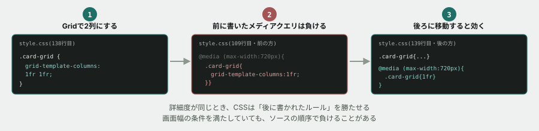

# 11. カードを2列にしたのに、スマホでも2列のまま



## 目的

新しい並べ方(<mark>CSS Grid</mark>)を導入します。それだけでなく、**「メディアクエリを書いたのに効かない」という、詳細度とは別の理由の不具合**を体験します。演習03で見た詳細度の話には、実は続きがあります。

## 状況(ここから、あなたは保守担当です)

> お知らせカードを、パソコンの広い画面では**2列**に並べてスペースを有効に使いたいです。スマートフォンでは今まで通り1列のままでお願いします。

## 準備

`curriculum/03-html-css-basics/samples/index.html` と `style.css` を開いてください。演習05までの内容(`.container` のメディアクエリ)が入っている前提で進めます。

<mark>CSS Grid</mark> は、Flexboxと同じく要素を並べるための仕組みです。`display: grid;` を親要素に指定し、`grid-template-columns` で「何列に、どんな幅で」割るかを書きます。

```css
.card-grid {
  display: grid;
  grid-template-columns: 1fr 1fr; /* 1fr は「余りを均等に分けた1つ分」 */
  gap: 20px;
}
```

## 手順

### Gridを導入する

- [ ] `index.html` で、3枚の `<section class="card">` 全体を `<div class="card-grid">` で囲む
- [ ] `style.css` に、上の `.card-grid` のルールを追加する
- [ ] 保存してブラウザで確認する。**カードは2列になりましたか**

### スマホ幅で確認する

- [ ] 開発者ツールのデバイスモードで、幅を **375px** にする。**2列のカードはどう見えますか。** 読みやすいですか

### メディアクエリを足す(が、効かない)

- [ ] **予測してください。** `.container` の既存のメディアクエリ(`@media (max-width: 720px) { ... }`)の中に、次を追加すると、375pxで1列に戻ると思いますか

```css
.card-grid {
  grid-template-columns: 1fr;
}
```

- [ ] 実際に、既存の `@media (max-width: 720px) { ... }` ブロックの中にこれを追加する(**`.container` や `.stats` の指定と同じブロックの中に書いてください**)
- [ ] 保存してリロードし、375pxで確認する。**1列に戻りましたか**

おそらく戻っていません。ここからが本題です。

### 原因を突き止める

- [ ] 開発者ツールで `.card-grid`(囲んだ `<div>`)を選び、Styles パネルを見る。**`grid-template-columns` の指定は何個ありますか。どちらに打ち消し線がついていますか**
- [ ] `style.css` の中で、`.card-grid { grid-template-columns: 1fr 1fr; ... }`(最初に書いたルール)と、`@media` の中の `.card-grid { grid-template-columns: 1fr; }` は、**どちらが下に書かれていますか**
- [ ] 演習03の詳細度の階段をもう一度見てください。**この2つのルールの詳細度は同じですか、違いますか**

## 予測のヒント

**詳細度が同じとき、CSSは「後に書かれたほう」を勝たせます。** これは演習03の `h1` と `.notice` の話で少し触れましたが、あのときは詳細度そのものが違いました。**今回は詳細度が完全に同じ(`.card-grid` というクラス1個)なので、勝敗は書かれた順序だけで決まります。**

問題は、**メディアクエリの中に書いた `.card-grid` が、通常の `.card-grid` より前に書かれていたことです。** 画面幅の条件を満たしていても、その後に「無条件の」`.card-grid { grid-template-columns: 1fr 1fr; }` が控えていて、そちらが後勝ちで上書きしてしまいます。

## 直す

- [ ] `@media (max-width: 720px) { ... }` の中に追加した `.card-grid { grid-template-columns: 1fr; }` を削除する
- [ ] 代わりに、**`.card-grid { grid-template-columns: 1fr 1fr; gap: 20px; }` のルールの直後**に、新しいメディアクエリを追加する

```css
@media (max-width: 720px) {
  .card-grid {
    grid-template-columns: 1fr;
  }
}
```

- [ ] 保存してリロードし、375pxで1列に、900px以上で2列になることを確認する

## 考えてみてほしいこと

以下は Issue のコメントに書いてください。

1. 「メディアクエリを書いたのに効かない」という症状に出会ったとき、**あなたはまず何を疑いますか。** 今日の経験を踏まえて書いてください
2. `.container` のメディアクエリは、`.container` の指定のすぐ後に書かれていたので問題が起きませんでした。**この教材の `style.css` のように、メディアクエリを各パーツの指定のすぐ後ろに書くやり方**と、**ファイルの一番下にメディアクエリを全部まとめて書くやり方**、それぞれの利点・欠点は何だと思いますか
3. 詳細度が同じ場合、CSSは「後に書かれたほう」を勝たせます。**これはCSSの設計として良いことだと思いますか、危険だと思いますか。** 理由も書いてください

## 完了条件

- パソコン幅(720px超)でカードが2列、スマートフォン幅(375px)で1列になること
- メディアクエリが `.card-grid` の通常ルールより**後**に書かれていること
- なぜ最初のメディアクエリが効かなかったのかを、詳細度ではなく「ソースの順序」の言葉で説明できていること
