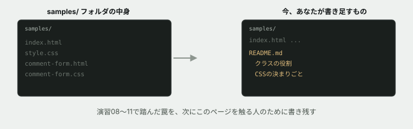

# 12. このページの説明書を、初めて書く

## 目的

演習07〜11で、あなたはこのページに何度も手を入れました。しかし**このページには、まだ説明書が1つもありません。** 次にこのページを触る人(あなた自身が半年後に見返す場合も含めて)のために、初めて書きます。

## 状況(ここから、あなたは保守担当です)

> ありがとうございました。ここまでいろいろ直していただいたので、**簡単な説明書を残しておいてもらえますか。** 次に誰が触ることになっても迷わないように。

## 準備

`curriculum/03-html-css-basics/samples/` フォルダを見てください。`index.html` と `style.css` はありますが、**説明書(README)はまだありません。**

## 手順

### 振り返る

- [ ] 演習07〜11のIssueを、上から順に読み返してください。**何を直し、何を新しく足しましたか**
- [ ] 特に、**あなたが今日までに踏んだ「見た目の罠」**を数え上げてください(例: `position: absolute` の基準点、共有クラスの波及、インラインスタイルの強さ、メディアクエリのソース順序)

### README.md を書く

`curriculum/03-html-css-basics/samples/README.md` を新しく作り、次の内容を書いてください。

- [ ] **このページが何か**(1〜2行でよい)
- [ ] **使われている主なクラスの一覧と役割** — `.card` `.card-meta` `.badge-new` `.card-grid` など、あなたが触ったものを中心に
- [ ] **CSSを書くときの決まりごと** — この演習を通して学んだことを、次の人への注意として書く。例:
  - `position: absolute` を使う要素の親には、`position: relative` を忘れずに
  - 共有クラスを直接変えず、専用のクラスを足す
  - `style="..."` は使わない
  - メディアクエリは対象のルールのすぐ後に書く
- [ ] **まだ残っている課題**があれば書く(なければ「特になし」で構いません。ただし、本当に無いか考えてから書いてください)

### 読み手を想像する

- [ ] 書き終えたら、**演習08を始める直前の自分**のつもりで読み返してください。**知りたかったことが書いてありますか**

## 予測のヒント

演習04のプログラミング基礎で「保守担当」を経験した人は覚えているかもしれませんが、**説明書は「使い方」だけでなく「踏んではいけない罠」を書いておくことに価値があります。** あなたが今日までに時間をかけて発見したことを、次の人は一瞬で知ることができます。

CSSの決まりごとを書くときは、**「なぜそうするのか」も1行添えてください。** ルールだけを並べると、状況が変わったときに応用が利きません。

## 考えてみてほしいこと

以下は Issue のコメントに書いてください。

1. 演習07〜11を通して、**最も時間がかかった(あるいは最も驚いた)不具合はどれでしたか。** なぜそう思いますか
2. 「CSSを書くときの決まりごと」として書いた項目のうち、**もしこの説明書が最初からあったら、避けられていた不具合はどれですか**
3. あなたが今日書いたREADMEは、**HTML/CSSを触ったことがない人が読んでも分かる内容ですか、それともある程度CSSを知っている前提ですか。** どちらを想定して書きましたか

## 完了条件

`samples/README.md` が新しく作られ、クラスの一覧・CSSの決まりごと・残っている課題が書かれていること。演習08を始める前の自分が読んでも迷わない内容になっていること。
