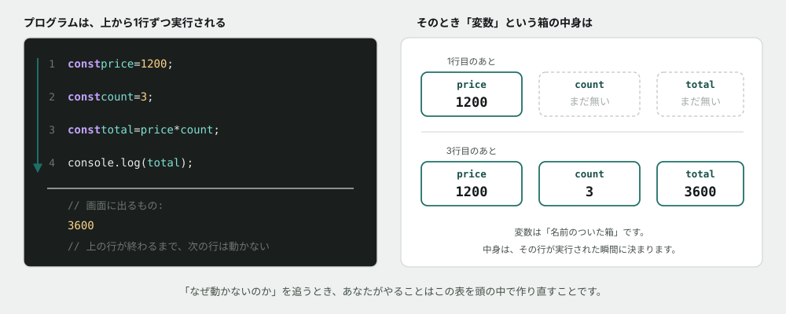
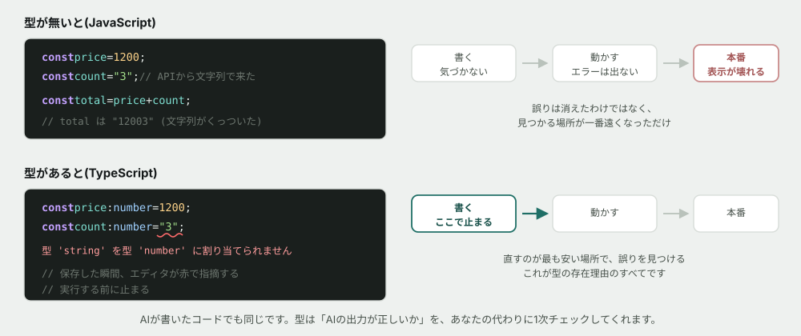
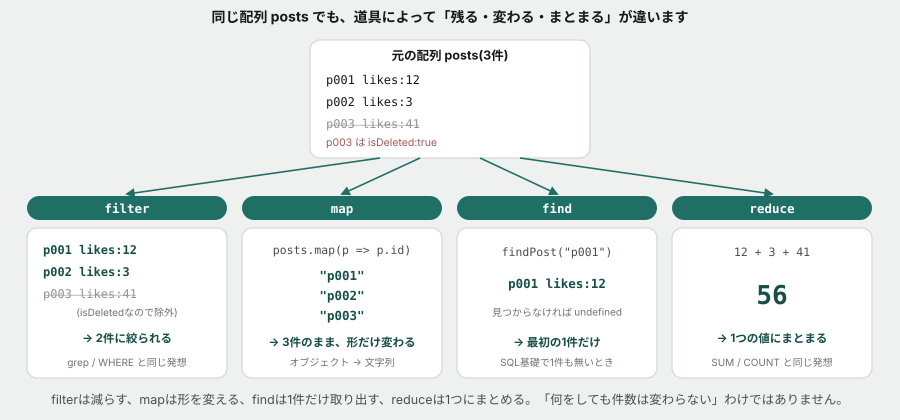
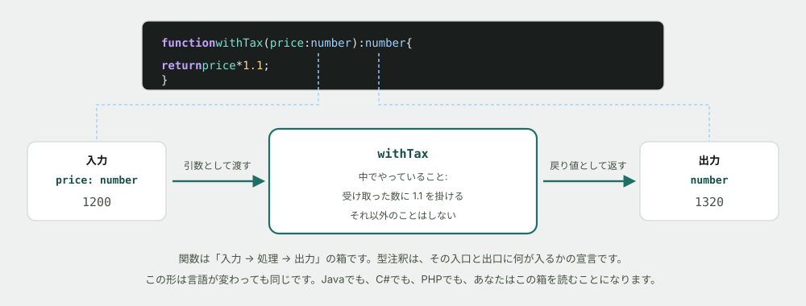
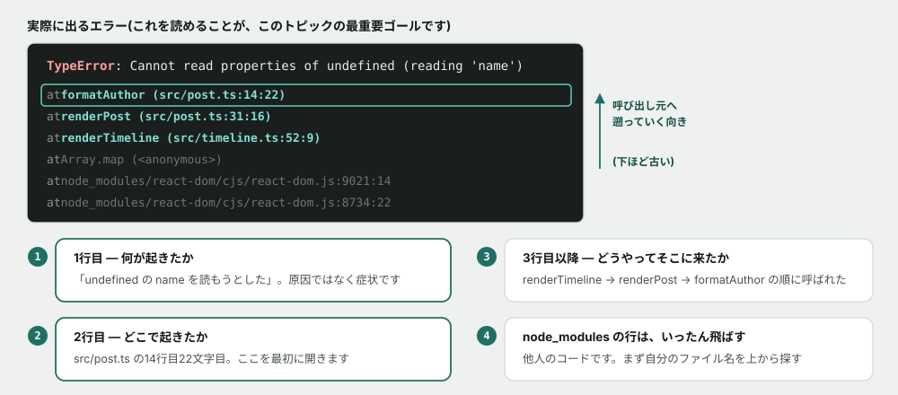
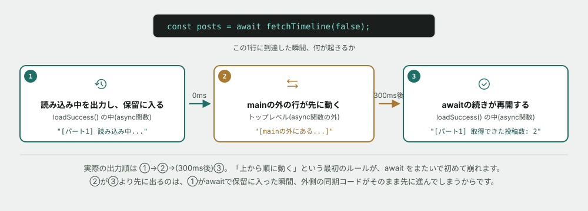
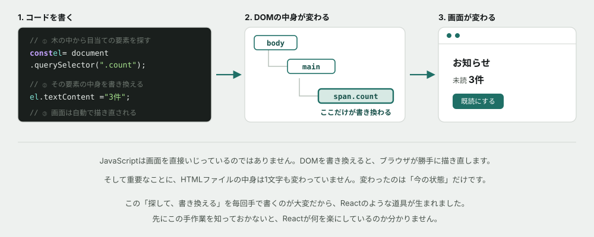
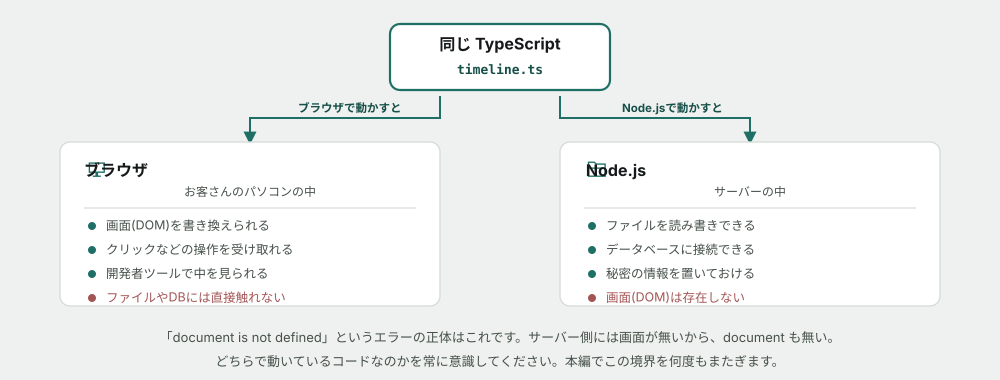

# プログラミング基礎(TypeScript)

## なぜこれを学ぶか

入門フェーズで**最も長い34時間**を割くトピックです。ここまでの3つ(コマンドライン・Git・HTML/CSS)は道具でしたが、ここからが**あなたが書く側に回る**部分になります。

使う言語は <mark>TypeScript</mark> です。

> [!NOTE]
> **「うちの現場はJavaなんだけど」と思った人へ** — その心配は正しく、そして解決済みです。
>
> このカリキュラムが約束しているのは「TypeScriptが書けるようになる」ことではなく、**配属先の言語が変わっても持ち越せるものを渡す**ことです。変数・型・条件分岐・繰り返し・関数・エラーの読み方・データの流れ — これらは**言語が変わっても同じ**です。TypeScriptは、それを学ぶための素材にすぎません。
>
> 実際、入門フェーズ108時間のうち**64時間は最初から言語に依存しません**(コマンドライン・Git・HTML/CSS・HTTP・SQL)。言語に依存するのは、このトピックだけです。

## このトピックのゴール

**書けるようになることより、読めるようになることを優先します。**

保守改修の現場で最初にやる仕事は、他人が書いたコードを読んで「今どういう順番で何が起きているか」を追うことです。書くのは、そのあとです。

具体的には、以下ができる状態を目指します。

| できること | なぜ必要か |
|---|---|
| コードを目で追って、実行順と変数の中身を説明できる | 保守の第一歩がこれ |
| **エラーメッセージとスタックトレースを読んで、最初に開くファイルを決められる** | 現場で最も頻繁に使う技術 |
| 型が何を守ってくれているかを説明できる | AIの出力を検証する第一の道具 |
| 関数を「入力→処理→出力」として読める | 言語が変わっても通用する |

> [!TIP]
> 読んでいて分からない言葉が出てきたら、AIに聞いて構いません。禁止しているのは、後半の演習(Issue)で自分の予測や回答をAIに考えさせることだけです。詳しくは末尾の「この教材の進め方」を参照してください。
>
> 構文を忘れたときは [早見表(チートシート)](cheatsheet.md) も使ってください。

## コードの見た目を先に読めるようにする

ここから先、コードが本格的に出てきます。**先に、コードの「見た目」だけ読めるようにしておきます。** 意味の深いところは後の節で説明するので、ここでは「これは何の記号か」が分かれば十分です。

**コメント** — `//` から行末までは、プログラムに一切影響しません。人間が読むためのメモです。

```typescript
// これはコメントです。プログラムは読み飛ばします。
console.log("これは実行されます");
```

**`console.log(...)`** — カッコの中身を画面に表示するだけの命令です。この教材のサンプルコードは、ほぼ全部この出力を読む形で進みます。

**`()` と `{}`** — `()` 丸括弧は「何を渡すか」を書く場所(`console.log("こんにちは")` の `("こんにちは")` が渡す中身)。`{}` 波括弧は「ひとまとまりの処理」を囲む場所で、中に何行あっても1つのまとまりとして扱われます。

```typescript
if (true) {
  console.log("1行目");
  console.log("2行目");
}
```

**演算子** — `+` `-` `*` `/` は四則演算、`===` は「等しいか」を確かめる比較です。

> [!WARNING]
> **`=`(1つ)は代入、`===`(3つ)は比較です。** 見た目が近く、初学者が最もよく踏む罠です。`x = 3` は「xに3を代入する」、`x === 3` は「xが3かどうか確かめる」で、まったく別の意味です。

**配列** — `[]` で囲むと、複数の値を順番に並べて持てます。

```typescript
const names = ["田中", "佐藤", "鈴木"];

console.log(names[0]);      // "田中"(数え始めは0番目から)
console.log(names.length);  // 3(件数)
```

**ここまでの5つ(コメント・`console.log`・`()`/`{}`・演算子・配列)が読めれば、この先のコードは形として追えます。** `const`/`let`の使い分けや型といった意味の深い部分は、この後の節で1つずつ説明していきます。

## プログラムは上から順に動く

まずここからです。**プログラムは、書いてある順に、1行ずつ実行されます。** 上の行が終わるまで、下の行は動きません。

そして実行の途中で、<mark>変数</mark>という「名前のついた箱」に値を入れていきます。



*図: 「今、何行目まで進んでいて、どの箱に何が入っているか」— これがプログラムの状態です。*

**この図を頭の中で作れることが、デバッグそのものです。** 「なぜ動かないのか」を追うとき、あなたがやるのは結局これです。「3行目の時点で `count` に何が入っているはずか」を考え、実際に何が入っているかを確かめる。ズレたところが原因です。

変数の作り方は2つあります。

| 書き方 | 意味 |
|---|---|
| `const` | **後から中身を変えない**箱。**まずこちらを使う** |
| `let` | 後から中身を変える箱 |

**迷ったら `const` です。** 変わらないと分かっている箱が多いほど、コードを読むときに考えることが減ります。「この値、どこかで書き換わっているかも」と疑わなくて済むからです。

## 型 — このトピックの中心

<mark>型</mark>とは、「この箱には数値しか入りません」「この箱には文字列しか入りません」という宣言です。

なぜそんな面倒なことをするのか。**間違いを、直すのが一番安い場所で見つけるため**です。



*図: 型が無くても誤りは消えません。**見つかる場所が、一番遠くなるだけ**です。*

よく使う型は5つだけです。

| 型 | 入るもの | 例 |
|---|---|---|
| `number` | 数値(整数も小数も同じ) | `1200`, `1.1` |
| `string` | 文字列 | `"こんにちは"` |
| `boolean` | 真か偽か | `true`, `false` |
| `配列` | 同じ型が並んだもの | `number[]`, `string[]` |
| `オブジェクト` | 名前つきの値の集まり | `{ name: string; age: number }` |

> [!IMPORTANT]
> **型は、AIの出力を検証する最初の道具です。**
>
> AIにコードを書かせると、たいてい動くものが出てきます。ただし**あなたが意図したものとは限りません。** 型があると、AIが返した値の形が想定と違うだけで、実行する前にエディタが赤くしてくれます。これは柱3(AIの出力を検証できる)の、最も安上がりな実現方法です。

## 条件分岐と繰り返し

コードが「上から順」だけでは、同じことしかできません。分岐と繰り返しで、初めて役に立ちます。

```typescript
// 条件分岐 — 条件によって、やることを変える
if (count > 10) {
  console.log("多いです");
} else {
  console.log("少ないです");
}

// 繰り返し — 配列の中身ひとつひとつに、同じことをする
const names = ["田中", "佐藤", "鈴木"];
for (const name of names) {
  console.log(name);
}
```

**繰り返しは、コマンドライン基礎で見た `grep` と同じ発想です。** 1000件を手で処理するのではなく、「1件に対する処理」を書いて、あとはコンピュータに任せます。

> [!NOTE]
> **`if (count > 10)` のように比較演算子を使わず、`if (stock)` とだけ書かれることもあります。** この場合、`stock` の値そのものが「真偽値のようなもの」として扱われます。`0`・`""`(空文字)・`undefined`・`null` は**偽**、それ以外の値は**真**として判定されます。**`stock` が `0`(在庫ゼロ)のとき、`if (stock)` は偽になる**という点は、直感に反するのでよく事故ります。迷ったら `if (stock > 0)` のように比較演算子を明示したほうが安全です。

## 配列を操作する — よくある処理には名前がついている

`for` で1件ずつ処理する代わりに、**「よくある処理」に名前がついた道具**があります。この4つを覚えると、`for` ループの大半が要らなくなります。

```typescript
const posts = [
  { id: "p001", likes: 12, isDeleted: false },
  { id: "p002", likes: 3, isDeleted: false },
  { id: "p003", likes: 41, isDeleted: true },
];

// filter — 条件に合うものだけ残す
const visible = posts.filter((p) => !p.isDeleted);

// map — 全部の形を変える
const ids = posts.map((p) => p.id);

// find — 最初の1件だけ探す(無ければ undefined)
const one = posts.find((p) => p.id === "p001");

// reduce — 全部を1つにまとめる
const total = posts.reduce((sum, p) => sum + p.likes, 0);
```

| 道具 | やること | 似ているもの |
|---|---|---|
| `filter` | 条件に合う行だけ残す | コマンドライン基礎の `grep`、SQL基礎の `WHERE` |
| `map` | 全部の形を変える | — |
| `find` | 最初の1件だけ探す。**見つからなければ `undefined`** | SQL基礎で1件も無いとき |
| `reduce` | 全部を1つの値にまとめる | SQL基礎の `SUM` `COUNT` |

**この対応関係は偶然ではありません。** 「絞り込む」「集計する」という考え方そのものは言語やツールを超えて共通しています。SQL基礎を学んだあとにこの節を読み返すと、同じ発想の繰り返しだと気づくはずです。



*図: **同じ配列から出発しても、道具によって「何が起きるか」が違います。** 減るのか、形が変わるだけなのか、1件だけ取り出すのか、1つにまとまるのか — この4つを混同すると、期待した件数と違う結果に戸惑うことになります。*

> [!WARNING]
> **`find` が返すのは、見つかったときは値、見つからなかったときは `undefined` です。** 見つかった前提でいきなり `.` でプロパティを読むと、プログラミング基礎の演習03と同じ `TypeError` を引き起こします。**使う前に、見つかったかどうかを確認する癖をつけてください。**

## 関数 — 入力・処理・出力

<mark>関数</mark>は、処理に名前をつけて、何度でも呼び出せるようにしたものです。



*図: 関数を読むときは、**まず入口と出口だけ見ます。** 中身は後回しでかまいません。*

- <mark>引数</mark>(ひきすう) — 入口から渡すもの
- <mark>戻り値</mark>(もどりち) — 出口から返ってくるもの

```typescript
function withTax(price: number): number {
  return Math.round(price * 1.1);
}

console.log(withTax(1000)); // 1100
```

**定義**(`function withTax(...) {...}`、「こういう処理です」と決めるだけ)と、**呼び出し**(`withTax(1000)`、実際にその処理を実行する)は別の行為です。定義しただけでは何も起きません。`(price: number)` の `: number` が引数の型、`): number` が戻り値の型です。**「何を受け取り(`price: number`)、何を返すか(`: number`)」を、コードを読まずに宣言の1行だけで確認できる**のが、型注釈の実務上の価値です。

**保守の現場で、他人の関数を読むときのコツがこれです。** 500行の関数でも、まず「何を受け取って、何を返すのか」だけ見る。それだけで、その関数がシステムの中でどういう役割かは分かります。中身を読むのは、そこが原因だと絞り込めてからです。

**この考え方は言語に依存しません。** Javaでも、C#でも、PHPでも、あなたはこの箱を読むことになります。

## エラーメッセージを読む(最重要)

**このトピックで一番大事な節です。** 構文より、こちらを覚えて帰ってください。

初学者とプロの差が最も出るのが、エラーが出た瞬間の行動です。初学者はエラーを見た瞬間に画面を閉じるかAIに丸ごと貼ります。**プロは読みます。** そして、たいてい答えはそこに書いてあります。



*図: 読む順番は決まっています。**1行目(何が) → 2行目(どこで) → 3行目以降(どうやって来たか)。***

読み方の手順:

1. **1行目を読む。** これは「症状」であって「原因」ではありません。`Cannot read properties of undefined` は「undefined のものを読もうとした」という症状で、**なぜ undefined になったかは書いてありません**
2. **2行目のファイル名と行番号を見る。** ここを最初に開きます
3. **`node_modules` の行は飛ばす。** 他人のコードです。**自分が書いたファイル名を、上から探してください**
4. その行で「何が undefined だったのか」を確かめる

> [!TIP]
> **AIにエラーを聞くのは自由です。** ただし**貼る前に、自分で2行目まで読んでください。** 「どのファイルの何行目か」を自分で言えてからAIに聞くのと、エラー全文を丸ごと貼るのとでは、身につくものが全く違います。前者を繰り返した人だけが、AIがいない状況でも動けるようになります。

## 時間がかかる処理 — async / await と try / catch

ここまでのコードは、上から下まで一瞬で終わっていました。しかし**データベースへの問い合わせやAPI通信は、答えが返ってくるまでに時間がかかります。** その間ずっと固まって待つわけにはいきません。

```typescript
async function loadTimeline(): Promise<void> {
  console.log("読み込み中...");
  const posts = await fetchTimeline();  // ← ここで一旦「保留」になる
  console.log("取得できた:", posts.length, "件");
}
```

`async` は「この関数の中に、時間のかかる処理があります」という宣言、`await` は「この行の結果が返ってくるまで、ここで待ちます」という意味です。

> [!WARNING]
> **`await` にたどり着いた瞬間、プログラムは「保留」にして、他の同期処理を先に進めます。** つまり、`async` 関数の**外**にある `console.log` のほうが、中の続きより先に実行されることがあります。「上から順に動く」という最初のルールに、初めて例外が出てくるのがここです。演習05で実際に確認します。



*図: ②(外側の同期コード)が③(awaitの続き)より先に出ます。①がawaitで保留に入った瞬間、外側のコードがそのまま先に進んでしまうからです。*

**時間がかかる処理は、失敗する可能性もあります。** サーバーが混み合っている、通信が切れた、などです。失敗を受け止める書き方が `try` / `catch` です。

```typescript
async function loadTimeline(): Promise<void> {
  try {
    const posts = await fetchTimeline();
    console.log("取得できた:", posts.length, "件");
  } catch (error) {
    console.log("失敗しました:", (error as Error).message);
  }
}
```

`try` の中で失敗が起きると、その場で処理が止まり、**`catch` の中にジャンプします。** `try` を書かずに失敗すると、**エラーが誰にも受け止められず、プログラムがそこで止まります。**

> [!IMPORTANT]
> **本編では、データベースへの問い合わせがすべてこの形(`async` / `await` + `try` / `catch`)で書かれます。** `try` / `catch` を書き忘れたコードは、開発中は動いて見えても、**本番でサーバーが混み合った瞬間に落ちます。** これも「開発中には気づけない」不具合の一種です。SQL基礎の演習で見た「本番でデータが増えたときだけ遅くなる」と、構造がよく似ています。

## 画面を動かす — DOM操作

ここまでは文字を出すだけでした。最後に、HTML/CSS基礎で学んだ<mark>DOM</mark>を、コードから書き換えます。



*図: 「探して、書き換える」の2ステップだけです。*

```typescript
// ① 探す(CSSのセレクタと同じ書き方が使えます)
const el = document.querySelector(".count");

// ② 書き換える
el.textContent = "3件";
```

**セレクタの書き方は、HTML/CSS基礎でやったものとまったく同じです。** `.count` はクラス、`#title` はID。あの知識がそのまま使えます。

> [!IMPORTANT]
> **なぜ、いまどきReactを使わずに手で書くのか。**
>
> 本編ではReactを使います。Reactは、この「探して、書き換える」を自動でやってくれる道具です。**しかし、手作業を知らない人には、Reactが何を楽にしているのかが永久に分かりません。** 「なぜ `querySelector` を書かないのか」を体験した人だけが、Reactの存在理由を理解できます。ここは遠回りではなく、必要な順序です。

## 動く場所は2つある — ブラウザと Node.js

同じTypeScriptのコードでも、**動く場所によってできることが違います。**



*図: サーバー側には画面がありません。だから `document` も存在しません。*

**`document is not defined` というエラーの正体はこれです。** サーバー側で動いているコードから画面を触ろうとしています。この境界は、本編で何度もまたぐことになります。

> [!NOTE]
> **コラム: なぜサーバー側もJavaScriptなのか** — もともとJavaScriptはブラウザの中だけで動く言語でした。2009年に Node.js が登場して、**同じ言語をサーバーでも動かせる**ようになりました。これによって「フロントは JavaScript、バックエンドは別の言語」という分断がなくなり、1つの言語で全部書けるようになった — これがこのカリキュラムでTypeScriptを選んでいる理由の1つでもあります。

---

**ここまでが「概念」の話です。** ここから、実際にコードを動かします。

## 演習を始める前に — 環境の準備

演習では Node.js を使います。

| OS | 入れ方 |
|---|---|
| Windows / macOS | [nodejs.org](https://nodejs.org/) から **LTS版**(v22系)のインストーラをダウンロードして実行。選択肢は既定のままでよい |
| Linux | ディストリのパッケージマネージャ、または [nvm](https://github.com/nvm-sh/nvm) 経由で `v22` 系を入れる |

インストールできたか確認してください。

```
node --version
```

`v22.x.x` のような数字が出れば準備完了です。**エラーが出たら、それ自体を Issue にコメントしてください。** 環境構築でつまずくのは普通のことで、隠す必要はありません。

題材は `samples/` にあります。

```
cd curriculum/04-programming-basics/samples
```

## もっと知りたい人へ

**読まなくても演習は完了できます。** 興味が湧いたときにどうぞ。

- [なぜ型があると嬉しいのか、もう少し詳しく](../columns/why-types-matter.md) — 型が「ドキュメント」にもなる話
- [クラウドとは何か](../columns/what-is-cloud.md) — このコードが最終的にどこで動くのか

AIへの質問例:

- 「`const` と `let` の使い分けを、実務でどう判断しているか教えて」
- 「`undefined` と `null` の違いを、初心者向けに例え話で説明して」

## この教材の進め方

演習は GitHub Issue として1つずつ配られます。**このREADMEを読み終えたら、下の表の順番通りに1→15と進めてください。**

演習01〜06は、それぞれ独立した小さなコードを読む・直す・実装する演習です。**演習07からは違います。** 1つの架空サービス「つながるノート」の運用ツールを、前任者から引き継いだという設定で、**07〜15の9つを通して同じコードベースを触り続けます。** 現場の保守改修は、まさにこの形です。

| 順番 | 演習 | 内容 | 目安時間 |
|---|---|---|---|
| 1 | [コードを読んで、出力を予測する](exercises/01-predict-the-output.md) | 実行順と変数の中身を追う。まだ書かない | 60〜90分 |
| 2 | [型に守ってもらう／型に怒られる](exercises/02-let-types-help-you.md) | わざと型エラーを出し、メッセージを読む | 60〜90分 |
| 3 | [壊れたコードを、エラーを頼りに直す](exercises/03-read-the-error.md) | スタックトレースから犯人を特定する | 90〜120分 |
| 4 | [配列を操作する](exercises/04-arrays.md) | `filter` `map` `find` `reduce` を実装する | 90〜120分 |
| 5 | [非同期処理を読み、エラーを受け止める](exercises/05-async.md) | `async` `await` `try` `catch` の挙動を確認する | 60〜90分 |
| 6 | [見つからないかもしれないデータを、安全に読む](exercises/06-search-and-render.md) | 文字列の検索(`trim` `includes`)と、`?.` `??` で安全に表示する | 60〜90分 |
| 7 | [引き継いだコードベースを、読む](exercises/07-read-the-codebase.md) | まだ何も直さない。全体の地図を作る | 90〜120分 |
| 8 | [数字が合わない、と言われる](exercises/08-numbers-dont-match.md) | 集計のズレを調査する。原因は1つとは限らない | 120〜150分 |
| 9 | [型は、最初から警告していた](exercises/09-it-was-warning-all-along.md) | 1行変えたら落ちた。型チェックが事前に警告していたことに気づく | 120〜150分 |
| 10 | [新しいコマンドを足す](exercises/10-add-a-command.md) | 既存の形に沿って機能を足す | 120〜150分 |
| 11 | [直した場所と、壊れた場所が違う](exercises/11-shared-function.md) | 共有関数を変えた影響が、依頼していない場所に及ぶ | 120〜150分 |
| 12 | [桁が揃わない](exercises/12-columns-dont-line-up.md) | 「文字数」と「表示幅」の違い | 90〜120分 |
| 13 | [集計と表示が、こっそり混ざっている](exercises/13-untangle-the-layers.md) | 動作を変えずに構造だけ直す | 120〜150分 |
| 14 | [自分が作ったものを、壊しにいく](exercises/14-break-it-on-purpose.md) | 観点表で試す場所を洗い出し、不具合票にまとめる | 90〜120分 |
| 15 | [壊していないことを、どう確かめるか](exercises/15-prove-you-didnt-break-it.md) | 回帰確認の仕組みを自分で作る | 150〜180分 |
| 16 | [次の人に引き継ぐ](exercises/16-hand-it-over.md) | 読み手を想定してドキュメントを書く | 90〜120分 |

このREADME自体の読了に55〜65分ほど見ています。**上の16個で合計25〜33時間程度**です。

> [!NOTE]
> **このトピックには合計34時間の枠があり、上の16個でほぼ埋まります。** 演習を終えてなお時間があれば、講師と相談のうえで追加の題材(オブジェクト指向の初歩など)に進みます。

> [!NOTE]
> この時間はまだ実測していない見積もりです。詰まって時間がかかっても、それ自体が確かめたい情報なので気にしないでください。

進め方のルール:

1. **コードを実行する前に、出力がどうなるかを Issue のコメントに書く**(当たっていなくてよい)
2. 実際に実行し、結果を貼る
3. 予測と結果が違っていたら、なぜ違ったかを一言書く
4. チェックリストをすべて満たしたら Issue を Close する

Closeするかどうかの判断は自分に任されています。承認を待つ必要はありません。ただし**講師は、Closeされた Issue のコメントに後から目を通します。** 一度で完璧である必要はなく、つまずいた形跡も含めて記録として残ることに意味があります。

**なぜ「予測してから実行」なのか**: プログラミングでは、**動かしてしまえば答えは一瞬で出ます。** だからこそ、動かす前に自分の理解を言葉にする価値があります。予測が外れた瞬間が、あなたの理解の穴が見えた瞬間です。動かして正解を見ただけでは、その穴には気づけません。

> [!IMPORTANT]
> **演習の予測・回答をAIに考えさせる／書かせるのは禁止です。** 一方で、**分からない用語や概念をAIに聞いて調べるのは自由**です。「予測してから実行する」の予測は、必ず自分の頭で考えてください。
>
> **入門フェーズでは、AIにコードを生成させることも禁止です。** ここで手を貸してもらうと、他人のコードを読む力が育ちません。本編に入ったら全面解禁します。

ここでの目的は構文を「知っている」ことではなく、「なぜこの結果になるかを自分の言葉で説明できる」ことです。分からないときは、AIに聞く前に `console.log` を1行足してください。答えは大抵そこに表示されます。
