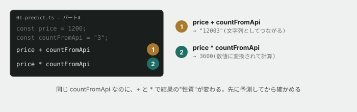

# 01. コードを読んで、出力を予測する



## 目的

**この演習では、コードを1文字も書きません。** 読んで、何が出力されるかを予測し、答え合わせをするだけです。

保守改修の現場でやることは、まさにこれです。他人が書いたコードを目で追い、「今どういう順番で何が起きているか」を頭の中で再現する。書くのは、そのあとです。

## 準備

```
cd curriculum/04-programming-basics/samples
node --version
```

`v22` 以上の数字が出れば準備完了です。エラーが出たら、**それ自体をこのIssueにコメントしてください。** 環境構築でつまずくのは普通のことで、隠す必要はありません。

`01-predict.ts` をエディタで開いてください。7つのパートに分かれています。

## 手順

> [!IMPORTANT]
> **まだ実行しないでください。** 全パートの予測を先に書いてから、一度だけ実行します。

### 予測を書く

- [ ] **パート1〜7それぞれについて、何が何行出力されるかを予測して、このIssueにコメントする**(`--- パートNおわり ---` の行は予測しなくて構いません)

書き方の例:

```
パート1の予測:
A
B
C
D
理由: 上から順に実行されるから
```

**当てることが目的ではありません。** 分からないパートは「見当がつかない」でも構いませんが、**なぜ分からないのかは書いてください。**

### 実行して答え合わせをする

- [ ] `node 01-predict.ts` を実行し、出力を全部コメントに貼る
- [ ] **予測と違ったパートを列挙する**
- [ ] 違ったパートそれぞれについて、**なぜそうなったのかを調べて1〜2行で書く**(AIに聞いても構いません)

### 特に見てほしいところ

- [ ] **パート1** — `greet()` の中身が出るタイミングは、関数を書いた場所と関係がありましたか
- [ ] **パート2** — `count = 99` に変えたのに、`shown` の中身は変わりませんでした。**なぜですか**
- [ ] **パート3** — `const` で作った `names` に、`push` で要素を足せてしまいました。**`const` は何を「変えられない」ようにしているのですか**
- [ ] **パート4** — `price + countFromApi` と `price * countFromApi` で、まったく違うことが起きました。**それぞれ何が起きたか**を説明してください
- [ ] **パート7** — `users[3]` は存在しないのに、エラーになりませんでした。**代わりに何が返ってきましたか**

## 予測のヒント

パート4がこの演習のいちばんの山です。**足し算と掛け算で結果の性質が変わった**ことに気づけましたか。これは JavaScript / TypeScript の有名な落とし穴で、**実務でも本当に事故ります。**

パート7の答えは、次の演習でエラーの原因として登場します。**覚えておいてください。**

## 考えてみてほしいこと

以下は Issue のコメントに書いてください。

1. パート4のような間違いは、**現場ではどんな不具合として現れる**と思いますか(例: 画面に何が表示されるか)
2. パート7で返ってきたものを、そのまま使おうとするとどうなると思いますか。**予想でかまいません**
3. この7パートのうち、**あなたが一番「意外だ」と思ったのはどれ**でしたか。理由も書いてください

## 完了条件

7パートすべての予測が実行前に書かれていること。実行結果が貼られていること。予測と違った箇所について、理由が自分の言葉で書かれていること。

**予測が全部当たっている必要はまったくありません。** むしろ全部当たった人は、この演習から得るものが少なかったということです。
