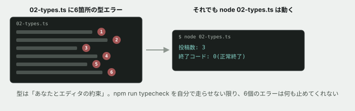

# 02. 型に守ってもらう / 型に怒られる



## 目的

型が**何を止めてくれるのか**を、自分の手で確かめる。あわせて **型は実行時には存在しない** という重要な事実を体験する。

この演習が終わると、「なぜわざわざ型を書くのか」を自分の言葉で説明できるようになります。

## 準備

```
cd curriculum/04-programming-basics/samples
npm install
```

`npm install` は、型チェックの道具(TypeScriptコンパイラ)をこのフォルダに入れます。**初回だけ少し時間がかかります。**

`02-types.ts` をエディタで開いてください。**わざと6箇所、型の誤りが仕込んであります。**

## 手順

### まず、目で探す

- [ ] エディタで `02-types.ts` を開き、**赤い波線が出ている箇所を全部探す**。何箇所ありましたか。行番号をコメントに書く
- [ ] 波線にマウスを乗せると、メッセージが出ます。**そのうち3つを、そのままコメントに貼る**

> [!TIP]
> 赤い波線が出ない場合、エディタがTypeScriptを認識していない可能性があります。**VS Code なら追加設定なしで出ます。** 出ないときは Issue にコメントしてください。

### 型チェックを実行する

- [ ] `npm run typecheck` を実行し、**出力を全部コメントに貼る**
- [ ] エディタで見つけた箇所と、**数が一致しましたか**

### ここが本題です — 実行してみる

- [ ] **`node 02-types.ts` を実行する前に、どうなるか予測してコメントする。** 型エラーが6個もあるコードは、動くと思いますか、動かないと思いますか
- [ ] 実際に `node 02-types.ts` を実行し、結果を貼る
- [ ] **予測と合っていましたか。** 合っていなかった場合、何が起きたのかを書く

### 誤りを1つずつ読む

以下、それぞれのエラーメッセージを読んで**「何がダメだと言われているか」を日本語1行で**書いてください。

- [ ] 誤り①(パート2) — `const postCount: number = "42";`
- [ ] 誤り②(パート4) — `const sato: User = { ... }`
- [ ] 誤り③(パート5) — `tanaka.email`
- [ ] 誤り④(パート7) — `describeUser("田中")`
- [ ] 誤り⑤(パート8) — `countPosts` の `return`
- [ ] 誤り⑥(パート10) — `const counts: number[] = [1, 2, "3"];`

### 直す

- [ ] **6箇所すべてを直して、`npm run typecheck` がエラー0件になるようにする**
- [ ] どう直したかを、6箇所それぞれ1行で書く

> [!NOTE]
> 直し方は1つではありません。例えば誤り③は「`email` を消す」でも「`User` 型に `email` を足す」でも通ります。**どちらを選んだか、なぜそちらにしたか**を書いてください。判断を見ています。

### おまけ — 前回のファイルも怒られていた

- [ ] `npm run typecheck` の出力に、**`01-predict.ts` の行も混ざっていたはずです。** どの行でしたか
- [ ] その行は、前回 `node` で実行したときには**問題なく動いていました。** なぜ TypeScript は怒るのに、Node は動かしたのだと思いますか

## 予測のヒント

「型エラーがあるコードは動かないはずだ」と思うのが自然です。**実際には動きます。** これがこの演習の中心です。

TypeScript の型は、**あなたとエディタの間の約束**であって、実行するコンピュータには渡されません。Node は型の部分を捨ててから実行しています。

だから **`npm run typecheck` を自分で走らせない限り、型は何も守ってくれません。** エディタの赤い波線を無視して進めることは、いつでもできてしまいます。

## 考えてみてほしいこと

以下は Issue のコメントに書いてください。

1. 型が実行時に消えるなら、**型は何の役に立っている**のですか。あなたの言葉で書いてください
2. AIにコードを書かせたとき、**型はどう役立つ**と思いますか(このカリキュラムが「AIの出力を検証できること」を柱の1つに置いている理由に関係します)
3. 誤り②(項目が足りない)は、**実行しただけでは気づけたと思いますか。** 実際に `node 02-types.ts` の出力を見返して答えてください
4. `npm run typecheck` を、**いつ実行するのが良い**と思いますか(書いた直後? コミット前? 毎回?)

## 完了条件

`npm run typecheck` がエラー0件で通ること。6箇所の直し方とその判断理由が書かれていること。そして **「型は実行時には存在しない」ことが、自分の言葉で説明されていること。** 最後のものが一番重要です。
