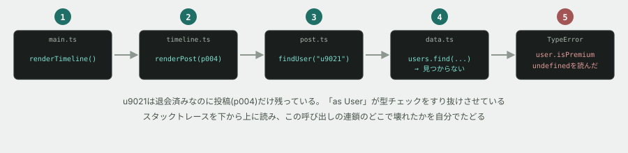

# 03. 壊れたコードを、エラーを頼りに直す



## 目的

**入門フェーズの総仕上げです。** これまでの3トピック(コマンドライン・Git・HTML/CSS)と、このトピックで学んだことを全部使います。

そして本編(保守改修フェーズ)で毎日やる仕事を、初めて小さく体験します — **他人が書いた複数ファイルにまたがるコードで、エラーを頼りに原因を突き止める。**

## 状況(ここから、あなたは保守担当です)

> お疲れさまです。つながるノートのタイムライン表示が、今朝から落ちるようになりました。
>
> 以前は動いていたそうです。ログを見ると `TypeError` が出ています。
> 原因を突き止めて直してください。**なぜそうなったのかも報告してください。**

## 準備

```
cd curriculum/04-programming-basics/samples/03-broken
```

4つのファイルがあります。**まだ中身を読まないでください。**

| ファイル | |
|---|---|
| `main.ts` | 入口 |
| `timeline.ts` | タイムライン全体を組み立てる |
| `post.ts` | 投稿1件を表示用の文字列にする |
| `data.ts` | データ(本来はデータベースにあるもの) |

## 手順

### 第1段階 — 再現する

保守の第一歩は「直す」ではなく「**自分の手元で同じ壊れ方を再現する**」ことです。

- [ ] `node main.ts` を実行し、**出力を全部コメントに貼る**
- [ ] エラーの **1行目** をそのまま貼り、「何が起きたと言っているか」を日本語1行で書く
- [ ] **画面に何行か出力されてから落ちましたか、それとも1行も出ずに落ちましたか。** 事実を書く

### 第2段階 — 場所を特定する(コードはまだ読まない)

> [!IMPORTANT]
> **ここではエラーメッセージだけを頼りにしてください。** ファイルを片っ端から開いて読むのは、いちばん時間がかかるやり方です。

- [ ] スタックトレースの中から、**`node:internal` を含まない行だけ**を抜き出して貼る
- [ ] **一番上の行は、どのファイルの何行目ですか**
- [ ] **一番下の(自分たちのコードの)行は、どのファイルの何行目ですか**
- [ ] スタックトレースを下から上に読むと、**どの関数がどの順で呼ばれたか**が分かります。呼び出しの順番を矢印でつないで書いてください(例: `main → ○○ → ○○ → ○○`)

### 第3段階 — 原因を突き止める

- [ ] エラーの1行目が指している **一番上の行** を開き、そのコードを貼る
- [ ] その行で、**何が `undefined` だったのか**を特定する
- [ ] **なぜそれが `undefined` になったのか**を、呼び出し元を1つずつ遡って突き止める
- [ ] **根本原因**を1〜2行で書く(「どのデータの、どこがおかしいのか」まで書いてください)

> [!TIP]
> 詰まったら、`console.log` を1行足して中身を見てください。**推測ではなく、見る。** これは HTML/CSS基礎で開発者ツールを使ったのと、まったく同じ考え方です。
>
> `grep` も使えます。「このIDはどこで使われている?」を調べるなら、コマンドライン基礎でやった `grep -rn` の出番です。

### 第4段階 — 直す

- [ ] **直す前に、どう直すつもりかをコメントに書く**
- [ ] 直して、`node main.ts` が最後まで動くことを確認する
- [ ] 出力を貼る
- [ ] **`npm run typecheck`(親フォルダで実行)がエラー0件のままであることも確認する**

### 第5段階 — なぜ型が守ってくれなかったのか

**ここがこの演習で一番大事な問いです。**

- [ ] 直す前の状態でも、`npm run typecheck` は**エラー0件でした。** 前の演習では型が誤りを見つけてくれたのに、今回は素通りしました
- [ ] `post.ts` の5行目に `as User` という書き方があります。**この `as` が何をしているのか**を調べて、1〜2行で書く(AIに聞いても構いません)
- [ ] **なぜ、この `as` があると型チェックが素通りしてしまうのか**を説明する
- [ ] `as User` を消すと、TypeScript は何と言ってきますか。**実際に消して確かめて**、メッセージを貼る

### 第6段階 — 報告する

保守の仕事は、直して終わりではありません。**報告までが仕事です。**

- [ ] 以下の形式で、依頼者への報告をコメントに書いてください

```
【現象】
【原因】
【対応】
【今後同じことが起きないためには】
```

## 予測のヒント

`data.ts` のコメントを読んでください。**書いた人が、何かを知っていて、そのまま放置した形跡があります。**

第5段階の `as` は、実務で最も危険な書き方の1つです。「TypeScriptさん、これは絶対 User だから、チェックしなくていいよ」と**あなたが宣言する**構文です。宣言が嘘だった場合、**型は何も守ってくれません。**

## 考えてみてほしいこと

以下は Issue のコメントに書いてください。

1. `data.ts` に書かれていたコメントを読んで、**書いた人は何を分かっていた**と思いますか。なぜ直さなかったのだと思いますか
2. あなたの直し方は、**退会したユーザーの投稿を「表示する」方向でしたか、「表示しない」方向でしたか。** なぜそちらを選びましたか(**正解はありません。** 判断とその根拠を見ています)
3. この不具合は「今朝から」出るようになったそうです。**コードは変わっていないのに、なぜ今朝から落ち始めた**のだと思いますか
4. `as` を使うべき場面は本当にないのでしょうか。**あるとしたら、どんな場面**だと思いますか
5. **前の3つのトピック(コマンドライン・Git・HTML/CSS)で学んだことのうち、この演習で実際に使ったものはありましたか**

## 完了条件

- `node main.ts` が最後まで動くこと
- `npm run typecheck` がエラー0件であること
- **スタックトレースから場所を特定した過程が、コメントに残っていること**(いきなりファイルを全部読んで見つけた、では完了になりません)
- **`as User` が型チェックを素通りさせていたことが、自分の言葉で説明されていること**
- 第6段階の報告が書かれていること

> [!NOTE]
> **この演習は、入門フェーズの中で一番難しく作ってあります。** 時間がかかって当然です。詰まったら30分〜1時間で講師に声をかけてください。「どこまで分かっていて、何を試して、どこで詰まったか」を言えるなら、それは**柱4(現場で沈まない)がすでにできている**ということです。
