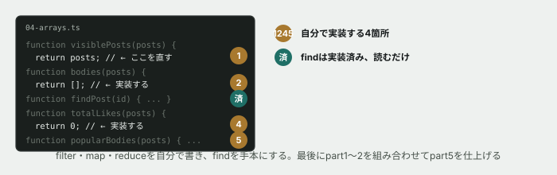

# 04. 配列を操作する



## 目的

**入門フェーズで初めて、あなたが実装する側に回ります。** これまでの3つの演習は「読む・予測する」でしたが、ここからは空いている関数を自分で埋めます。

配列を1件ずつループで処理するのではなく、`filter` `map` `find` `reduce` という**「よくある処理に名前がついた道具」**を使えるようになります。


## 準備

```
cd curriculum/04-programming-basics/samples
```

`04-arrays.ts` をエディタで開いてください。5つのパートがあり、いくつかの関数が空欄(または間違った内容)になっています。

## 手順

### パート1 — filter で絞り込む

- [ ] `node 04-arrays.ts` を実行する **前に**、`visiblePosts` が今のまま(`return posts;`)だと何件返ってくるか予測してコメントする
- [ ] 実行して結果を貼る
- [ ] `visiblePosts` を、**削除済み(`isDeleted: true`)を除く**ように直す(ヒント: `.filter((p) => ...)`)
- [ ] 直した後、**何件になるはずか予測してから**実行し、結果を貼る

### パート2 — map で形を変える

- [ ] `bodies` を実装する(投稿の配列から、本文の文字列だけの配列を作る)
- [ ] 実行し、6件の文字列が出力されることを確認する

### パート3 — find を読む(すでに実装済み)

- [ ] `findPost("p003")` と `findPost("p999")` の結果を貼る
- [ ] **存在しないIDを渡すと、何が返ってきますか。** これはプログラミング基礎の演習01・03で見た `undefined` と同じものです

### パート4 — reduce で集計する

- [ ] `totalLikes` を実装する **前に**、`reduce` がどう動くかをコメントに1〜2行で説明する(分からなければAIに聞いて構いません)
- [ ] 実装して実行し、合計を貼る。**自分で6件を手計算して、一致するか確認してください**

### パート5 — 組み合わせる

- [ ] `popularBodies`(削除されておらず、いいねが10件以上の投稿の本文だけ)を実装する
- [ ] 実行し、結果を貼る
- [ ] **何件になりましたか。** 元データを見て、自分で数え直して確認する

### 型チェックも忘れずに

- [ ] `npm run typecheck`(親フォルダで)を実行し、エラーが0件であることを確認する

## 予測のヒント

`filter` は「条件に合う行だけ残す」、`map` は「全部の形を変える」、`find` は「最初の1件だけ探す」、`reduce` は「全部を1つにまとめる」。**これはコマンドライン基礎の `grep`(絞り込む)や、SQL基礎の `WHERE`(絞り込む)・`SUM`(集計する)と同じ発想です。** 言語が変わっても、この考え方は持ち越せます。

## 考えてみてほしいこと

以下は Issue のコメントに書いてください。

1. `visiblePosts` の直し忘れ(`return posts;` のまま)を想像してください。**本番でこのまま公開されたら、画面にはどんな不具合が出ますか**
2. `find` が見つからないとき `undefined` を返すのは、なぜだと思いますか。**エラーを投げる(例外にする)のではなく、`undefined` を返す設計には、どんな利点がありますか**
3. `filter` → `map` を2回に分けて書く方法と、`reduce` で1回にまとめて書く方法があります。**あなたはどちらが読みやすいと感じましたか**

## 完了条件

5つのパートすべてが実装され、`node 04-arrays.ts` が正しい値を出力すること。`npm run typecheck` がエラー0件であること。
