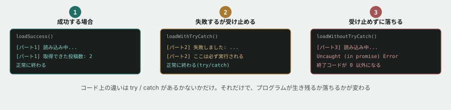

# 05. 非同期処理を読み、エラーを受け止める



## 目的

「時間がかかる処理」の書き方(`async` / `await`)と、その失敗の受け止め方(`try` / `catch`)を身につける。**本編では、データベースへの問い合わせがすべてこの形で書かれます。**

## なぜ「時間がかかる処理」が特別なのか

ここまでのコードは、上から下に書いた順にすぐ終わっていました。しかし、データベースへの問い合わせやAPI通信は、**答えが返ってくるまでに時間がかかります。** その間、プログラムは待つのではなく、**「答えが来たら、この続きをやってね」**という予約だけをして、他のことを進められます。この仕組みを扱うための書き方が `async` / `await` です。


## 準備

```
cd curriculum/04-programming-basics/samples
```

`05-async.ts` を開いてください。**APIを本物のように再現した、`fetchTimeline` という関数**が用意されています。`shouldFail` を `true` にすると、失敗する場合を再現できます。

## 手順

### パート1 — 成功する場合

- [ ] `node 05-async.ts` を実行する **前に**、`[パート1]` の2行がどんな順番で出力されるか予測してコメントする。**特に、一番下の `console.log("[mainの外にある...")` がどこに割り込むかも予測してください**
- [ ] 実行して、出力を全部貼る
- [ ] **予測と合っていましたか。** 合っていなかった場合、何が起きたのかを1〜2行で書く

### パート2 — 失敗する場合(try/catchあり)

- [ ] `loadWithTryCatch` の中身を読む。**`try` の中で失敗したら、どこに処理が移りますか**
- [ ] 出力の `[パート2]` の3行を見て、**「ここは、成功でも失敗でも必ず実行される」という行が、本当に実行されたか**を確認する

### パート3 — 失敗する場合(try/catchなし)

**ここからは、実際にコードを壊します。**

- [ ] `main` 関数の中の `// await loadWithoutTryCatch();` を、**コメントを外す前に**、実行したらどうなると予測するか書く
- [ ] コメントを外し(`await loadWithoutTryCatch();` にする)、保存して `node 05-async.ts` を実行する
- [ ] **今までと様子が違うはずです。** 出力を全部貼る(赤い文字やスタックトレースが出ても、消さずにそのまま貼ってください)
- [ ] `echo $?` を実行し、**終了コード(exit code)が何になっているか**を確認する。`0` であれば正常終了、それ以外は異常終了です

### 元に戻す

- [ ] `// await loadWithoutTryCatch();` に戻し(コメントアウト)、保存する
- [ ] もう一度実行し、正常に終わることを確認する

## 予測のヒント

パート1の予測は、たいてい外れます。**`await` にたどり着いた瞬間、プログラムはそこで一旦「保留」にして、他の同期処理を先に進めてしまう**からです。`main()` の外にある `console.log` が、`[パート1]` の結果より先に出るのはこのためです。**これはプログラミング基礎の全体を通して、最も直感に反する挙動の1つです。**

パート3で出てくる赤い文字は、**「誰も受け止めなかったエラー」がそのままプログラムを落とした**印です。プログラミング基礎の演習03で見たスタックトレースと、実は同じ読み方ができます。

## 考えてみてほしいこと

以下は Issue のコメントに書いてください。

1. パート2とパート3の違いは、コード上では `try` `catch` が**あるかないか**だけです。**それだけで、なぜここまで結果が変わるのですか**
2. 本編では、投稿を取得するたびにこの `fetchTimeline` のような処理を書きます。**もし `try` / `catch` を書き忘れたら、現場ではどんな形の不具合として報告されると思いますか**(ヒント: サーバーが混み合う時間帯はいつだと思いますか)
3. パート3の失敗を、**あなたなら画面上でユーザーにどう伝えますか。** 「エラーが発生しました」とだけ出すのと、他に何か工夫の余地はありますか

## 完了条件

パート1〜3すべてを実行し、それぞれの出力が貼られていること。パート3で異常終了(終了コードが0以外)したことを、自分で確認していること。最後にコメントアウトへ戻し、正常終了する状態で提出すること。
