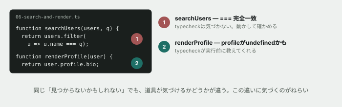

# 06. 見つからないかもしれないデータを、安全に読む



## 目的

「つながるノート」のユーザー検索窓を実装します。**検索(文字列操作)** と **見つかった後の安全な表示(オプショナルチェイニング)** を、1つの流れとして体験します。

この演習には、種類の違う2つの不具合が仕込まれています。**片方は `npm run typecheck` が教えてくれますが、もう片方は教えてくれません。** その違いに気づくことが、この演習のねらいです。

## 準備

```
cd curriculum/04-programming-basics/samples
```

`06-search-and-render.ts` をエディタで開いてください。2つのパートがあり、それぞれ1関数ずつ空欄(または間違った内容)になっています。

## 手順

### パート1 — search: 名前の一部で検索する

- [ ] `node 06-search-and-render.ts` を実行する **前に**、`searchUsers(users, " 太郎 ")`(前後に空白入り)が何件返ってくるか予測してコメントする
- [ ] 実行して結果を貼る。**予測と合っていましたか**
- [ ] `searchUsers` を、**前後の空白を無視し、名前の一部が含まれていれば見つかる**ように直す(ヒント: `.trim()` と `.includes()`)
- [ ] 直した後、もう一度実行し、「田中太郎」が見つかることを確認する

### パート2 — render: 見つかったユーザーを安全に表示する

- [ ] `renderProfile` を直す **前に**、`npm run typecheck` を実行してください。**出力に何件、どんなメッセージが出ましたか。行番号もコメントに書く**
- [ ] 直す **前に**、`node 06-search-and-render.ts` を実行するとどうなるか予測してコメントする(型エラーが出ているコードは動くと思いますか)
- [ ] 実際に実行し、結果を貼る。**エラーの内容は、演習03で見たものとどこが同じで、どこが違いますか**
- [ ] `renderProfile` を、**プロフィールが無いユーザーには `"(自己紹介はありません)"` と表示する**ように直す(ヒント: `?.` と `??`)
- [ ] 直した後、`npm run typecheck` を再実行し、この演習分のエラーが消えたことを確認する

### 型チェックも忘れずに

- [ ] `npm run typecheck`(親フォルダで)を実行し、**この演習ファイル(`06-search-and-render.ts`)のエラーが0件**であることを確認する(`01-predict.ts` と `02-types.ts` の分は、演習02が未着手ならまだ残っていて構いません)

## 予測のヒント

パート1の不具合(`===` による完全一致)は、TypeScriptにとって**何も間違っていません。** 文字列と文字列を比べているだけで、型はちゃんと合っています。だから `npm run typecheck` は何も教えてくれません。**動かして、目で確かめるしかない**種類の不具合です。

パート2の不具合は逆です。`profile` は `Profile | undefined` という型なので、`.bio` を読もうとした瞬間に **TypeScriptがエディタ上で先に止めてくれます。** 演習02で見た「型は実行前に赤くしてくれる」が、ここでも起きています。

## 考えてみてほしいこと

以下は Issue のコメントに書いてください。

1. パート1の不具合と、パート2の不具合。**どちらのほうが本番で見つかりにくいと思いますか。** 理由も書いてください
2. `?.`(オプショナルチェイニング)を使わず、`if (user.profile) { ... }` で同じことを書くこともできます。**あなたは `?.` を使う書き方と、`if` で書く方法、どちらが読みやすいと感じましたか**
3. `u9021` は演習03で見た「退会済みなのに投稿が残っているユーザー」と同じ人物です。**退会処理のときに `profile` だけ消して `posts` を消し忘れる、という状況は現実にありそうですか。** あなたの考えを書いてください

## 完了条件

2つのパートが実装され、`node 06-search-and-render.ts` が正しい結果を出力すること。`npm run typecheck` で、この演習ファイル分のエラーが0件であること。
