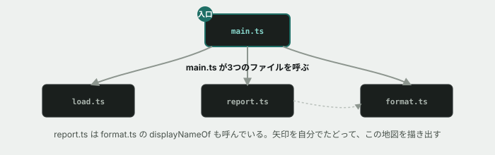

# 07. 引き継いだコードベースを、読む



## 目的

**この演習でも、コードを1文字も書きません。** ここから先の演習は、すべて同じ1つのコードベースを触り続けます。その第一歩として、**まず全体を読んで、地図を作ります。**

演習06までは、1つの演習に1つの小さなファイルが対応していました。ここからは違います。**5つのファイルに分かれた、300行ほどのツール**を引き継ぎます。現場で最初に渡されるのは、こういうものです。

いきなり直そうとしないでください。**どこに何が書いてあるかが分からないうちに変更を入れると、必ず壊します。**

## 状況(ここから、あなたは保守担当です)

SNS「つながるノート」の運用担当が使っているコマンドラインツールがあります。前任者が書いて、すでに1年ほど動いています。今日からあなたが引き継ぎます。

前任者はもういません。**あるのはコードと、動いているという事実だけです。**

## 準備

```
cd curriculum/04-programming-basics/samples/tsunagaru-cli
node --version
```

`v22` 以上の数字が出れば準備完了です。まず [samples/tsunagaru-cli/README.md](../samples/tsunagaru-cli/README.md) を読んでください。**このツールが何をするものか**と、**運用上の決まり**が書いてあります。

## 手順

### まず動かす

- [ ] **3つのコマンドを実行する前に、それぞれ何が表示されるか予測してコメントする**(README を読んだだけの状態で構いません)

```
node --experimental-strip-types src/main.ts summary
node --experimental-strip-types src/main.ts top
node --experimental-strip-types src/main.ts suspended
```

- [ ] 実行して、3つの結果を貼る
- [ ] `node --experimental-strip-types src/main.ts foo` のように、無いコマンドを渡すとどうなるかも試して貼る

### 地図を作る

- [ ] `src/` の5つのファイルを、**上から順にではなく、`main.ts` から読み始めてください。** 入口はそこです
- [ ] **どのファイルが、どのファイルを呼んでいるか**を書き出す(矢印で書けば十分です。図でも箇条書きでも構いません)
- [ ] 各ファイルの役割を、**それぞれ1行で**説明する

### データの流れを追う

- [ ] `summary` コマンドを実行したとき、**データがどういう順番でどこを通るか**を書く。「JSONファイル → ( ) → ( ) → 画面」の空欄を埋める形で構いません
- [ ] `report.ts` の `summarizeUsers` は、**何を受け取って、何を返しますか。** 型注釈の1行だけを見て答えてください(中身は読まなくてよい)
- [ ] `formatSummaryLine` が呼ばれるのは、`main.ts` の何行目ですか

### 気づいたことを書き留める

- [ ] **出力を眺めて、「おや」と思ったことがあれば書いてください。** 数字でも、表示でも、何でも構いません。**無ければ「特になし」で構いません**

## 予測のヒント

**`main.ts` から読む**のがコツです。プログラムには必ず入口があり、そこから呼ばれていない関数は、どれだけ長くても今は関係ありません。

ファイルの役割を掴むときは、**まず関数の名前と型注釈だけを見てください。** 中身を読むのは、そこが原因だと絞り込めてからです。READMEの「関数 — 入力・処理・出力」でやった読み方が、そのまま使えます。

`report.ts` と `format.ts` が分かれているのには理由があります。**片方は数を数え、もう片方は文字を組み立てます。** なぜ分けてあるのかを考えてみてください。

## 考えてみてほしいこと

以下は Issue のコメントに書いてください。

1. **もしこの5つのファイルが、全部 `main.ts` 1つにまとまっていたら**、何が困りますか。逆に、分かれていることで困ることはありますか
2. `report.ts` の中に `console.log` は1つもありません。**表示を一切しない**のはなぜだと思いますか
3. **このツールに新しいコマンドを1つ足すとしたら**、どのファイルに何を書き足すことになりますか(実際に書く必要はありません。触るファイルを挙げるだけで構いません)

## 完了条件

チェックリストがすべて埋まり、**ファイル同士の呼び出し関係と、各ファイルの役割**が自分の言葉で書けていること。

**まだ何も直していなくて構いません。** 次の演習から、実際に手を入れていきます。
