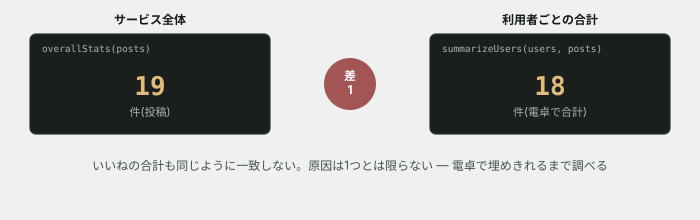

# 08. 数字が合わない、と言われる



## 目的

**報告された症状から、原因を自分で突き止めます。** 前の演習で作った地図を使う番です。

現場で渡されるのは「どこが悪いか」ではなく「何が変か」だけです。**原因は自分で探します。** そして探し当てたものが、いつも「直せばいいバグ」とは限りません。

## 状況

運用担当から、こう報告がありました。

> 月次の報告書を作ろうとして、`summary` の数字を使いました。
> **利用者ごとの投稿数を全部足しても、いちばん上の「サービス全体」の数と合いません。**
> いいねの数も合いません。どちらが正しいんでしょうか。

## 準備

```
cd curriculum/04-programming-basics/samples/tsunagaru-cli
node --experimental-strip-types src/main.ts summary
```

**変更を始める前に、今の出力をIssueに貼っておいてください。** 直したあとに見比べるためです。

[samples/tsunagaru-cli/README.md](../samples/tsunagaru-cli/README.md) の「運用上の決まり」を、もう一度読んでください。**この報告を判断する基準はそこにあります。**

## 手順

### 症状を数字で確かめる

- [ ] 「サービス全体」の投稿数といいね数を書き出す
- [ ] 利用者ごとの投稿数を**電卓で合計**して書き出す。いいねも同様に
- [ ] **それぞれ、いくつズレていますか。** 2つの数字を書く

### ズレの正体を予測する

- [ ] **コードを読む前に、予測してコメントしてください。** 「ズレはいくつで、原因は何だと思うか」。外れて構いません
- [ ] `report.ts` を開き、`summarizeUsers` と `overallStats` を**並べて比べる**。同じことをしているように見えて、**違うところ**があります

### 原因を突き止める

- [ ] **見つけた違いを、コードの行を引用して説明する**
- [ ] その違いによって、**どちらの数字が、どれだけズレるか**を説明する
- [ ] **その説明で、さっき書き出したズレの数を説明しきれていますか。** 合わない場合は、**まだ見つけていない原因があります**

> [!IMPORTANT]
> **原因が1つだと思い込まないでください。** 「1つ見つけたから終わり」で止まると、直したあとに数字がまだ合わず、もう一度調べ直すことになります。**ズレの数を、自分の説明で完全に埋められるまで探してください。**

### 直す

- [ ] **直す前に、直したらどの数字がいくつになるかを予測してコメントする**
- [ ] 「運用上の決まり」に照らして**明らかに間違っている**ものを直す
- [ ] 実行して、結果を貼る
- [ ] 予測と違っていたら、なぜ違ったかを書く

### 決まっていないことに気づく

- [ ] 見つけた原因のうち、**「運用上の決まり」を読んでも正解が書いていないもの**があるはずです。それはどれですか
- [ ] **それを勝手に直してはいけません。** 代わりに、**運用担当に何を確認すべきか**を、質問の文章として書いてください

## 予測のヒント

`summarizeUsers` と `overallStats` は、**どちらも「削除された投稿は数えない」を守っているように見えます。** 本当に両方とも、最後まで守っているでしょうか。**関数の中に、絞り込みが何回出てくるか**を数えてください。

もう1つのズレは、**数え始める場所**の違いから来ます。片方は利用者から数え、もう片方は投稿から数えています。**投稿はあるのに、その投稿の持ち主が利用者一覧にいなかったら**、どちらの数え方で拾えて、どちらで漏れるでしょうか。

`data/posts.json` の `authorId` を、`data/users.json` の `id` と**突き合わせてみてください。** 全部の投稿に、持ち主がいますか。

## 考えてみてほしいこと

以下は Issue のコメントに書いてください。

1. **2つの原因は、ズレを大きくする方向に働いていましたか。それとも打ち消し合っていましたか。** 打ち消し合っていた場合、それは調査にとって有利ですか、不利ですか
2. **もし片方だけ直して「直りました」と報告していたら**、何が起きていたと思いますか
3. 「持ち主のいない投稿」を見つけたとき、**あなたはそれをバグだと思いましたか、仕様だと思いましたか。** そう判断した理由を書いてください
4. このツールに**同じ種類のズレが二度と起きないようにする**には、どうするのがよいと思いますか(実装しなくて構いません。考えだけ書いてください)

## 完了条件

- ズレの数を、**2つの原因それぞれがいくつ分か**まで分解して説明できていること
- 「決まりに反しているもの」を直し、実行結果を貼ってあること
- **「決まっていないもの」は直さずに、確認すべき質問として書いてあること**

> [!NOTE]
> **勝手に決めずに聞く、というのは逃げではありません。** 運用のルールは、コードを読んでも書いていないことがあります。**書いていないことに気づけたなら、それはコードを正しく読めた証拠です。**
