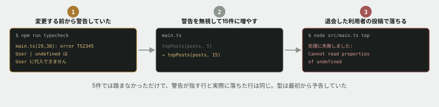

# 09. 型は、最初から警告していた



## 目的

**1行だけ変えたら壊れた。** そこから、なぜ壊れたのかを突き止めます。

そして、**その事故は防げたことを知ります。** このコードには、壊れるずっと前から警告が出ていました。前任者はそれを無視していただけです。

## 状況

演習08で確認した件について、運用担当から回答が来ました。

> **持ち主のいない投稿は、退会した利用者のものです。** 退会しても投稿は残す仕様です。
> サービス全体の集計には**含めてください。** 表示するときは `(退会した利用者)` と出してもらえますか。

あわせて、別の依頼も来ました。

> `top` が5件だと少ないです。**15件に増やしてもらえますか。**

## 準備

```
cd curriculum/04-programming-basics/samples/tsunagaru-cli
npm install
```

型チェックを動かすために、一度だけ必要です。

## 手順

### 変える前に予測する

- [ ] **`top` を15件に増やすと、どうなると思いますか。** コメントに予測を書いてください。「いいねの少ない投稿が10件増えるだけ」で構いません
- [ ] `main.ts` の `topPosts(posts, 5)` を `topPosts(posts, 15)` に変える(変えるのはこの1箇所だけです)
- [ ] 実行して、結果を貼る

```
node --experimental-strip-types src/main.ts top
```

### エラーを読む

うまくいかなかったはずです。**ここからが本番です。**

- [ ] 出たメッセージを、そのまま貼る
- [ ] **READMEの「エラーメッセージを読む」の手順どおりに読んでください。** 1行目は「何が」、2行目以降は「どこで」
- [ ] `Cannot read properties of undefined (reading 'displayName')` は**症状**です。**「何が `undefined` だったのか」**を、自分の言葉で書いてください
- [ ] **なぜ5件では起きず、15件で起きたのですか。** 演習08で見つけたことと結びつけて説明してください

> [!NOTE]
> **エラーが出ても、プロセスは落ちきらずに「処理に失敗しました」と表示されたはずです。** なぜそうなったのか、`main.ts` を見て説明してください。READMEの `try` / `catch` の節が効いています。

### 警告は前から出ていた

- [ ] 次を実行してください

```
npm run typecheck
```

- [ ] 出た内容を貼る
- [ ] **この警告は、あなたが1行変える前から出ていました。** `git stash` などで変更を戻して、もう一度 `npm run typecheck` を実行し、同じ警告が出ることを確かめてください
- [ ] **警告が指している行と、実際に落ちた行は同じですか**
- [ ] 警告の文面 `Type 'undefined' is not assignable to type 'User'` は、**今日起きたことを、どこまで正確に予告していましたか**

### 直す

- [ ] **直す前に予測する。** どう直せば、15件でも落ちなくなりますか。方針をコメントに書いてください
- [ ] 運用担当の回答どおり、**持ち主が見つからない投稿は `(退会した利用者)` と表示する**ように直す
- [ ] 実行して、15件が最後まで表示されることを確かめて貼る
- [ ] **`npm run typecheck` を実行し、警告が消えたことを確かめて貼る**

> [!IMPORTANT]
> **`as User` と書いて型チェックを黙らせるのは、直したことになりません。** それは「警告するな」と言っただけで、実行時には同じように落ちます。**`undefined` だったときに何をするかを、コードに書いてください。**

## 予測のヒント

`find` は「最初に見つかった1件」を返しますが、**見つからなければ `undefined` を返します。** READMEの配列の節と、演習06でやった内容です。

「5件では起きず、15件で起きた」のは、**問題のある投稿が上位5件に入っていなかった**だけです。データが変わればいつでも起きました。**今日たまたま踏んだのであって、今日から壊れたわけではありません。**

直し方は1つではありません。「見つからなかったら別の表示にする」「そもそも一覧に含めない」など、いくつか考えられます。**運用担当の回答に沿うものを選んでください。**

## 考えてみてほしいこと

以下は Issue のコメントに書いてください。

1. **前任者は、なぜこの警告を無視できたのだと思いますか。** 責めるためではなく、**自分が同じことをしないため**に考えてください
2. もし型チェックが無い言語だったら、この問題は**いつ、どこで**見つかっていたと思いますか
3. **「動いているから正しい」と「壊れていないだけ」は違います。** このコードは1年動いていました。他にも「まだ踏んでいないだけ」の場所があるかもしれません。どうやって探しますか
4. あなたが今日やった作業を、**運用担当への報告として3行以内**で書いてください。何が起きて、原因は何で、どう直したか

## 完了条件

- 15件でも落ちずに表示されること
- **`npm run typecheck` の警告が消えていること**(`as` で黙らせたのではないこと)
- エラーメッセージの読み解きと、**警告が事前に出ていた事実**について、自分の言葉で書けていること

> [!NOTE]
> **型が守ってくれるのは、あなたが警告を読んだときだけです。** 赤い波線を消すために書くのではなく、**まだ踏んでいない事故を先に見せてくれる道具**として使ってください。READMEに書いた「型はAIの出力を検証する最初の道具」も、同じ話です。
