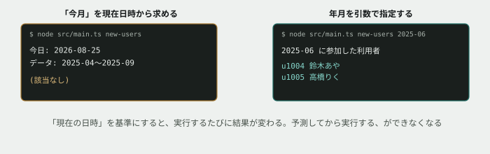

# 10. 新しいコマンドを足す



## 目的

**ここから、自分で機能を足していきます。** ただし白紙に書くのではありません。**既にある3つのコマンドと同じ形**に沿って足します。

演習07で「新しいコマンドを足すならどのファイルを触るか」を考えてもらいました。今日はその答え合わせです。

## 状況

運用担当から、新しい依頼が来ました。

> **今月から使い始めた人だけを一覧したいです。** `new-users` みたいなコマンドを足せますか。

## 準備

演習08・09までの修正が入った状態から始めます。まだの場合は先に済ませてください。

```
cd curriculum/04-programming-basics/samples/tsunagaru-cli
```

## 手順

### まず素朴に作ってみる

**コードを書く前に、これから作るものを4行で書き出します。** 現場では詳細設計と呼ばれる作業の、いちばん小さい形です。

- [ ] **次の4項目をコメントに書いてください。** 思いつくままで構いません。埋まらない項目があれば「分からない」と書いて構いません

```
【入力】 何を受け取るか
【出力】 何を返すか・何を表示するか
【分岐】 場合分けはどこにあるか
【境界】 うまくいかない入力は何か
```

- [ ] **「今月」をどう判定するか**は、【分岐】の欄に書いてください
- [ ] その方針で、`report.ts` に**利用者を年月で絞り込む関数**を書く
- [ ] `main.ts` に `new-users` コマンドを足す(振り分けの `if` に1つ増やす形です)
- [ ] 実行してみる

```
node --experimental-strip-types src/main.ts new-users
```

### うまくいかない場合

**「今月」を現在の日時から求めた場合、うまく動かないはずです。** `data/users.json` を開いて、`joinedAt` の値を確認してください。

- [ ] **なぜ「今月」で判定すると結果が変わるのか(あるいは常に0件になるのか)を説明してください**
- [ ] **この関数を、来月あなたが実行したら、結果は同じになりますか。** 半年後は?

> [!WARNING]
> **「現在の日時」を基準にするコードは、実行するたびに結果が変わります。** 今日確かめられた動作が、明日も同じとは限りません。予測してから実行する、という今までの演習のやり方そのものが成立しなくなります。

### 作り直す

- [ ] **「今月」ではなく、`2025-06` のように年月を指定できる形**に作り直してください。指定は、コマンドの後ろに続けて渡す形にします

```
node --experimental-strip-types src/main.ts new-users 2025-06
```

- [ ] 実行前に、何人出るか予測してコメントする
- [ ] 実行して結果を貼る
- [ ] **該当者がいない年月**でも試す。結果を貼る

## 予測のヒント

`joinedAt` は `"2025-06-01"` のような文字列です。**年月だけを取り出さなくても、文字列の前方一致で判定できます。** `"2025-06-01".startsWith("2025-06")` を実際に打って確かめてください。

配列の絞り込みには、演習04で使った道具がそのまま使えます。

コマンドの後ろに続く値は `process.argv` の3番目に入ります(`process.argv[2]` が `top` や `summary` そのもの、`process.argv[3]` がその後ろに続く値です)。既存の `main` 関数で `command` をどう受け取っているかを見れば分かります。

## 考えてみてほしいこと

以下は Issue のコメントに書いてください。

1. **「今月」を現在の日時から求める作り**と、**「年月を指定させる」作り**、依頼された内容に近いのはどちらですか。運用担当は本当に「今月」を求めていたと思いますか
2. あなたが最初に書いた4行は、実際どうなりましたか。予測とズレていたら、何を見落としていましたか
3. **【境界】の欄に、あなたは何を書きましたか。** 書いたものは全部、実際に試しましたか
4. このコマンドを、**半年後に運用担当が実行したとします。** 何を指定すればよいか、迷わずに使えますか。使い方をどこかに書いておくとしたら、どこに書きますか

## 完了条件

- `new-users <年月>` が動き、該当者ありと該当者なしの両方を確認していること
- **「現在の日時を基準にすると何が困るか」を自分の言葉で説明できていること**
- 書き始める前の4行(入力・出力・分岐・境界)がコメントに残っていること。**あとから書き直さず、最初に書いたまま残してください**
