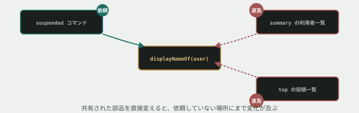

# 11. 直した場所と、壊れた場所が違う



## 目的

**1箇所を直したつもりが、別の場所を壊していた** — 保守の現場で一番よく起きる事故です。今日はそれを実際に体験します。

## 状況

運用担当から、依頼が来ました。

> **停止中の利用者が一覧で見分けられません。** 名前の後ろに `(停止中)` と付けてもらえますか。

対象は `suspended` コマンドの一覧です。

## 準備

```
cd curriculum/04-programming-basics/samples/tsunagaru-cli
```

## 手順

### まず素直に直す

- [ ] 利用者の名前を表示している関数を探してください。`src/format.ts` の `displayNameOf` です
- [ ] **`displayNameOf` そのものを直接書き換えて**、停止中の利用者には `(停止中)` が付くようにする
- [ ] `suspended` コマンドを実行し、狙いどおり付いていることを確認して貼る

```
node --experimental-strip-types src/main.ts suspended
```

### 依頼されていない場所を確認する

**ここで止まらないでください。** `displayNameOf` は他のコマンドからも呼ばれています。

- [ ] `grep` で、`displayNameOf` がどこから呼ばれているかを**すべて**洗い出してください

```
grep -rn "displayNameOf" src/
```

- [ ] 洗い出した呼び出し元を、**1つずつ**実行して確認する。`summary` はどうですか。**`top` は?**

> [!IMPORTANT]
> **`data/posts.json` を見ると、停止中の利用者(`u1004`)も投稿しています。** 停止中でも投稿は残る、という「運用上の決まり」を思い出してください。

- [ ] **依頼していないのに変わってしまった箇所**があれば、それを貼る

### 直し方をやり直す

- [ ] **`displayNameOf` 自体は元に戻してください。** 停止中かどうかの表示は、**`suspended` コマンドを表示している場所だけ**で行うようにする
- [ ] `main.ts` の、停止中の利用者を表示している行を探して直す
- [ ] `suspended` を実行し、狙いどおりになっていることを確認する
- [ ] `summary` と `top` を実行し、**さっき見つかった意図しない変化が消えていること**を確認する
- [ ] 型チェックも実行しておく

```
npm run typecheck
```

## 予測のヒント

`displayNameOf` は、**「名前を表示するすべての場所」から呼ばれる共有の部品です。** 共有されているものを直接変えると、**呼んでいる場所すべてに変化が及びます。** それがすべて望ましい変化であれば問題ありませんが、今回は違いました。

「その情報を必要としているのは、本当にどこか」を考えてください。**`(停止中)` を必要としているのは `suspended` コマンドの表示だけ**で、`displayNameOf` 自体が知る必要はありません。

呼び出し元を探す手段として `grep` を使いました。**コマンドライン基礎で「この先3ヶ月で最も多く使うコマンド」と説明されていたのは、まさにこの場面のためです。**

## 考えてみてほしいこと

以下は Issue のコメントに書いてください。

1. **最初の直し方で、なぜ `summary` や `top` まで変わってしまったのですか。** 自分の言葉で説明してください
2. `grep` を実行する**前**に、影響する場所を全部言い当てられていましたか。言い当てられなかったなら、何が難しかったですか
3. **「共有されている部品を直接変えていいとき」と「呼び出し側で対応すべきとき」**、その違いをどう判断すればよいと思いますか
4. もしこのプロジェクトに `grep` で探しても見つからない呼び出し方(動的に組み立てた文字列など)があったら、**あなたはどうやって影響範囲を確認しますか**

## 完了条件

- `suspended` に `(停止中)` が付き、`summary` と `top` には影響していないこと
- `npm run typecheck` が通ること
- **「なぜ最初の直し方は駄目だったか」を自分の言葉で説明できていること**
