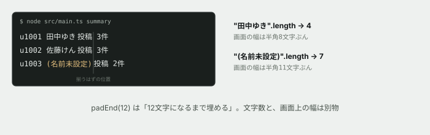

# 12. 桁が揃わない



## 目的

**「文字の数」と「見た目の幅」は、同じではありません。** 今日はそのズレの正体を突き止め、直します。

## 状況

運用担当から、依頼が来ました。

> `summary` の一覧、**列がガタガタで読みにくいです。** 揃えてもらえますか。

## 準備

```
cd curriculum/04-programming-basics/samples/tsunagaru-cli
node --experimental-strip-types src/main.ts summary
```

出力をよく見てください。**確かに、揃っていません。**

## 手順

### 原因を突き止める

- [ ] `src/format.ts` の `formatSummaryLine` を開いてください。**桁を揃えるために何を使っていますか**
- [ ] Node を対話モードで起動し(`node` とだけ打つ)、次を1つずつ打って結果を見てください

```javascript
"田中ゆき".length
"(名前未設定)".length
"田中ゆき".padEnd(12).length
"(名前未設定)".padEnd(12).length
```

- [ ] **両方とも `padEnd(12)` の結果の `.length` は同じはずです。** それなのに、なぜ画面では桁がズレて見えるのか、予測してコメントする
- [ ] 対話モードを抜けます(`.exit` またはCtrl+D)

### 正体を確かめる

- [ ] `"田中ゆき"` は何文字ですか。実際に画面に表示したときの**横幅は、半角の文字何個分**に見えますか(数えてみてください)
- [ ] 日本語の1文字は、画面上では**半角の文字およそ何個分**の幅を占めますか
- [ ] `padEnd(12)` は「12**文字**になるまで埋める」処理です。**「12文字」と「12文字分の幅」が違う**ことに気づけましたか

## 予測のヒント

`.length` は**文字の個数**を数えているだけで、**画面上の幅**は見ていません。半角の英数字は幅1、日本語などの全角文字は幅2として表示されるのが普通です。同じ4文字でも、`"abcd"` と `"田中ゆき"` は画面上の幅が違います。

`padEnd` はこの違いを知りません。**文字数だけを見て「もう12文字あるから十分」と判断してしまいます。**

直し方は1つではありません。

- 表示幅(全角なら2、半角なら1)を自分で計算する関数を書き、それに合わせて埋める
- 桁を厳密に揃えるのをやめて、区切り文字(`|` など)で区切る
- 名前の表示を、決まった文字数で切る

**どれを選ぶかを、理由つきで決めてください。** 正解は1つではありません。

## 手順(続き)

- [ ] 直し方を1つ選ぶ。選んだ理由をコメントに書く
- [ ] `formatSummaryLine` を直す
- [ ] 実行し、**列が揃っていることを目で確認して**貼る
- [ ] `formatPostLine` にも同じ問題がないか確認する(`top` を実行してみてください)。あれば同様に直す
- [ ] 型チェックを実行する

```
npm run typecheck
```

## 考えてみてほしいこと

以下は Issue のコメントに書いてください。

1. **`.length` が見ているのは何ですか。** 「文字数」「バイト数」「表示幅」のうち正しいものを選び、理由を説明してください
2. あなたが選んだ直し方の**トレードオフ**を書いてください。他の方法と比べて、何を得て何を諦めましたか
3. この問題は、**英語だけの環境では起きなかったはずです。** 日本語のサービスを作るとき、他にも気をつけたほうがよさそうなことはありますか(実際に確かめなくて構いません。思いつくことを書いてください)

## 完了条件

- `summary` と `top` の両方で、日本語の名前を含む行の桁が揃っていること
- **なぜ元のコードでズレていたのかを、`.length` の性質から説明できていること**
