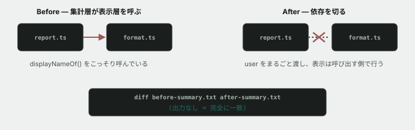

# 13. 集計と表示が、こっそり混ざっている



## 目的

**今回は依頼ではありません。** 自分のための片付けです。**動作を1ミリも変えずに、構造だけを直す**という、保守の現場で頻繁にやる作業を体験します。

## 状況

演習07で、こう問いかけました。

> `report.ts` の中に `console.log` は1つもありません。**表示を一切しない**のはなぜだと思いますか。

「集計する層」と「表示する層」を分ける、というのがこのコードの設計です。ところが、**よく見るとその境界が守られていない場所があります。**

## 準備

```
cd curriculum/04-programming-basics/samples/tsunagaru-cli
```

## 手順

### 崩れている場所を見つける

- [ ] `src/report.ts` の先頭の `import` を見てください。**「集計する層」であるはずなのに、何をインポートしていますか**
- [ ] `summarizeUsers` の中身を見てください。**どの行で、表示層の関数を呼んでいますか**
- [ ] `src/types.ts` の `UserSummary` を見てください。**`displayName` というフィールドがあります。これは「集計結果」でしょうか、「表示用の文字列」でしょうか**

### 直す前に確かめる

**構造を変える作業でいちばん怖いのは、直したつもりで動きまで変えてしまうことです。** 先に「変える前の姿」を残しておきます。

- [ ] 3つのコマンドすべての出力を、ファイルに保存してください

```
node --experimental-strip-types src/main.ts summary > /tmp/before-summary.txt
node --experimental-strip-types src/main.ts top > /tmp/before-top.txt
node --experimental-strip-types src/main.ts suspended > /tmp/before-suspended.txt
```

(Windows/Git Bashでも同じコマンドが使えます。保存先のフォルダはお好みで変えて構いません)

### 直す

- [ ] `UserSummary` から `displayName` を消し、代わりに **`user: User` を丸ごと持たせる**ように `types.ts` を直す
- [ ] `report.ts` の `summarizeUsers` を、`displayName: displayNameOf(user)` の代わりに **`user` をそのまま返す**ように直す
- [ ] `report.ts` の先頭から、`format.ts` の `import` を消す
- [ ] `format.ts` の `formatSummaryLine` を、`summary.displayName` の代わりに **`displayNameOf(summary.user)`** を呼ぶように直す
- [ ] `summary.userId` を使っている箇所も、`summary.user.id` に直す

### 変わっていないことを確かめる

- [ ] 同じ3つのコマンドを実行し、**さっき保存した内容と一致するか比べてください**

```
node --experimental-strip-types src/main.ts summary > /tmp/after-summary.txt
diff /tmp/before-summary.txt /tmp/after-summary.txt
```

- [ ] 3つとも `diff` の結果が空である(=完全に一致する)ことを確認して貼る。**1文字でも違ったら、どこかで動きを変えてしまっています**
- [ ] 型チェックも実行する

```
npm run typecheck
```

## 予測のヒント

`report.ts` が `displayNameOf` を呼んでいるのは、**「表示するときにどう見せるか」という判断を、集計する側が先取りしてしまっている**からです。集計は「誰が何件投稿したか」を出すだけでよく、「名前をどう表示するか」は表示する側が決めればよいはずです。

`diff` は、2つのファイルの中身を1行ずつ比べて、違うところだけを教えてくれるコマンドです。**「動きを変えていないこと」を目で1行ずつ確認する代わりに、機械に比べさせています。**

## 考えてみてほしいこと

以下は Issue のコメントに書いてください。

1. `UserSummary` が `displayName`(表示用の文字列)を持っていたときと、`user`(元のデータ)を持つようになった今とで、**このデータを使う側は何が変わりましたか**
2. **もし直した後で `diff` に差分が出ていたら**、あなたはどうやって原因を探しますか
3. 「集計する層は表示に一切関わらない」というルールを、**今後この設計を知らない誰かが破らないようにする**には、どうすればよいと思いますか(コメントを書く、ファイルを分ける、などアイデアで構いません)

## 完了条件

- `report.ts` が `format.ts` の関数を呼んでいないこと(`import` が消えていること)
- 3つのコマンドすべてで、**変更前とdiffが完全に一致する**こと
- `npm run typecheck` が通ること
