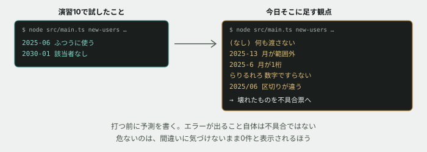

# 14. 自分が作ったものを、壊しにいく



## 目的

**自分が作ったものを、他人の目で壊しにいきます。**

演習10で `new-users <年月>` コマンドを作りました。あのとき確かめたのは「ちゃんと動く使い方」と「該当者がいない年月」の2つです。**それで十分だったでしょうか。**

現場で新人が最初に任される仕事のひとつが、この「試す」工程です。動かして満足するのではなく、**どこを試すべきかを先に洗い出し、壊れたら他人が再現できる形で報告する**。今日はその型を身につけます。

## 状況

運用担当から、こう言われました。

> `new-users` 便利です。ありがとうございます。
> ところで、**うちの若いメンバーにも使わせたい**んですが、変な使い方をしても大丈夫ですか。
> 打ち間違いとかすると思うので。

「大丈夫です」と答える前に、確かめる必要があります。

## 準備

演習10で作った `new-users` コマンドが動く状態にしておいてください。

```
cd curriculum/04-programming-basics/samples/tsunagaru-cli
node --experimental-strip-types src/main.ts new-users 2025-06
```

利用者が何人か表示されれば準備完了です。

> [!NOTE]
> **今日はコードをほとんど書きません。** まず試して、壊れたところを記録します。直すのは最後のひとつだけです。

## 手順

### 試す場所を、先に洗い出す

思いついた順に打つのではなく、**先に表を作ります。** これを現場では「テスト観点」と呼びます。

`new-users` が受け取るのは年月の文字列ひとつだけです。その1つの入り口について、**性質の違う入力**を挙げていきます。

- [ ] **実際に打つ前に、下の表をIssueのコメントに写して、「予測」の欄だけ先に埋めてください**

| # | 観点 | 入力 | 予測 | 実際 |
|---|---|---|---|---|
| 1 | ふつうに使う | `2025-06` | | |
| 2 | 該当者がいない | `2030-01` | | |
| 3 | 何も渡さない | (なし) | | |
| 4 | 月が範囲外 | `2025-13` | | |
| 5 | 月が1桁 | `2025-6` | | |
| 6 | 数字ですらない | `らりるれろ` | | |
| 7 | 区切りが違う | `2025/06` | | |

- [ ] **7つ以外に、自分で思いついた観点があれば行を足してください。** 「境目はどこか」「ありえない値は何か」を考えると出てきます

### 試して、埋める

- [ ] 7つすべてを実際に実行し、「実際」の欄を埋める。出力はそのまま貼る
- [ ] **予測と違ったものに印を付ける**

```
node --experimental-strip-types src/main.ts new-users 2025-13
```

### 「壊れている」とは何かを決める

ここが今日のいちばん大事なところです。

- [ ] 実際の結果を1つずつ見て、**「これは壊れている」「これは壊れていない」を仕分けしてください**
- [ ] **仕分けの基準を、自分の言葉で1行書いてください**

> [!IMPORTANT]
> **エラーが出る = 壊れている、ではありません。**
>
> 打ち間違いに対してエラーを出して止まるのは、正しい動きかもしれません。逆に、**エラーも出さず、何事もなかったように0件と表示する**ほうが危険なこともあります。利用者は「本当に0件だった」と信じてしまうからです。
>
> 「どちらが親切か」ではなく、**「利用者が間違いに気づけるか」**で考えてみてください。

### 不具合票を書く

壊れていると判断したものについて、**他人が読んで再現できる形**にまとめます。様式はSQL基礎の演習02で使ったものと同じです。

- [ ] 壊れていると判断したもののうち、**いちばん危ないと思うもの1つ**について、次の4項目を書く

```
【現象】
【再現手順】
【原因】
【判断が必要な点】
```

- [ ] **【再現手順】は、あなたのパソコンを知らない人が、そのまま打てば同じ結果になる形で書いてください。** 「コマンドを実行する」ではなく、実際に打つ文字列をそのまま書きます

### 1つだけ直す

- [ ] 不具合票に書いたものを直す
- [ ] **直す前に、直したあと7つの結果がそれぞれどうなるかを予測してコメントする**
- [ ] 直して、7つすべてをもう一度実行し、結果を貼る
- [ ] **直した1つ以外の結果が変わっていないことを確認する**

## 予測のヒント

観点表の予測は、**当てることが目的ではありません。** 「見当がつかない」でも構いません。大事なのは、**打つ前に自分の理解を言葉にしておく**ことです。

観点の出し方には型があります。今日使ったのは主に2つです。

- **境目を狙う** — `2025-12` と `2025-13` の間に線があります。線のすぐ内側と、すぐ外側を試します
- **性質でまとめる** — `2025-06` も `2025-07` も「ふつうの年月」という同じ仲間です。同じ仲間からは1つ試せば足ります。逆に**仲間が違えば、必ず1つずつ試します**

だから7つなのであって、「たくさん試したほうが安心だから」ではありません。**少ない回数で、性質の違うところを漏れなく通すための表**です。

## 考えてみてほしいこと

以下は Issue のコメントに書いてください。正解を当てる問題ではありません。

1. **7つの観点のうち、演習10のときに試していたのはどれですか。** 試していなかったものは、なぜ思いつかなかったと思いますか
2. 演習13で「**集計する層は表示に一切関わらない、というルールを、今後この設計を知らない誰かが破らないようにするには**」と聞きました。**今日作った観点表と再現手順は、その答えの一部になりますか。** なるとしたら、どこが足りていませんか
3. 直さずに残したものについて、**「今は直さない」と判断した理由**を書いてください。時間がなかった、以外の理由で書けますか
4. **自分が作ったものを自分で試すことの限界**は、どこにあると思いますか

## 完了条件

- 観点表が、予測と実際の両方で埋まっていること。自分で足した観点があればなお良い
- 「壊れている」の仕分けと、その基準が1行で書かれていること
- 不具合票の4項目が書かれ、**【再現手順】が他人の環境でそのまま打てる形**になっていること
- 1つ直し、直す前の予測と、直したあとの7つの結果が貼られていること
- 直した1つ以外の結果が変わっていないことを確認していること

> [!NOTE]
> **今日作った観点表と不具合票は、消さずに残しておいてください。** 次の演習15では、この「毎回7つ手で打つ」作業を機械にやらせます。
