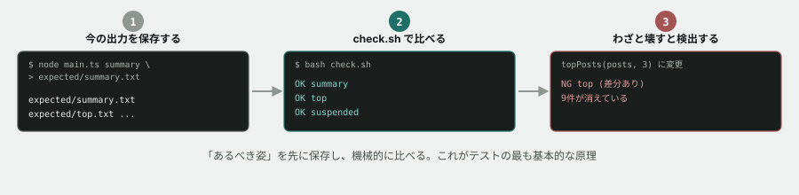

# 15. 壊していないことを、どう確かめるか



## 目的

**演習07から今まで、毎回3つのコマンドを目で見て確認してきました。** それで十分だったのは、確認する対象が3つだけだったからです。この先コマンドが増えたら、目視はいずれ見落とします。

今日は、**「壊していないこと」を自分の代わりに確かめてくれる仕組み**を作ります。

## 状況

これは運用担当からの依頼ではありません。**あなた自身のための作業**です。演習13で `diff` を使って「動きを変えていないこと」を確認しました。あれを、毎回手で打たなくても済むようにします。

## 準備

```
cd curriculum/04-programming-basics/samples/tsunagaru-cli
```

## 手順

### 期待する出力を保存する

- [ ] `expected` という名前のフォルダを作る
- [ ] 3つのコマンドの出力を、それぞれ `expected/summary.txt` `expected/top.txt` `expected/suspended.txt` として保存する

```
mkdir expected
node --experimental-strip-types src/main.ts summary > expected/summary.txt
node --experimental-strip-types src/main.ts top > expected/top.txt
node --experimental-strip-types src/main.ts suspended > expected/suspended.txt
```

- [ ] 3つのファイルの中身を確認する。**これが「今、正しいとみなす出力」です**

### 比べる仕組みを書く

- [ ] `check.sh` というファイルを作り、次のことをする**シェルスクリプト**を書いてください

  - `summary` `top` `suspended` の3つについて
  - 今の出力を実行して取り、`expected/` の中身と比べる
  - **1つでも違っていたら、何が違うかを表示して、最後に失敗したことが分かるようにする**

分からない場合は、コマンドライン基礎で学んだ `for` の考え方(繰り返し)と、`diff`(比較)を思い出してください。1コマンドずつ、順番に比べれば十分です。

- [ ] 書けたら実行する

```
bash check.sh
```

- [ ] **今は何も壊していないはずなので、全部一致すると出るはずです。** 実行結果を貼る

### わざと壊して確かめる

**仕組みを作っただけでは、それが本当に機能するか分かりません。** 壊れることを、壊してみて確かめます。

- [ ] `main.ts` の `topPosts(posts, 15)` を、一時的に `topPosts(posts, 3)` に変える
- [ ] `bash check.sh` を実行する。**`top` が「違う」と検出されるはずです**
- [ ] 検出された結果を貼る
- [ ] **`topPosts(posts, 15)` に戻す**
- [ ] もう一度 `bash check.sh` を実行し、全部一致することを確認する

## 予測のヒント

やっていることは単純です。**「あるべき姿」をあらかじめファイルに書いておき、「今の姿」と機械的に比べる。** これがテストの最も基本的な原理です。

`expected/` の中身は、**今のコードが正しく動いている前提で保存したもの**です。もし今のコードにまだ知らないバグが残っていたら、そのバグごと「正解」として保存してしまいます。**この仕組みは「今と違う変化」を教えてくれるだけで、「今が正しいかどうか」までは教えてくれません。**

## 考えてみてほしいこと

以下は Issue のコメントに書いてください。

1. **この仕組みがあるのと無いのとで、演習11(共有関数を直したら別の場所が壊れた)は何か変わっていたと思いますか**
2. `expected/` に保存した内容そのものが間違っていたら、この仕組みはどうなりますか。**「テストが通る」ことと「正しく動いている」ことは、同じですか**
3. 新しいコマンドを足すたびに、`expected/` にファイルを1つ追加する必要があります。**これは面倒だと思いますか。それとも妥当だと思いますか**。理由も書いてください
4. 本編(保守改修フェーズ)の評価観点には「テストの書き方」が入っています。**今日作ったものと、本格的な「テスト」は、何が同じで何が違うと思いますか**(想像で構いません)

## 完了条件

- `check.sh` が3つのコマンドを比較し、**一致・不一致を明確に表示すること**
- **わざと壊した状態で実行し、実際に検出できることを確認していること**
- 検出できることを確認したあと、**元に戻して全部一致する状態で終えていること**

> [!NOTE]
> **`expected/` と `check.sh` は、あなたがこのために作った成果物です。** 消さずに残しておいてください。演習16で使います。
