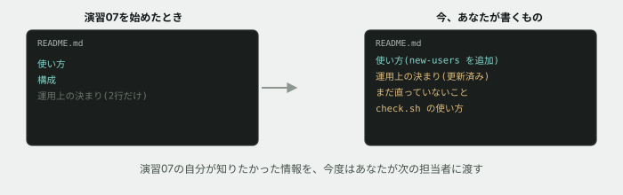

# 16. 次の人に引き継ぐ



## 目的

**演習07で、あなたは何も情報がない状態からこのコードを引き継ぎました。** あのとき、README にもう少し書いてあれば楽だった、と思った部分があったはずです。

今日はあなたが、**次の担当者のために同じものを書きます。**

## 状況

運用担当から、最後の連絡です。

> ありがとうございました。**来月から、この案件は別の方に担当してもらいます。** 引き継ぎ資料をお願いできますか。

## 準備

```
cd curriculum/04-programming-basics/samples/tsunagaru-cli
```

演習07〜14で、あなたはこのコードにいくつも手を入れてきました。ここではコードは変更しません。**`README.md` だけを書き直します。**

## 手順

### 振り返る

- [ ] 演習07〜14のIssueを、**上から順に読み返してください。** 何を直し、何を足し、何を保留にしたか
- [ ] 特に、**演習08で「仕様が決まっていない」として質問に留めたもの**があったはずです。その後どう決着しましたか(演習09の依頼で解決したもの、まだ確認していないもの、それぞれ確認してください)

### README を書き直す

[samples/tsunagaru-cli/README.md](../samples/tsunagaru-cli/README.md) を開いて、次の内容を**足してください**(既存の内容を消す必要はありません)。

- [ ] **使えるコマンドの一覧を更新する。** `new-users` が増えています
- [ ] **「運用上の決まり」を更新する。** 演習08〜09を経て、決まりごとが増えたり、はっきりしたりしたはずです
- [ ] **「まだ直っていないこと」「気づいたが手を付けなかったこと」を書く節を足す。** 何も無ければ「特になし」で構いませんが、**本当に無いか、もう一度考えてから書いてください**
- [ ] **`check.sh` の使い方を書く。** 演習15で作った、あなたにしか使い方が分からない道具です

### 読み手を想像する

- [ ] 書き終えたら、**演習07を始める直前の自分**のつもりで、もう一度読んでください。**知りたかったことが、書いてありますか**
- [ ] 足りないと感じた箇所があれば、書き足す

## 予測のヒント

演習07で読んだときの `README.md` は、**「これから何かをしてもらう相手」のために書かれていました。** 使い方と、決まりごとだけです。

今書くものは、それに加えて**「ここまで何が起きたか」の記録**でもあります。次の担当者は、あなたが演習08〜14でやったことを知りません。**あなたが最初に持っていなかった情報を、今度はあなたが渡す番です。**

「まだ直っていないこと」を書くのは、**弱みを見せることではありません。** それを書かずに引き継いで、次の担当者が同じ場所で同じだけ時間をかけて気づき直すことのほうが、ずっと損失が大きいです。

## 考えてみてほしいこと

以下は Issue のコメントに書いてください。

1. **演習07を始めたときの自分に、今の README を渡せていたら、何分くらい早く進めたと思いますか**
2. あなたが今日書いた「まだ直っていないこと」は、**なぜ今回は直さなかったのですか**(時間が無かった、依頼されていない、判断に迷ったなど)
3. **コードを読む力と、コードについて書く力は、同じものだと思いますか、別のものだと思いますか**
4. ここまで9つの演習(07〜15)を通して、**最初に `main.ts` を開いたときの自分と、今の自分で、何が一番変わったと思いますか**

## 完了条件

- `README.md` に、コマンド一覧・運用上の決まり・未解決事項・`check.sh` の使い方が反映されていること
- **「演習07を始める直前の自分が読んだら十分か」という基準で、自分で読み直していること**

> [!NOTE]
> **これで、プログラミング基礎の演習は終わりです。** ここまでの9つの演習(07〜15)は、最初から最後まで**同じ1つのコードベース**を触り続けました。現場での保守改修は、まさにこの繰り返しです。読んで、直して、確かめて、次の人に渡す。
