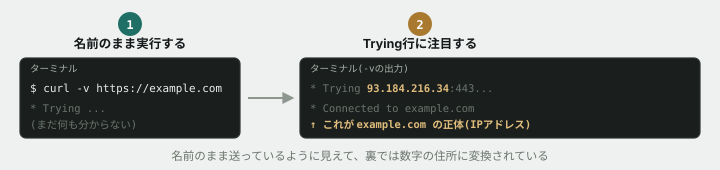

# 01. DNSで名前を解決してみる

## 目的

`curl -v` で通信の様子を詳しく表示させ、`example.com` という名前が、実際には数字の並び(IPアドレス)に変換されてから通信していることを自分の目で確認する。

## 手順

- [ ] `curl -v https://example.com` を実行する **前に**、いつもの結果に何が追加で表示されそうか予測してこのIssueにコメントする
- [ ] 実際に `curl -v https://example.com` を実行し、結果をコメントに貼る
- [ ] 出力の中から `Trying` という単語で始まる行を探す
- [ ] その行に含まれる数字の並びが何を表しているか、本文の内容を踏まえて自分の言葉で一言書く

## 予測のヒント

実務で毎回この手順を踏むわけではありません。ここでは意図的に立ち止まり、先に自分の理解を言葉にする訓練をしています。当てることが目的ではありません。「`example.com` という名前のまま、インターネットの海を渡っていくわけではない」という本文の内容を思い出しながら予測してください。

## 完了条件

チェックリストがすべて埋まり、`Trying` 行の数字が何を表しているかのコメントが書かれていること。
