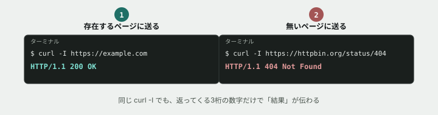

# 02. リクエストを送って、レスポンスを読む

## 目的

`curl` で実際にHTTPリクエストを送り、ステータスコードとヘッダを自分の目で確認する。「動いた/動かなかった」ではなく、返ってきた中身を読む習慣をつける。

## 手順

- [ ] `curl -I https://example.com` を実行する **前に**、ステータスコードが何番になりそうか予測してこのIssueにコメントする
- [ ] 実際に `curl -I https://example.com` を実行し、結果をコメントに貼る
- [ ] `curl -I https://httpbin.org/status/404` を実行する **前に**、ステータスコードが何番になりそうか予測してコメントする
- [ ] 実際に `curl -I https://httpbin.org/status/404` を実行し、結果をコメントに貼る
- [ ] 2つの結果を見比べて、ステータスコードの数字が何を伝えようとしているか、自分の言葉で一言書く

## 予測のヒント

実務で毎回この手順を踏むわけではありません。ここでは意図的に立ち止まり、先に自分の理解を言葉にする訓練をしています。当てることが目的ではありません。2つ目のURLの中に埋め込まれた `404` という数字が何のヒントになりそうか、まず自分で考えてから実行してください。

## 完了条件

チェックリストがすべて埋まり、2つの結果を比較したコメントが書かれていること。
