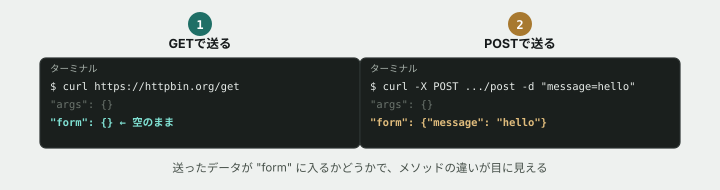

# 03. GETとPOSTの違いを送って確かめる

## 目的

同じ相手(`httpbin.org`)に、メソッドの違う2種類のリクエストを送り、返ってくる中身の違いから「メソッドが何を伝えているか」を体で覚える。

## 手順

- [ ] `curl https://httpbin.org/get` を実行する **前に**、レスポンスの中に何が書かれていそうか予測してコメントする
- [ ] 実際に `curl https://httpbin.org/get` を実行し、結果をコメントに貼る
- [ ] `curl -X POST https://httpbin.org/post -d "message=hello"` を実行する **前に**、GETのときと何が変わりそうか予測してコメントする
- [ ] 実際に `curl -X POST https://httpbin.org/post -d "message=hello"` を実行し、結果をコメントに貼る
- [ ] レスポンスに含まれる `"args"` と `"form"` という項目に注目し、2つの結果で何が違ったかを一言書く

## 問い

GETとPOST、同じ`httpbin.org`宛てでも中身が違う理由は何だと思いますか。「情報を取ってくる」操作と「情報を送って処理してもらう」操作とで、リクエストの作り方が変わるとしたら、それはなぜだと思いますか。自分の言葉で予想して書いてください。

## 完了条件

チェックリストがすべて埋まり、最後の問いに対する自分なりの答えが書かれていること。
