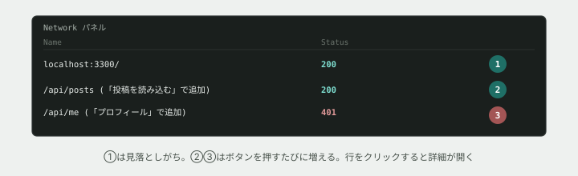

# 05. Networkパネルで、ブラウザの通信を見る



## 目的

`curl` は自分でリクエストを1回送るだけでしたが、実際のWebページは**裏側で何度も通信しています。** それを丸ごと記録して見せてくれるのが、開発者ツールの **Network パネル** です。

## 準備

演習用のAPIサーバーを起動します(演習04で止めていたら、もう一度起動してください)。

```
cd curriculum/05-http-basics/samples
node server.js
```

ブラウザで `http://localhost:3300/` を開いてください。「つながるノート」というページと、ボタンが2つ表示されます。

## 手順

### Networkパネルを開く

- [ ] 開発者ツールを開き、**Network** タブを選ぶ(HTML/CSS基礎で使った Elements・Styles の隣にあります)
- [ ] ページを **リロード**する。一覧に何か記録されましたか。**一番上にある行は、何のリクエストだと思いますか**(ヒント: あなたが今見ているHTMLファイルそのものです)

### 投稿の読み込みを観察する

- [ ] Network パネルの一覧を**空にする**(多くのブラウザでは、禁止マークのようなアイコンがあります。無ければ気にせず進めてください)
- [ ] 「投稿を読み込む」ボタンを**クリックする前に**、Networkパネルに何が追加されると思うか予測してコメントする
- [ ] クリックする。**新しい行が追加されましたか。** その行の名前(URL)を貼る
- [ ] その行をクリックして詳細を開く。**Status(ステータスコード)は何番ですか**
- [ ] 詳細の中に **Headers**(または Response Headers)というタブがあります。開いて、`curl` で見たのと同じ `X-RateLimit-Remaining` があるか確認する

### 401を、ブラウザ側からも観察する

- [ ] 「プロフィールを読み込む(未ログイン)」ボタンをクリックする **前に**、Networkパネルに何が起きるか、Statusは何番になるか予測してコメントする
- [ ] クリックする。**新しい行の Status は何番でしたか**
- [ ] 演習04で `curl` を使って再現したのと**同じ401**が、今度はブラウザの操作から自然に発生したことを確認する

### Console パネルも確認する

- [ ] Console タブに切り替える。「プロフィール取得: 401」のようなログが出ているはずです。これは `server.js` が返したページの中のJavaScriptが、`fetch` の結果をコンソールに出力しているものです

### 後片付け

- [ ] `server.js` を実行しているターミナルで `Ctrl + C` を押し、サーバーを止める

## 予測のヒント

一番上に記録される行は、ほとんどの人が見落とします。**あなたが読んでいるHTMLファイルそのものも、1つのHTTPリクエストの結果です。** ボタンを押して発生する通信だけがリクエストではありません。

## 考えてみてほしいこと

以下は Issue のコメントに書いてください。

1. `curl` で見た401と、Networkパネルで見た401は、**中身として同じものですか、違うものですか**
2. 本編で「画面に投稿が表示されない」という不具合報告を受けたとき、**Networkパネルの何を最初に見ますか**(ヒント: Statusと、そもそもリクエストが送られているかどうか)
3. Networkパネルには、あなたが操作していないのにブラウザが自動で送っているリクエストが記録されることもあります。**それはどんな種類の通信だと思いますか**(調べてもAIに聞いても構いません)

## 完了条件

投稿読み込み(200)とプロフィール読み込み(401)、両方のリクエストをNetworkパネルで確認し、それぞれのStatusとURLが記録されていること。「一番上の行が何のリクエストか」への回答が書かれていること。
