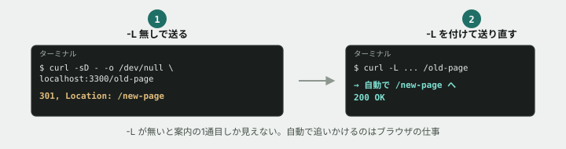

# 06. リダイレクトを追いかける



## 目的

300番台のステータスコードを、`Location` ヘッダと合わせて読む。**「勝手に別のページに飛ばされた」ときに、どこで何が起きているかを自分で追えるようになる。**


## 準備

演習04と同じサーバーを使います。まだ起動していなければ、

```
cd curriculum/05-http-basics/samples
node server.js
```

`つながるノート API サーバー: http://localhost:3300` と表示されたら起動成功です。別のターミナル(タブ)を開いて、以降のコマンドはそちらで打ちます。

## 手順

### 301(恒久的な引っ越し)を見る

- [ ] `curl -sD - -o /dev/null http://localhost:3300/old-page` を実行する **前に**、ステータスコードが何番になると思うか予測してコメントする
- [ ] 実行して結果を貼る。**`Location` ヘッダには何と書かれていますか**
- [ ] `-L` オプションを付けて `curl -sD - -o /dev/null -L http://localhost:3300/old-page` を実行する **前に**、`-L` が無いときと何が変わると思うか予測してコメントする(ヒント: `-L` は「リダイレクト先を自動で追いかける」オプションです)
- [ ] 実行して結果を貼る。**最終的に何番のステータスコードで終わりましたか。表示されたヘッダの数は、`-L` の有無でどう変わりましたか**

### 302(今回だけの案内)を見る — 未ログインで /mypage にアクセスする

- [ ] `curl -sD - -o /dev/null http://localhost:3300/mypage` を実行する **前に**、ステータスコードと `Location` を予測してコメントする(トークンを付けていません)
- [ ] 実行して結果を貼る
- [ ] `curl -sD - -o /dev/null "http://localhost:3300/mypage?token=tsunagaru-secret-token"` (正しいトークンをクエリで渡す)を実行する。**今度は何番が返ってきましたか**

### 401との違いを比べる

- [ ] 演習04で見た `curl -sD - -o /dev/null http://localhost:3300/api/me`(未ログイン)の結果を思い出してください(もう一度実行してもかまいません)。**同じ「未ログイン」なのに、`/api/me` は401、`/mypage` は302を返しました。この違いはなぜだと思いますか**

## 予測のヒント

301と302は、どちらも `Location` ヘッダで行き先を示す点は同じです。違うのは「その引っ越しが**続くか、今回だけか**」という意味です。`-L` を付けると、`curl` はブラウザと同じように**自動でLocationの行き先へ改めてリクエストを送ります。** 付けなければ、最初の1回分(リダイレクトそのもの)しか見えません。

## 考えてみてほしいこと

以下は Issue のコメントに書いてください。

1. もしあなたが会社のトップページを `/old` から `/new` へ引っ越すとき、**301と302のどちらを使いますか。** 理由も書いてください
2. `/api/me` は401を返し、`/mypage` は302でログイン画面に案内しました。**あなたがAPIと画面(ページ)、両方を設計するとしたら、この使い分けをどんなルールとして覚えておきますか**
3. 301は「ブラウザに強くキャッシュされることがある」と本文にありました。**もし301の設定を間違えて、後から直したくなったら何が困ると思いますか**(調べてもAIに聞いても構いません)

## 完了条件

`/old-page`(`-L` あり・なし両方)、`/mypage`(トークンあり・なし両方)の実行結果が貼られていること。401と302の使い分けについて自分の言葉で説明されていること。

## サーバーを止める

`server.js` を実行しているターミナルに戻り、`Ctrl + C` で止めてください。
