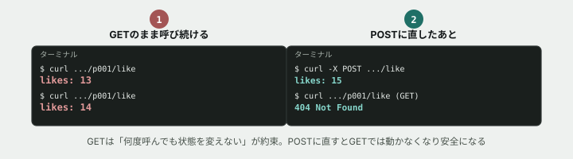

# 07. GETを送るたびに、数字が増えていく



## 目的

演習03で「GETは何度実行しても、サーバー側の状態は変えない」と学びました。今日は、**それが守られていないコードを実際に踏んで**、何が危険なのかを体で確かめます。

## 状況(ここから、あなたは保守担当です)

> 投稿に「いいね」ボタンを付けてほしいという依頼があり、前任者が実装してくれました。**動作は確認済みだそうです。** 念のため、あなたも一度触っておいてください。

## 準備

```
cd curriculum/05-http-basics/samples
node server.js
```

`つながるノート API サーバー: http://localhost:3300` と表示されたら起動成功です。別のターミナル(タブ)を開いて、以降のコマンドはそちらで打ちます。

## 手順

### 「いいね」を送ってみる

- [ ] `curl http://localhost:3300/api/posts/p001/like` を実行する **前に**、レスポンスの中身がどうなると思うか予測してコメントする
- [ ] 実行して結果を貼る。`likes` の数はいくつになりましたか(演習04・05で見た `p001` の初期値は12でした)
- [ ] **もう一度同じコマンドを実行してください。** `likes` はどうなりましたか

### 何が起きているかを読む

- [ ] `curriculum/05-http-basics/samples/server.js` を開き、`endsWith("/like")` を含む行を探してください。**このルートは、リクエストのメソッドとして何を条件にしていますか**
- [ ] 本文の「はじめの一歩」を思い出してください。`curl <URL>` を実行したとき、送られるメソッドは何でしたか(オプションを何も付けていません)

### 危険性を考える

- [ ] もしこの「いいねリンク」が、ページの中に `<a href="/api/posts/p001/like">いいね</a>` という**普通のリンク**として置かれていたら、何が起きると思いますか。次を考えてコメントする
  - ブラウザの「リンク先読み(プリフェッチ)」機能が、クリックされていないリンクを先回りして読み込んでしまったら
  - 検索エンジンのクローラーが、ページ内の全リンクを機械的に辿っていったら

## 予測のヒント

**GETは「取ってくるだけ」という約束の上に、Web全体の仕組みが成り立っています。** ブラウザの先読み機能や検索エンジンのクローラーは、この約束を信じて「GETなら何回踏んでも安全」という前提で動きます。今回のように**GETで状態を変えてしまうコードがあると、その前提が崩れ、誰も操作していないのに数字が動いていく**という不具合になります。

## 直す

- [ ] `server.js` の `/like` ルートで、メソッドの条件を `"GET"` から `"POST"` に変更する
- [ ] 保存し、サーバーを再起動する(一度 `Ctrl + C` で止めてから `node server.js`)
- [ ] `curl -X POST http://localhost:3300/api/posts/p001/like` を実行する。**`likes` は増えましたか**
- [ ] 直した後に、**さっきと同じ** `curl http://localhost:3300/api/posts/p001/like`(`-X POST` なし)を実行する。**結果はどう変わりましたか。ステータスコードは何番ですか**

## 考えてみてほしいこと

以下は Issue のコメントに書いてください。

1. 直した後、`-X POST` を付けずに実行すると404が返ってきました。**なぜ404になったのか**、`server.js` の中身を見ながら自分の言葉で説明してください(ヒント: `/like` を条件にしたルートを、GETリクエストは通らなくなりました。その後、リクエストはどのルートに流れていきますか)
2. あなたが今後「削除」や「送金」のようなAPIを設計するとしたら、**メソッドの選び方についてどんなルールを自分に課しますか**
3. 前任者は「動作は確認済み」と言っていました。**何を確認すれば、この不具合に気づけたと思いますか**

## 完了条件

- `/like` がGETでは呼び出せなくなり(実行するとエラーになり)、`POST` で呼び出したときだけ `likes` が増えること
- なぜGETのままだと危険なのかを、ブラウザの先読みかクローラーの例を使って説明できていること

## サーバーを止める

`server.js` を実行しているターミナルに戻り、`Ctrl + C` で止めてください。
